# Инструкция по работе с личным кабинетом

## Вход в личный кабинет 
1.	Зайдите на сайт [netology.ru](https://netology.ru)
2.	В правом верхнем углу нажмите кнопку **Войти**.

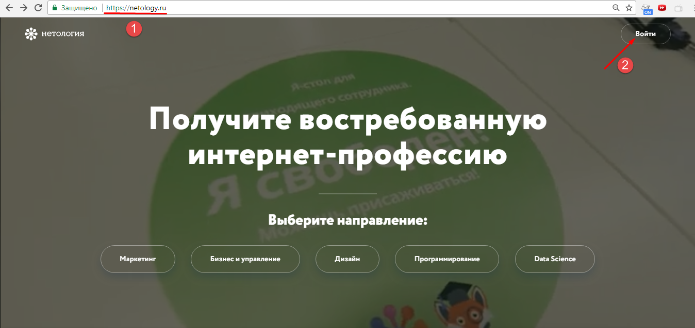 

3.	Открывается окно аутентификации. В соответствующие поля введите адрес электронной почты и пароль. Нажмите кнопку **Войти**.

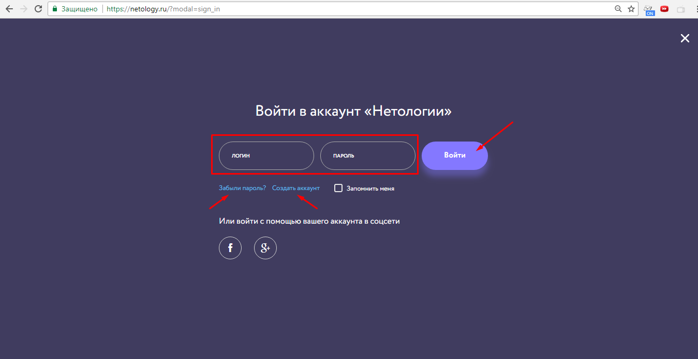 

4.	Если вы забыли пароль, нажмите на кнопку **Заыбли пароль?**. В открывшемся окне введите свой адрем электронной почты и нажмите кнопку **Создать новый пароль**.

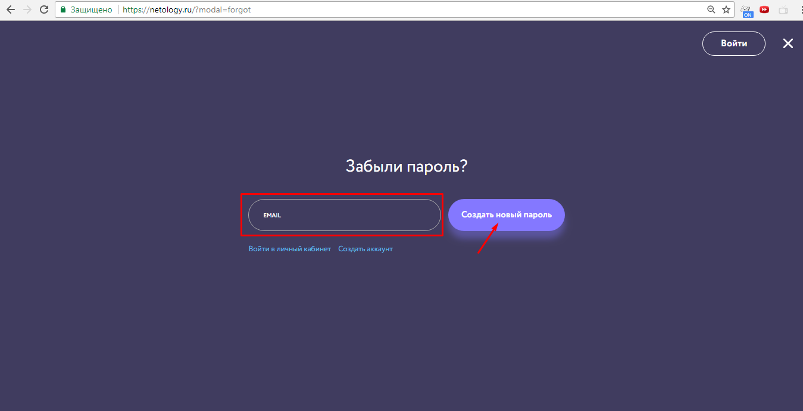 

5.	Для регистрации нажмите кнопку **Создать аккаунт**. Выберите направление, введите ваше имя и адрес электронной почты, поставьте галочку о том, что вы принимаете пользовательское соглашение и нажмите кнопку **Зарегистрироваться**.

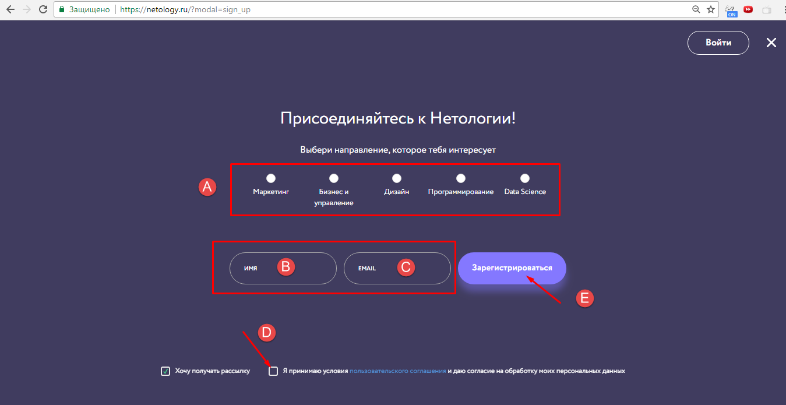
 
## Навигация по личному кабинету
Зайдя на сайт с вашим логином и паролем, в правом верхнем углу нажмите иконку личного кабинета. В меню этой иконки выбираете **Мой профиль и программы** и попадаете в личный кабинет.

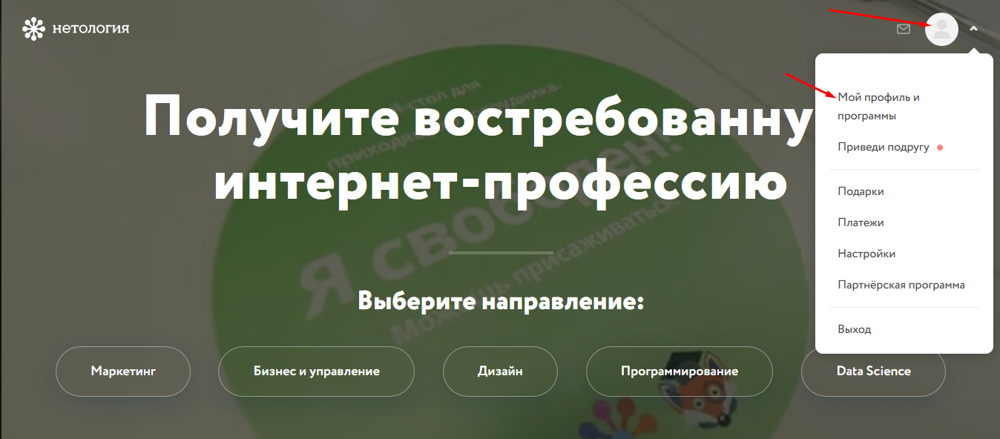 

В личном кабинете вы можете видеть ваши программы обучения, профессии и видеокурсы.

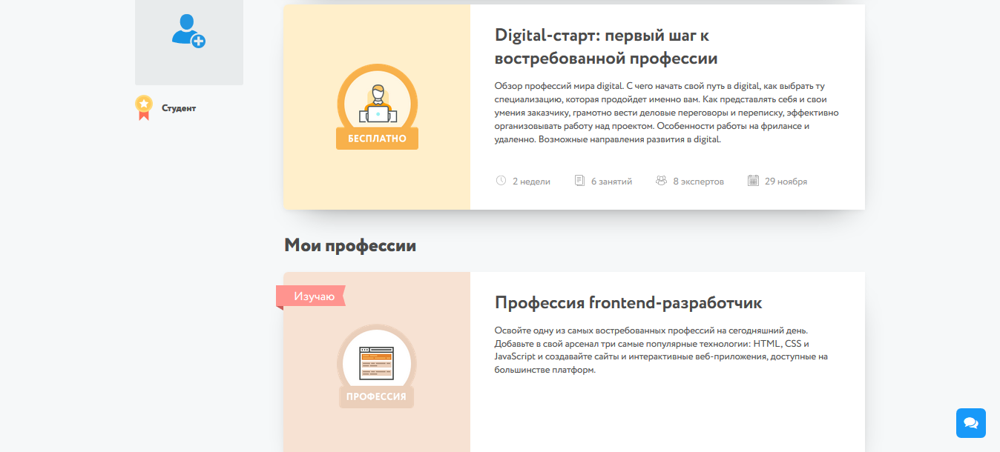 

Выбираете интересующий курс, например, «Основы HTML и CSS».

### Основной курс
Список занятий в этом курсе. По каждому занятию есть информация о преподавателе, ведущем лекцию, дате и времени его проведения, а также срок выполнения домашнего задания и срок доступа к видеозаписи лекции. Обратите внимание, что запись лекции появляется примерно через *2 часа после окончания занятия* и будет доступна вам в течение года.

В день лекции, до ее начала появляется ссылка на прямую трансляцию, а после лекции через некоторое время ссылка на видеозапись: **Посмотреть запись**. По ссылке **Материалы** доступна презентация лекции. Промежуточный тест к лекции для проверки, как вы усвоили материал, доступен по ссылке **Тест**. По ссылке **Выполнить задания** вы попадаете на вкладку домашних заданий.

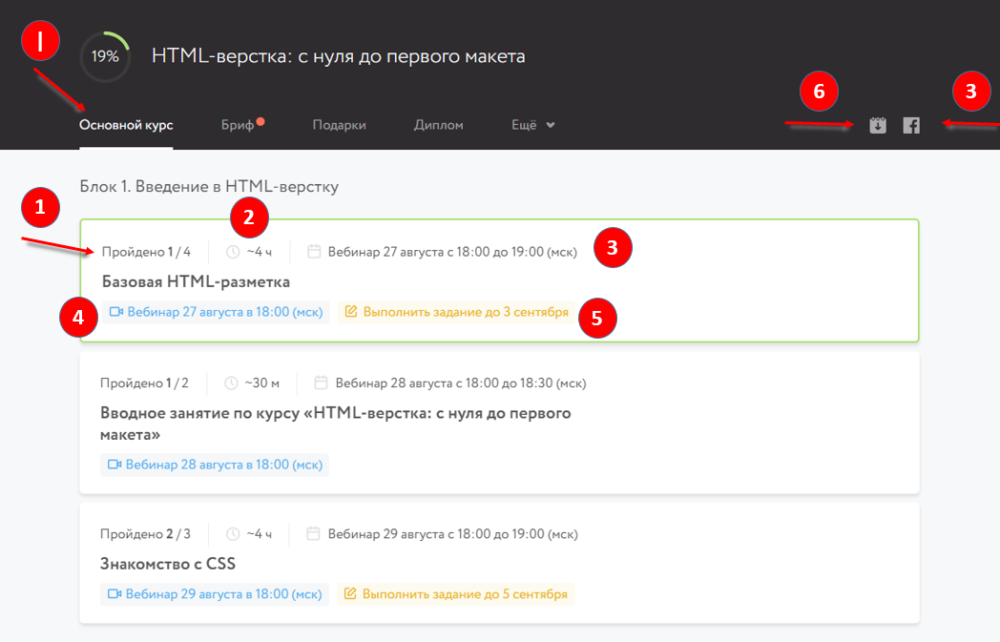

### Задания
В этой вкладке доступна информация по домашним заданиям. На данном курсе все домашние задания вы проверяете самостоятельно по готовым решениям, которые приходят вам на почту и публикуются в группе на Facebook на следующий рабочий день после лекции. То есть отправлять домашние задания никуда не нужно.

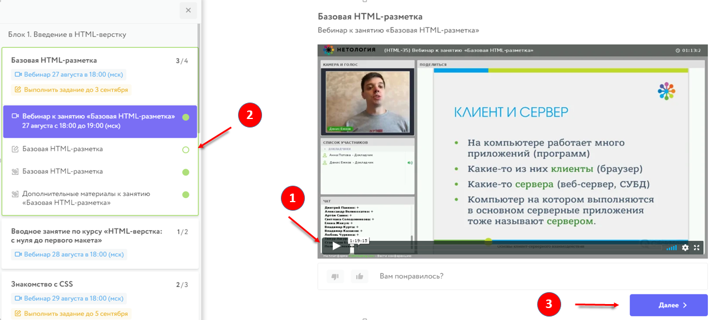
 
### Бриф
Чтобы обучение в «Нетологии» было для Вас максимально эффективным, мы просим
Вас ответить на некоторые вопросы.

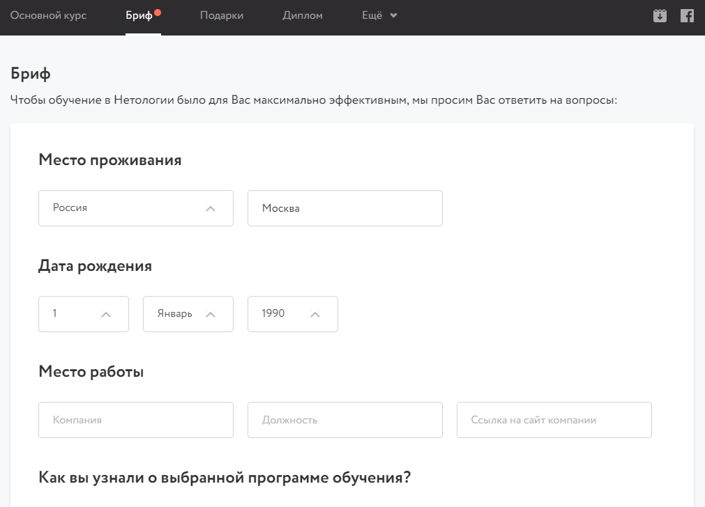

### Группа в Facebook
По ссылке можно перейти в закрытую группу на Facebook, где можно увидеть анонсы лекций, задавать вопросы кураторам и аспирантам по курсу.

### FAQ
Список самых часто задаваемых вопросов по курсу с ответами. Пожалуйста, ознакомьтесь с ними перед началом курса.

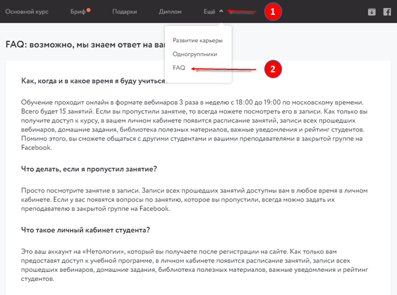
 
### Связь с координатором
Если у вас остались какие-то вопросы, вы можете связаться с координатором курса прямо из личного кабинета. Для этого нажмите на значок конверта справа вверху.

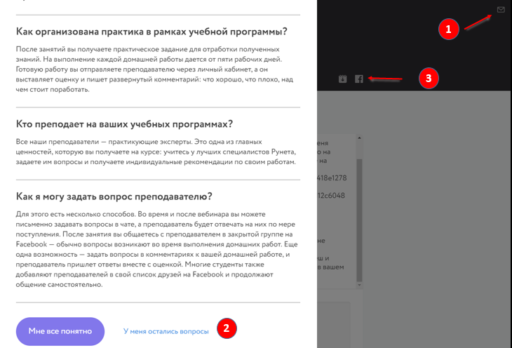
 
### Финальный тест
После последней лекции вам будет открыт доступ к финальному тесту. До финального теста будут допущены **все** студенты, независимо от прохождения промежуточных тестов и выполнения домашних заданий.
Финальный тест будет доступен в течение *1 недели*, и у вас будет *2 попытки*, чтобы его пройти.
Финальный тест состоит из 25 вопросов с несколькими вариантами ответов. На прохождение теста даётся 60 минут. Тест считается пройденным успешно, если вы дали правильные ответы на 70% вопросов и более.
 
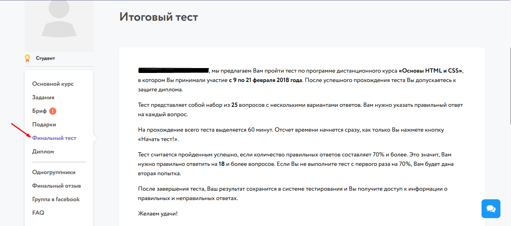

### Финальный отзыв
По окончании курса большая просьба оставить свой отзыв о курсе, чтобы мы могли сделать его лучше.

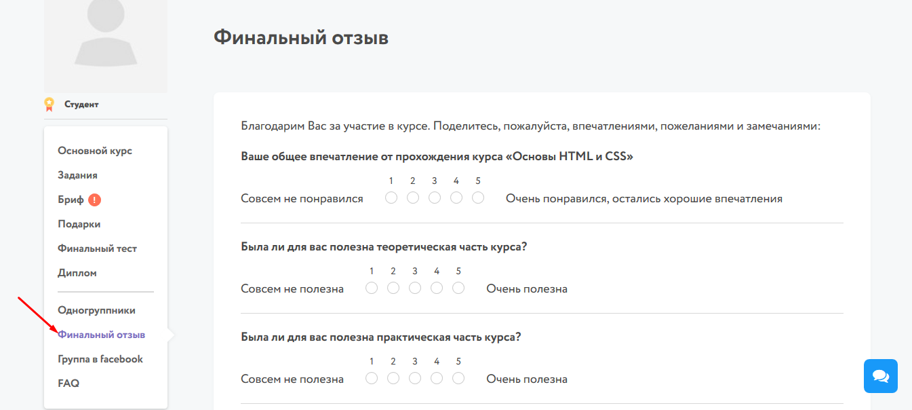
 
