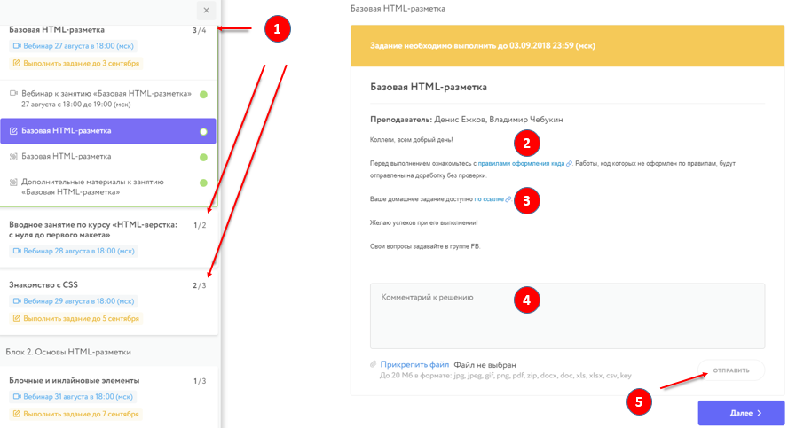

# Инструкция по работе с личным кабинетом

## Вход в личный кабинет 
1. Зайдите на сайт [www.netology.ru](http://www.netology.ru)
2. В правом верхнем углу нажмите кнопку **ВОЙТИ**

3. Открывается окно **ВОЙТИ В АККАУНТ НЕТОЛОГИИ**. В соответствующие поля введите электронную почту (A) и пароль (B) и нажмите кнопку **ВОЙТИ (C)**.

4. Если вы забыли пароль, нажмите на кнопку **ЗАБЫЛИ ПАРОЛЬ**. В открывшемся окне введите свою электронную почту (A) и нажмите кнопку **СОЗДАТЬ НОВЫЙ ПАРОЛЬ (B)**.

5. Для регистрации нажмите кнопку **СОЗДАТЬ АККАУНТ**. Выберите направление (A), введите ваше имя (B) и адрес электронной почты (C), поставьте галочку о том, что вы принимаете [пользовательское соглашение](https://netology.ru/legal) (D) и нажмите кнопку **ЗАРЕГИСТРИРОВАТЬСЯ (E)**.

## Навигация по личному кабинету
1. Зайдя на сайт с вашим логином и паролем, в правом верхнем углу нажмите иконку личного кабинета (A). В меню этой иконки выбираете [Мой профиль и программы](https://netology.ru/profile) **(B).** И попадаете в личный кабинет.

2. В личном кабинете вы можете видеть ваши программы обучения, профессии и видеокурсы.

3. Выбираете интересующий курс, например, «HTML-вёрстка: с нуля до первого макета».

## **ОСНОВНОЙ КУРС (I)**
Список занятий в этом курсе. По каждому занятию есть информация о преподавателе, ведущем лекцию (1), дате и времени его проведения (2), а также срок выполнения домашнего задания (3) и срок доступа к видеозаписи лекции (4).

В день лекции, до ее начала, появляется ссылка на прямую трансляцию: **ССЫЛКА НА ЗАНЯТИЕ**. После лекции через некоторое время (примерно через 2 часа после её окончания) будет доступна ссылка на видеозапись: **ПОСМОТРЕТЬ ЗАПИСЬ (5)**. По ссылке **МАТЕРИАЛЫ** доступна презентация лекции (6).

На некоторых курсах нужно пройти промежуточные тесты. Они доступны по ссылке **ТЕСТ.** По ссылке **ВЫПОЛНИТЬ ЗАДАНИЕ (7)** вы попадаете на вкладку домашних заданий. При желании можно получить файл расписания всех занятий курса (8), чтобы добавить его в Google Calendar, MS Outlook или любое другое приложение-календарь поддерживающее формат ics.

## **ЗАДАНИЯ**
В этой вкладке содержится информация по домашним заданиям: их статус (сколько выполнено (1), на проверке (2), на доработке (3), не сдано (4) и сдано (5)) и количество. Кликая по выбранному заданию (6), перейдете в раздел выполнения заданий.

## **ВЫПОЛНЕНИЕ ЗАДАНИЙ**
В этой вкладке (1) проходит ваше общение с преподавателем, проверяющим домашнее задание. В разделе *выполнение задания* в поле комментарий надо отправлять ссылки на выполненное домашнее задание в Codepen, и здесь же будет ответ и
комментарий преподавателя.

Перед выполнением заданий, ознакомьтесь с [правилами оформления кода](https://netology-university.bitbucket.io/codestyle/index.html) (2) для HTML и CSS и [инструкцией по работе с онлайн-редактором Codepen](https://netology-university.bitbucket.io/guides/wm/codepen-guide/). Описание задания доступно **по ссылке** (3). После выполнения задания в Codepen необходимо сохранить результат, скопировать адрес из адресной строки браузера и вставить скопированную ссылку в поле «Комментарий к решению» (4). При необходимости, можно дополнить ссылку на решение своими комментариями или вопросами. Порядок выполнения и публикации решения подробно описан в первом задании. После добавления текста в поле комментарий станет доступна кнопка «Отправить» (5). Нажав на нее, вы отправите решение на проверку. Задание при этом примет соответствующий статус.

Задания, по которым истек срок выполнения, перемещаются в группу “Не выполнены”. Открыть к ним доступ можно лишь **три раза** за курс. Чтобы получить доступ, нужно сначала выполнить задание и только после этого заполнить
[форму](https://docs.google.com/forms/d/e/1FAIpQLSewC8Fv3NQacd24-NXbEtQNokW2akbekmnUWMavPY9winPESQ/viewform). Пожалуйста, не откладывайте выполнение заданий на потом, делайте их сразу после появления.

## **БРИФ**
Чтобы обучение в «Нетологии» было для Вас максимально эффективным, мы просим

Вас ответить на некоторые вопросы.

## **ГРУППА В FACEBOOK**
Эта ссылка перенаправит вас в закрытую группу, где можно увидеть анонсы лекций, задать вопросы кураторам и аспирантам по вашему курсу.

## **FAQ**
Список самых популярных вопросов по курсу с ответами. Пожалуйста, ознакомьтесь с ним перед началом курса.

Если у вас остались какие-то вопросы, вы можете связаться с координатором курса прямо из личного кабинета. Для этого нажмите на значок конверта справа вверху.

## **ФИНАЛЬНЫЙ ТЕСТ**
После прохождения последней лекции вам будет открыт доступ к финальному тесту. Он будет открыт в течение 1 недели. Финальный тест состоит из 25 вопросов с несколькими вариантами ответов. На прохождение теста даётся 60 минут. Тест считается пройденным успешно, если вы дали правильные ответы на 70% вопросов и более.

## **ФИНАЛЬНЫЙ ОТЗЫВ**
По окончании курса большая просьба оставить свой отзыв о курсе, чтобы мы могли сделать его лучше.

