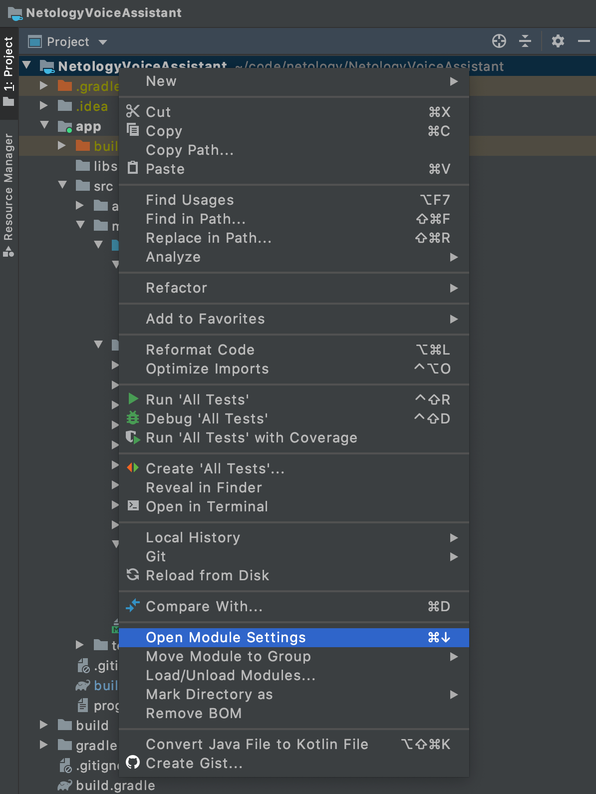
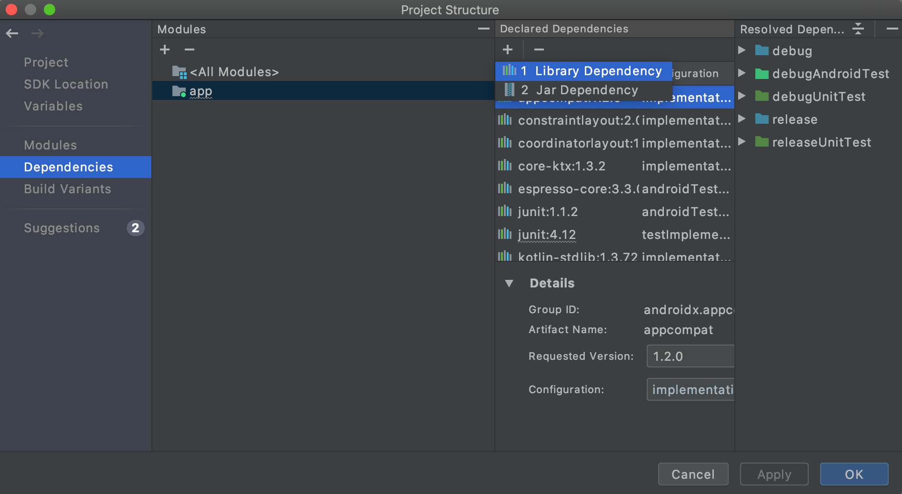
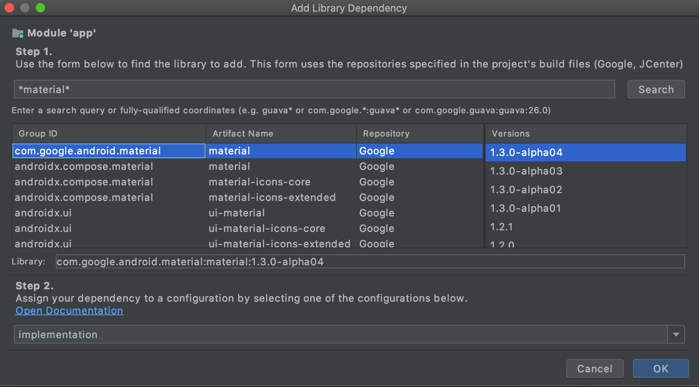
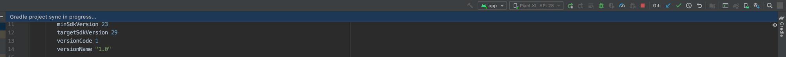
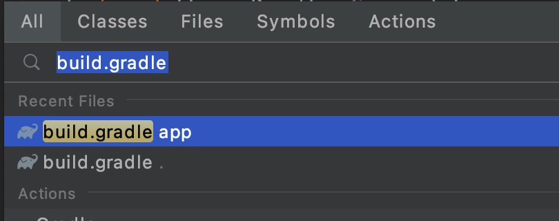
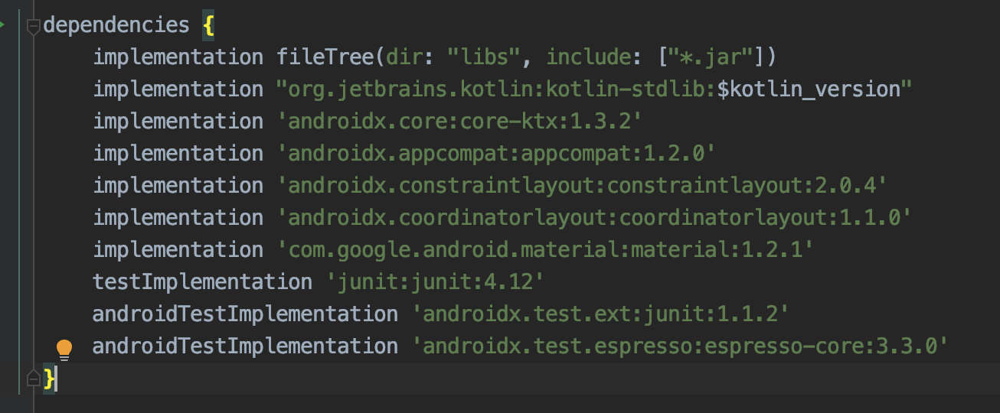

# Инструкция по добавлению библиотеки Material Design Components в проект.

1. Нажмите правой кнопкой на проект, выберите **Open Module Settings**. 

2. Выберите Dependencies → app → + → Library Dependencies.

3. Найдите **com.google.android.material**, например, с помощью маски \*material*, где * — любой набор символов. 

4. Нажмите **OK** два раза, и библиотека будет добавлена.

Сверху появится плашка **Gradle project sync in progress...** . Это значит, что библиотека скачивается. Когда плашка пропадёт, её можно использовать.
Таким же образом можно добавить любую другую библиотеку, набрав её название в поиске.

5. Список всех используемых библиотек можно найти в файле **build.gradle** в проекте **app**.

В блоке **dependencies**.

