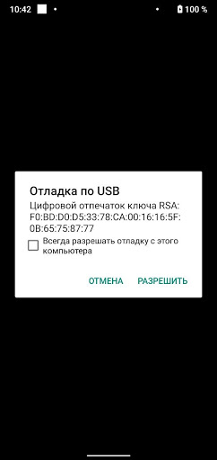
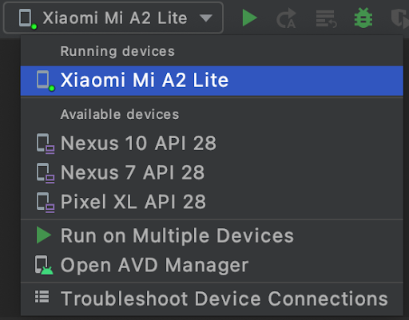

# Инструкция по запуску приложения на реальном устройстве. 

1. Нужно включить режим разработчика на Android-устройстве. Для этого надо зайти в "Настройки" -> "О телефоне" -> и 7 раз нажать на "Номер сборки".

2. Появится всплывающее сообщение, говорящее, что вы стали разработчиком. Поздравляем!

3. После этого где-то в настройках (в зависимости от вашего телефона, например, в разделе "Система и обновления") появится раздел "Для разработчиков".
В этом разделе нужно активировать пункт "Отладка по USB".

Гайд в [документации](https://developer.android.com/studio/debug/dev-options).

После этого: 
1. Подключите девайс к компьютеру. 
2. На девайсе появится запрос на разрешение подключения к компьютеру, разрешите доступ.

3. Выберите устройство в Android Studio, вы можете запускать на нём приложение точно так же, как раньше запускали на эмуляторе.

