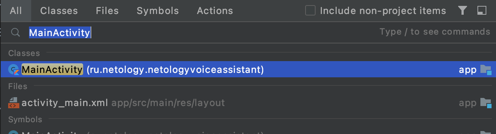
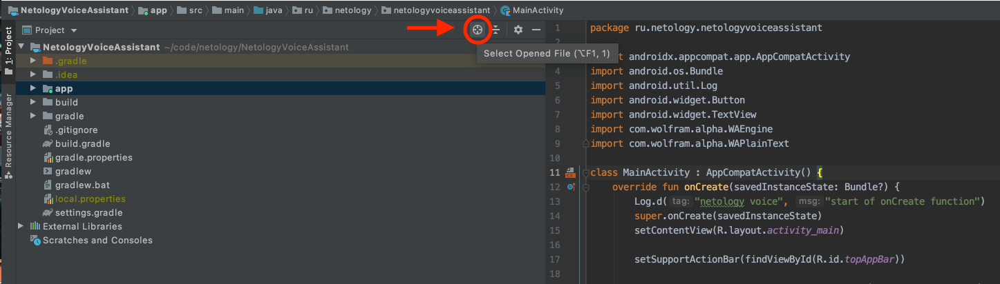
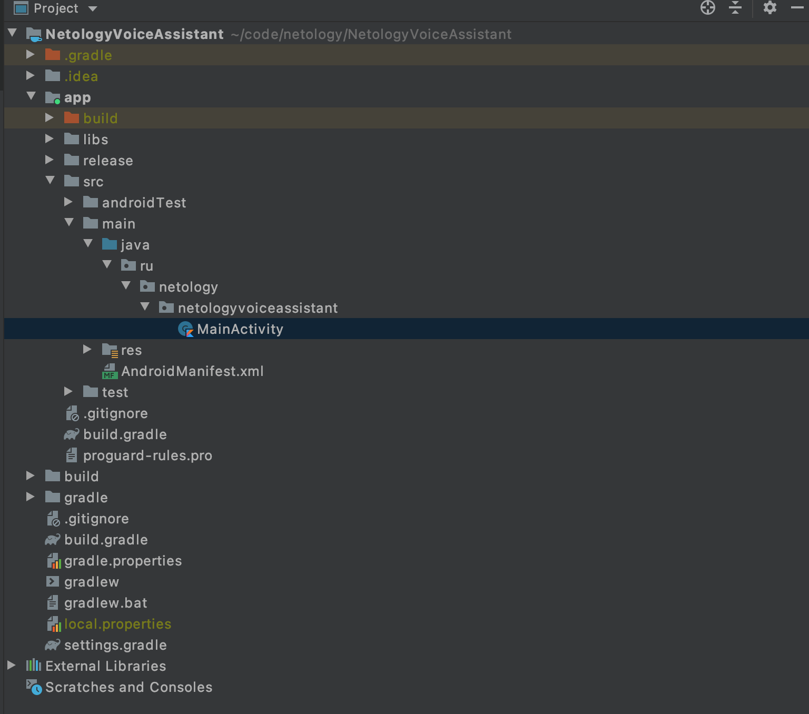
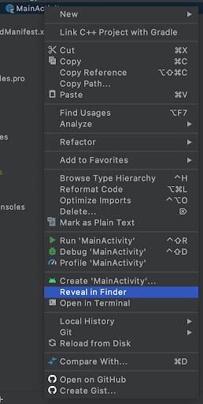
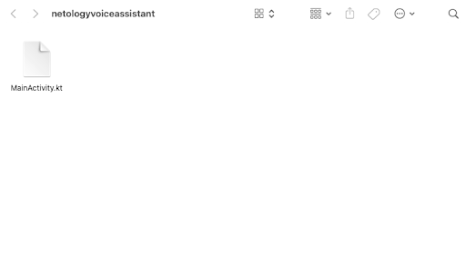
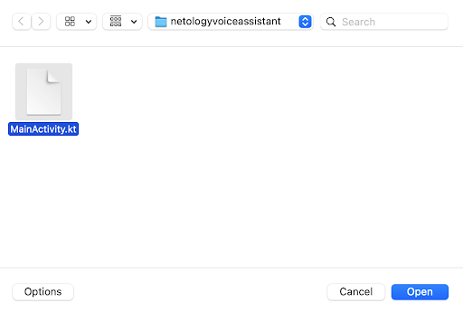

# Как найти файлы для сдачи домашнего задания?

1. Откройте проект в Android Studio.

2. С помощью поиска (2 нажатия на Shift) найдите и откройте требуемый файл.

3. Нажмите на кнопку поиска текущего открытого файла в дереве проекта.

4. После ее нажатия в дереве проекта автоматически выберется текущий открытый файл.

5. Нажмите правой кнопкой на файл, в появившемся меню выберите “Show in explorer” на Windows, или “Reveal in Finder” на MacOS.

6. Откроется папка с выбранном файлом, именно его нужно загрузить в форму домашнего задания.

7. В форме домашнего задания переключитесь на загрузку файла. 

8. Нажмите “Прикрепить файл” и выберите необходимый файл. (можно перетащить из другого окна, которое было открыто на 6 шаге). Нажмите Open.

9. Отправьте задание на проверку. 

