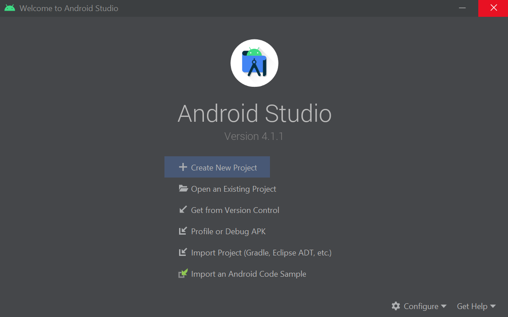
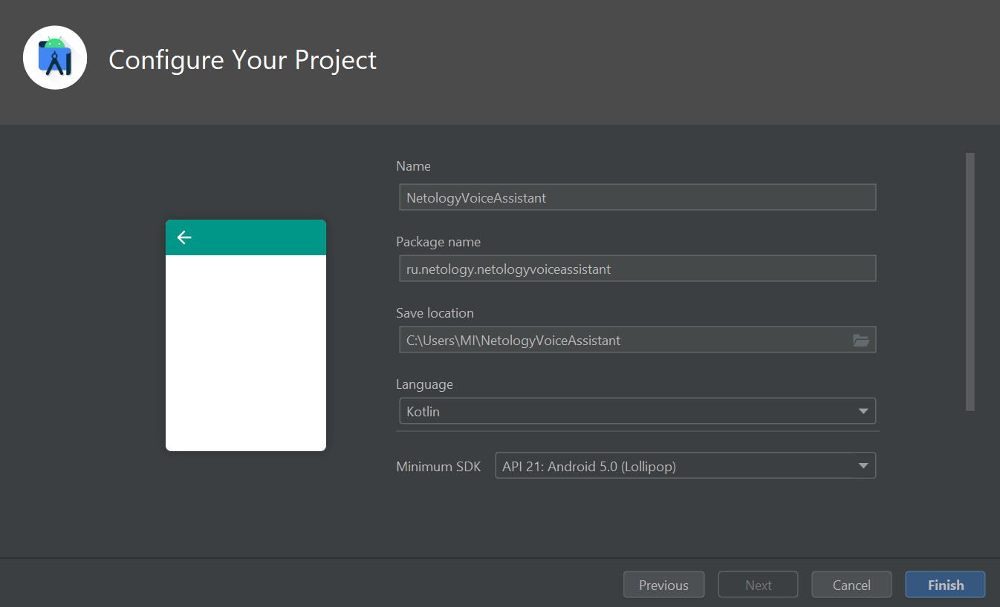

# Инструкция по созданию приложения в Android Studio.

1. Нажмите на кнопку **Create New Project**.

2. Выберите один из шаблонов. Для этого курса мы выбираем **Empty Activity**.

3. Введите домен, название проекта и пространство имён. Пространство имён — это обычно домен, записанный наоборот, и название приложения. 
В нашем случае  домен — **netology.ru**, название приложения — **NetologyVoiceAssistant**, поэтому пространство имён получается **ru.netology.netologyvoiceassistant**.
Выберите минимальную версию Android, на которой будет работать приложение. Чем меньше версия — тем больше людей сможет пользоваться приложением. Чем больше версия, тем больше функций будет доступно вам как разработчику.

