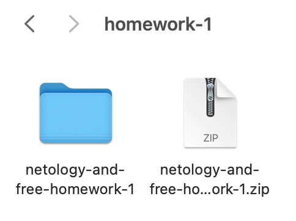
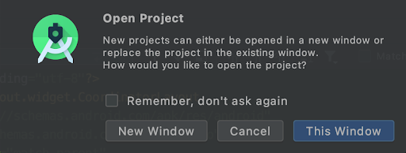
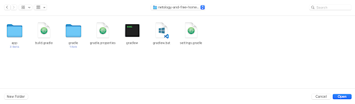
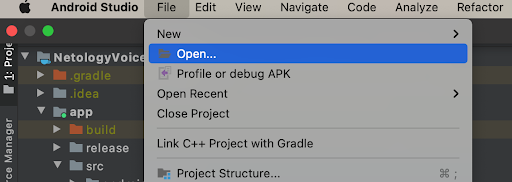

# Как использовать архив с домашним заданием?

1. Скачайте необходимые архивы по ссылкам: 

[Решение домашнего задания 1.](https://github.com/tpom6oh/netology-and-free/archive/homework-1.zip)

[Решение домашнего задания 2.](https://github.com/tpom6oh/netology-and-free/archive/homework-2.zip)

[Решение домашнего задания 3.](https://github.com/tpom6oh/netology-and-free/archive/homework-3.zip)

[Решение домашнего задания 4.](https://github.com/tpom6oh/netology-and-free/archive/homework-4.zip)

2. Распакуйте архив. 

3. Откройте Android Studio и выбирете File -> Open.

4. Откройте папку с содержимым архива, в нашем примере - netology-and-free-homework-1. Нажмите Open.

5. Может появиться такой диалог. Если нажать New Window - откроется новый экземпляр Android Studio с проектом из архива. 
Если нажать This Window - проект откроется в текущем экземпляре Android Studio.

