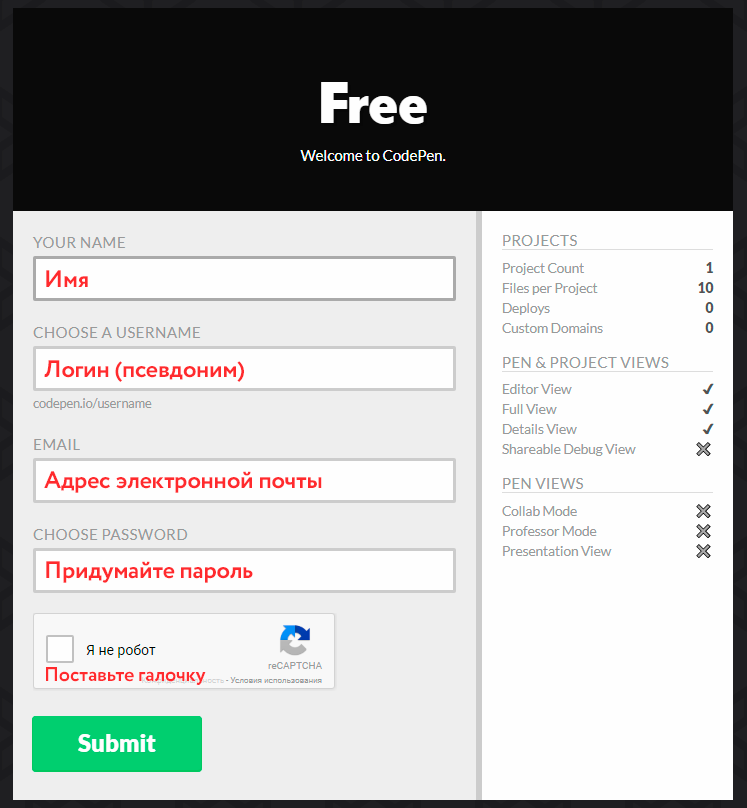
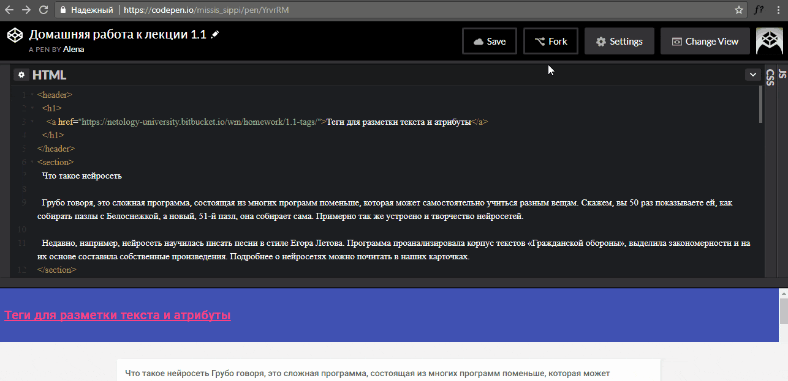
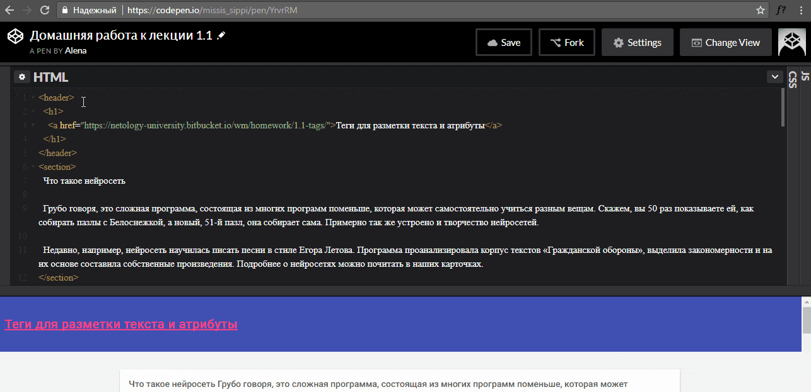
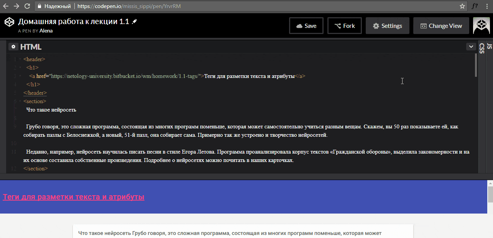

# Инструкция по работе с онлайн-редактором Codepen

1. Перейдите по ссылке на [codepen.io](https://codepen.io).
2. На открывшейся странице заполните форму регистрации. После заполнения нажмите кнопку **Submit**.

3. На следующей странице можете заполнить личные данные. Это не обязательно, на ваше усмотрение. Нажмите кнопку **Save & Continue**.

4. Подтвердите свой аккаунт. Для этого надо перейти по ссылке из вашей электронной почты.
5. Перейдите по ссылке на странице с домашним заданием. Она расположена под заголовком.

6. Перед вами открылось окно, разделенное на две части. В верхней части — редактор HTML. В нижней части вы можете в реальном времени видеть результат вашей работы.

7. Нажмите вверху кнопку **Fork** — это создаст вашу личную копию задания.

8. Выполняйте задание и не забывайте нажимать **Save** после сделанных изменений.

9. Найти сохраненную работу вы сможете на странице [Dashboard](https://codepen.io/dashboard/), в разделе «Pens», отфильтровав пены по значению «Fork».

