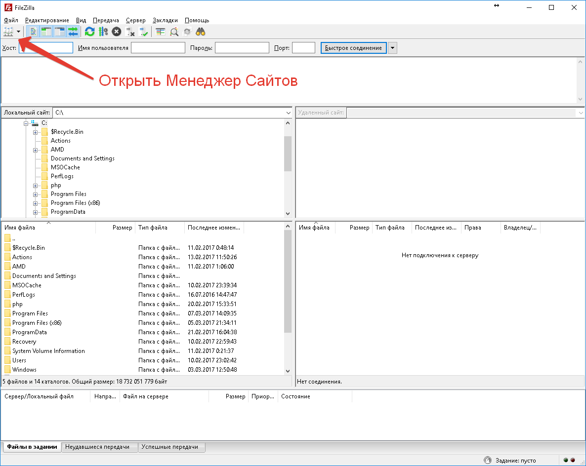
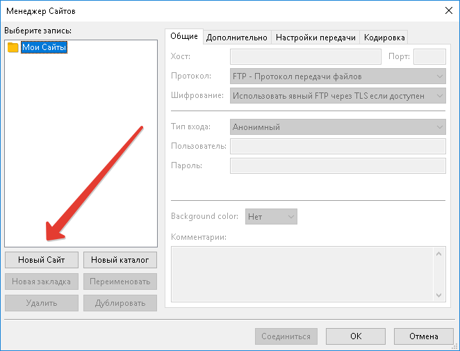
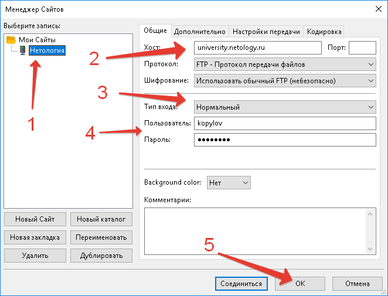
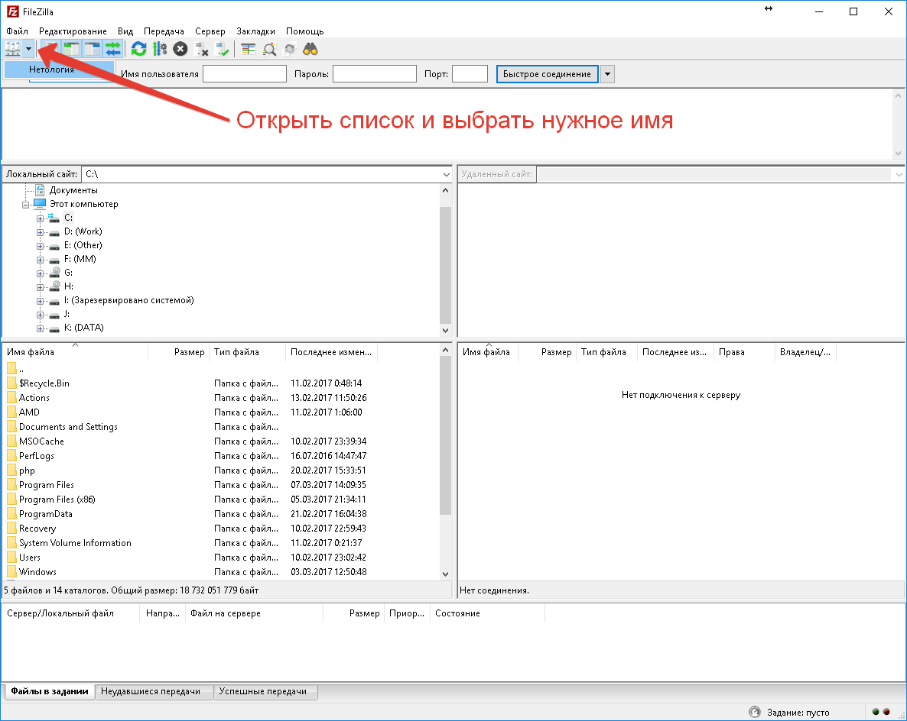
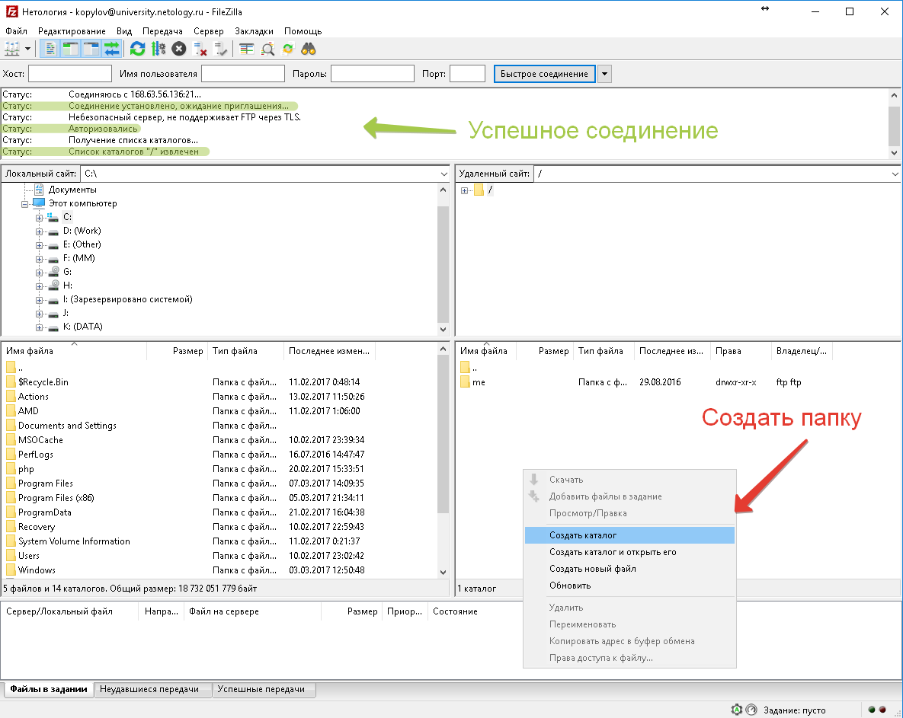
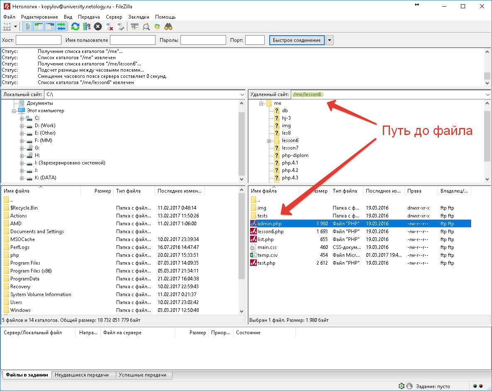
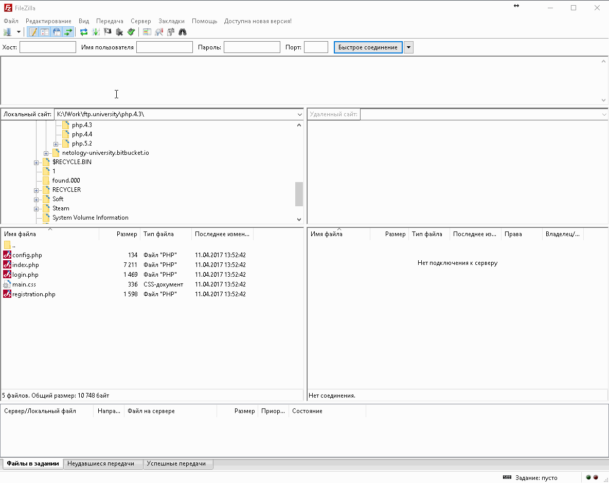

# Инструкция по загрузке файлов на учебный хостинг Нетологии

Для загрузки файлов на учебный хостинг рекомендуем использовать [FTP-клиент FileZilla](https://filezilla-project.org/download.php?type=client) . 

1. Открыть менеджер сайтов.

2. Добавить новый сайт.

3. Заполнить поля «Хост», «Пользователь» и «Пароль» из письма.

4. Открыть список и выбрать необходимый сайт.

5. Убедиться, что соединение прошло успешно. Теперь можно создать/загрузить файл и/или папку.

6. В качестве примера загрузим файл `admin.php` в папку `/me/lesson6`. У вас могут быть любые другие названия файлов и папок.

После загрузки файла нажмите на него правой кнопкой мыши и выберите пункт «Копировать адрес в буфер обмена».

7. Перейдите по ссылке: [конвертер ссылок](https://netology-code.github.io/guides/converter). Вставьте в поле ввода скопированную ссылку и нажмите кнопку «Преобразовать».
После того, как появится второе поле нажмите кнопку «Скопировать».
Эту ссылку нужно будет отправить преподавателю в личном кабинете Нетологии для проверки вашего домашнего задания.

## Весь процесс в одной GIF’ке

