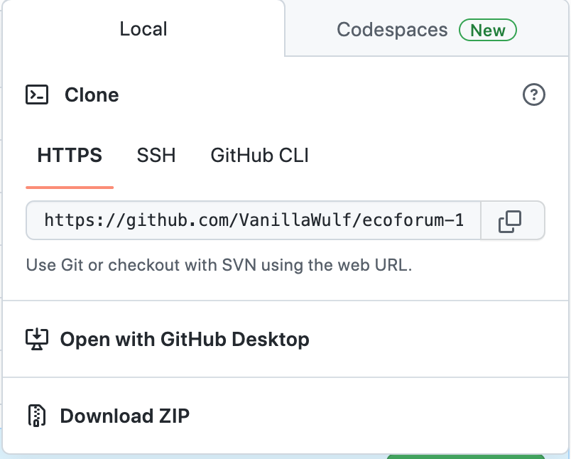
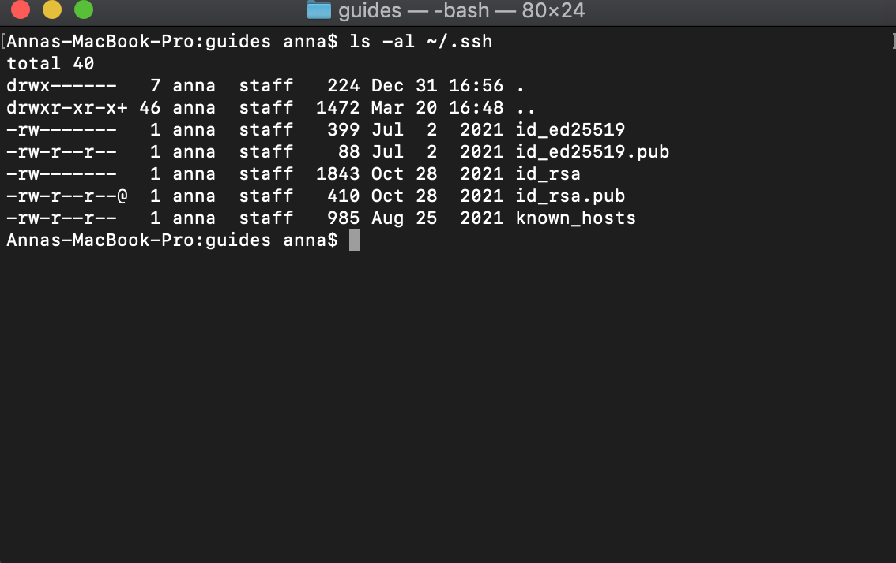
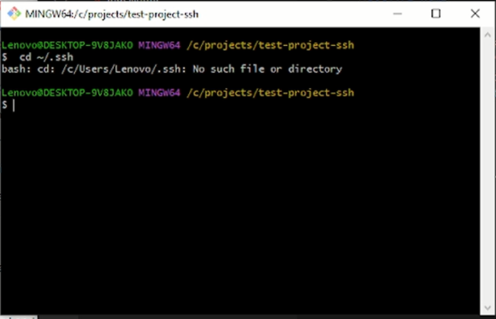
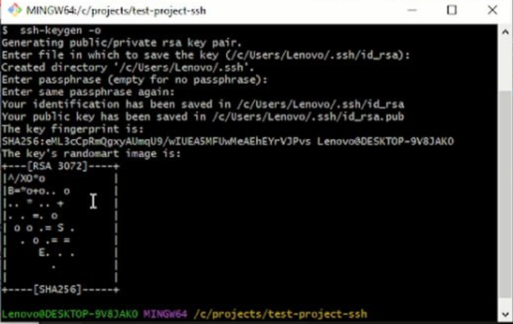
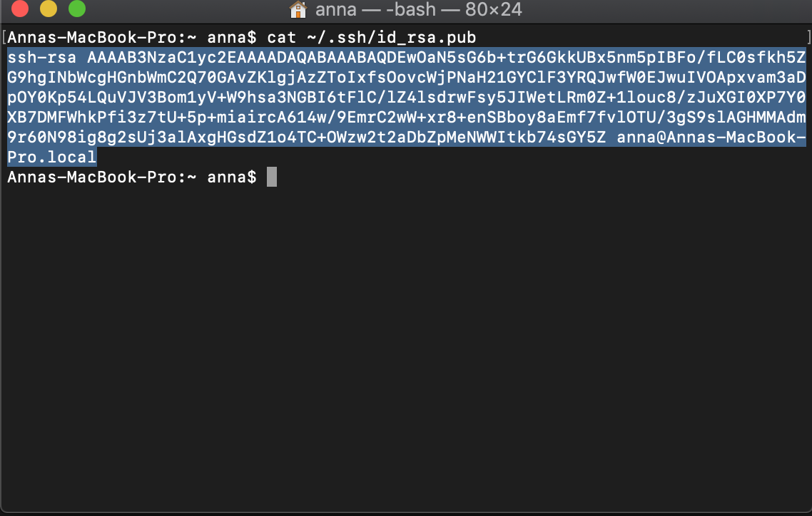
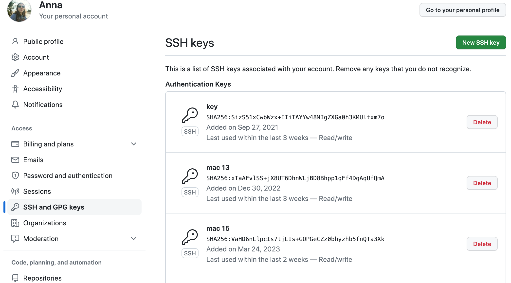
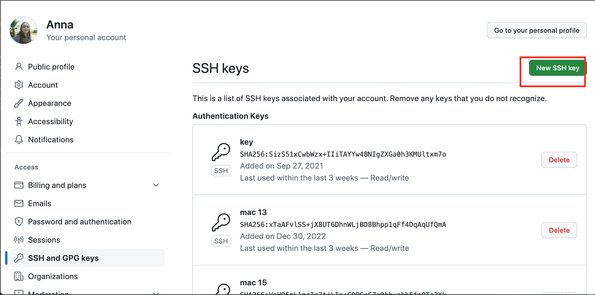

# Зачем нужен ssh

Есть 2 протокола по которому общается компьютер и git:
* https
* ssh

По протоколу https мы раньше могли забирать и публиковать изменения, но в 2021 году это изменилось в целях безопансоти. И теперь по этому протоколу мы не можем делать push (клонировать можем).

Теперь чтобы полноценно использовать github нам нужен настроить ssh между нашим компьютером и guthub.

Ssh основан на принципах публичного и прайват ключа. В одном месте у вас будет храниться публичный ключ, а в другом для расшифровки публичный и приватный ключ.

# Как сделать ssh ключ

1. Для начала вам нужно проверить есть он у вас на компьютере. Зайдите в терминал и введите `ls -al ~/.ssh`
Если ключ уже есть, то можете переходить к пункту  Как добавить ssh ключ в github

Если же его нет, то нам его нужно будет сгенерировать

2. Генерируем ключ командой `ssh-keygen -o`. Генератор попросит вести фразу для генерации, но это делать неоьбязательно, можно просто нажать enter

3. Как добавить ssh ключ в github. Для начала вам надо перейти в файл с публичным ключом. Это можно сделать перейдя в сгенерированый папку .ssh вручную и открыть файл с раширением .pub или ввести команду `cat ~/.ssh/id_rsa.pub`. В этом файл хранится открытый ключ - именно его мы будем вставлять на гитхаб. Скопируйте его полностью.

4. Теперь откройте настройки для своего профиля на github

5. Откройте вкладку с ключами - там происходят вся работа с ключами (удаление и добавление)

6. Нажмите на кнопку 'New SSH key' для того, чтобы добавить ключ

7. Придумайте имя для своего ключа. 1 ключ = 1 компьютер, придумайте такое имя, чтобы было понятно, что это за компьютер, например если это домашний компьютер, то можно сделать home

8. После того, как вы добавите ключ, он у вас появисять в списке. Если вам больше не нужен этот копмьютер, то и доступ можно удалить.
