# Git. Краткое руководство по терминалу

- [Git. Краткое руководство по терминалу](#git-краткое-руководство-по-терминалу)
  - [Введение](#введение)
  - [Открытие терминала](#открытие-терминала)
    - [Linux](#linux)
    - [Mac](#mac)
    - [Windows (Git Bash)](#windows-git-bash)
    - [Первоначальная настройка Git](#первоначальная-настройка-git)
  - [Пути](#пути)
  - [Переменные окружения](#переменные-окружения)
  - [Автодополнение](#автодополнение)
  - [Ключевые команды](#ключевые-команды)
    - [Текущий рабочий каталог](#текущий-рабочий-каталог)
    - [Смена рабочего каталога](#смена-рабочего-каталога)
    - [Листинг каталога](#листинг-каталога)
    - [Создание файлов](#создание-файлов)
      - [nano](#nano)
      - [Vim](#vim)
      - [VS Code](#vs-code)
    - [Создание каталогов](#создание-каталогов)
    - [Перемещение файлов и каталогов](#перемещение-файлов-и-каталогов)
    - [Удаление файлов и каталогов](#удаление-файлов-и-каталогов)
    - [На заметку](#на-заметку)
      - [Важность консольных сообщений](#важность-консольных-сообщений)
      - [Выход из программы вывода текста](#выход-из-программы-вывода-текста)
      - [Копирование/вставка](#копированиевставка)
      - ["Короткий путь"](#короткий-путь)

## Введение

Данное краткое руководство демонстрирует основные команды в терминале Bash:
* Bash (Linux/Mac)
* Git Bash (Windows)

## Открытие терминала

Первая задача: открыть терминал сразу в нужном каталоге.

### Linux

В Linux достаточно щёлкнуть правой кнопкой мыши на каталоге и выбрать пункт меню `Open in Terminal` или `Открыть в терминале`:

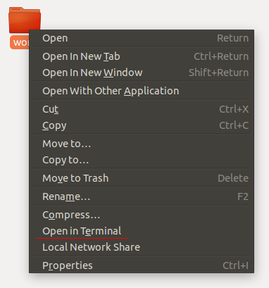

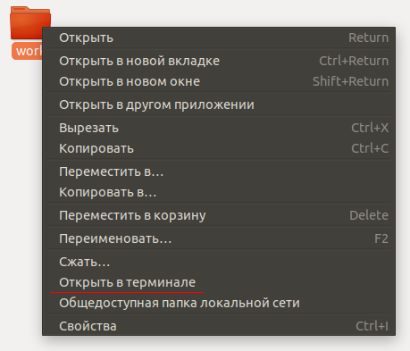


### Mac

В Mac всё немного сложнее, необходимо настроить отображение этого пункта меню в Finder.

Для этого необходимо перейти в `Системные настройки`, затем пункт меню `Клавиатура`, в разделе `Службы` выбрать раздел `Файлы и папки` и поставить флажок напротив `Новый терминал по адресу папки`:

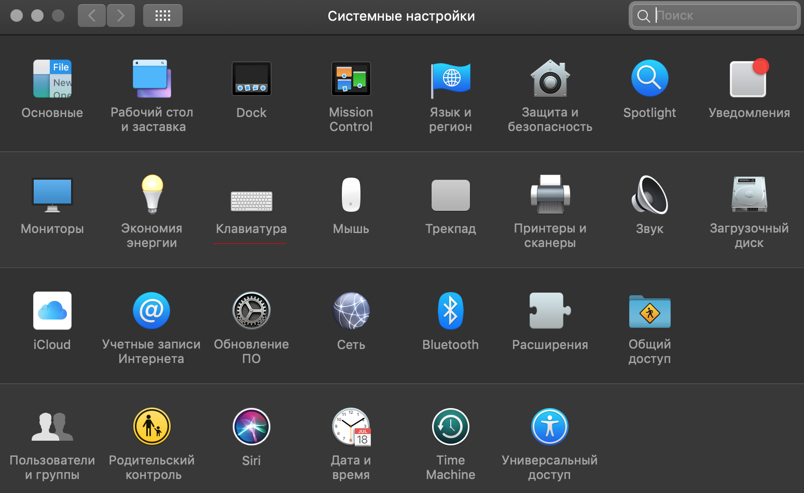

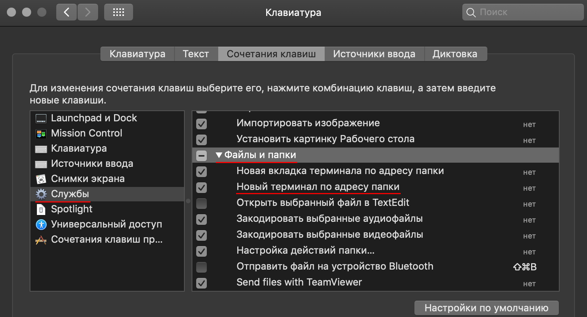


После чего при клике правой кнопкой мыши на каталоге появится необходимый пункт меню:

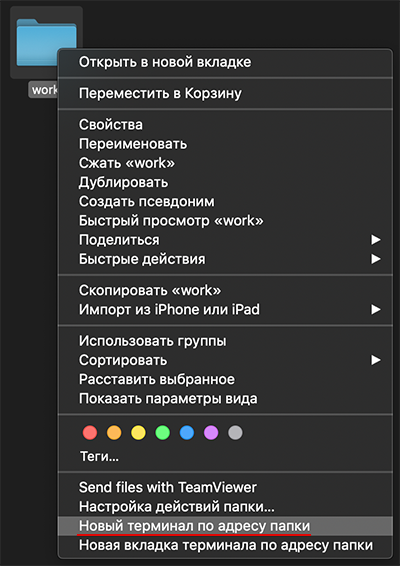

### Windows (Git Bash)

В Windows всё достаточно просто - клик правой кнопкой мыши на каталоге и выбор `Git Bash Here`:

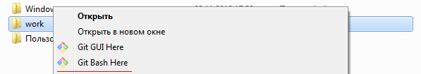

### Первоначальная настройка Git

После установки Git первое, что мы сделаем - укажем наши имя и адрес электронной почты. Это важно, потому как этой информацией подписывается каждый коммит (кто сделал изменения и его электронная почта). Для настройки потребуется ввести команды: 

```shell
$ git config --global user.name "Thorin Oakenshield"
$ git config --global user.email ereborsons@stone.com
```
Если указана опция `--global`, настройки применятся глобально, то есть для всех ваших действий в системе Git. Без этой опции настройки применяются локально, для текущего репозитория, и не влияют на глобальные настройки.

## Пути

Одно окно терминала подразумевает, что вы можете в один момент времени находиться только в одном каталоге, который называется `Current Working Directory` (текущий каталог), так же как и в одном открытом окне `Nautilus`, `Finder` или проводника Windows.

Вы можете выполнять команды относительно текущего каталога или относительно абсолютного пути.

Абсолютный путь - это путь, начинающийся от корня файловой системы. Корень файловой системы обозначается символом `/`.

Например, в Git Bash (Windows) абсолютный путь для каталога `Program Files`, будет чаще всего выглядеть следующим образом: `/c/Program Files/`.

Для домашнего каталога в Ubuntu (Linux), абсолютный путь будет выглядеть следующим образом: `/home/user/`, где `user` - имя пользователя.

Bash (Git Bash в том числе) используют символ `/` для разделения каталогов.

Ещё два специальных обозначения помимо корня файловой системы:
* `.` - обозначает текущий каталог;
* `..` - обозначает родительский каталог.

Важно: в терминале символ ` ` (пробел) является символом, разделяющим команды и опции. Поэтому если в пути есть пробел, то варианта два:
- заключать путь в кавычки, то есть `"Program Files"`;
- использовать символ `backslash` для экранирования пробела: `Program\ Files`.

## Переменные окружения

Командная оболочка устанавливает ряд переменных, которые выполняют специфические функции. Так, переменная с именем `PATH` содержит список путей, в которых будет производиться поиск программы, если вы наберёте её название в терминале.

Для вывода содержимого конкретной переменной используется команда `echo` следующим образом:
```shell
$ echo $PATH
```

Команда `printenv` позволяет отобразить все переменные окружения:
```shell
$ printenv
```

Видно, что в переменных окружения содержится достаточно много информации о системе.

## Автодополнение

В командных оболочках работает автодополнение по клавише `Tab`:
* дополняются имена команд;
* дополняются пути.

Используйте автодополнение, так как оно позволяет сократить время на набор команды.

## Ключевые команды

В этом разделе будут описаны ключевые команды, необходимые нам для работы. Естественно, список этот далеко не полный.

### Текущий рабочий каталог

`pwd` - сокращение от "Print Working Directory".

Отображение текущего рабочего каталога:
```shell
$ pwd
```

### Смена рабочего каталога

`cd` - сокращение от "Change Directory".

Переход в определённый каталог:
```shell
$ cd <path>
```
`path` может быть как абсолютным, так и относительным путём.

Например, перейти на каталог выше:
```shell
$ cd ..
```

Перейти в подкаталог `src`:
```shell
$ cd src 
```
Если перед путём нет слеша - он трактуется как относительный (относительно текущего каталога). 

### Листинг каталога

`ls` - сокращение от "List".

Отображает листинг (содержимое каталога):
```shell
$ ls
```

По умолчанию, `ls` не отображает файлы, начинающиеся с `.`, например, `.gitignore`. Для отображения таких файлов нужно использовать флаг `-a`:
```shell
$ ls -a
```

### Создание файлов

Для создания файлов используются специальные программы (например, для создания текстовых файлов - текстовые редакторы).

В рамках рассмотрения Bash мы рассмотрим два текстовых редактора, которые позволят вам создавать и редактировать файлы в псевдографическом режиме.

#### nano

[_nano_](https://www.nano-editor.org) - простой текстовый редактор.

Для того, чтобы создать файл достаточно ввести команду `nano` и имя файла:
```shell
$ nano README.md
```

Откроется редактор следующего вида:

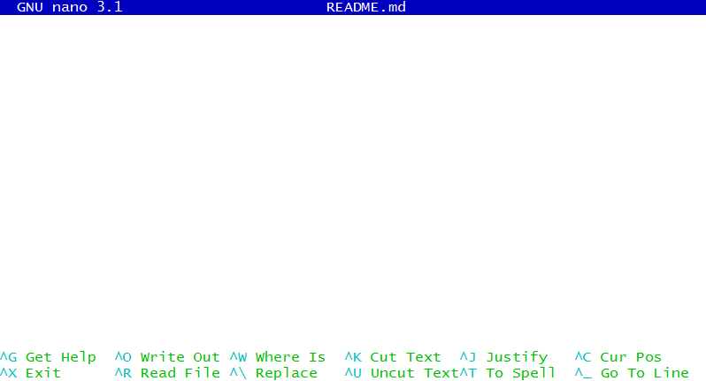

Пункты меню в нижней части вызываются с помощью горячих клавиш, где символ `^` обозначает клавишу `Ctrl`.

То есть чтобы записать файл и выйти следует последовательно нажать `Ctrl + O` (запись) и `Ctrl + X` (выход).

Редактор _nano_ установлен в большинстве Unix-подобных операционных системах и Git Bash.

#### Vim

Редактор [_Vim_](https://www.vim.org/) (a programmer's text editor) - профессиональный редактор, позволяющий достичь максимальной производительности при работе с любыми текстовыми файлами. Настолько популярен, что для любой графической среды (IDE, текстовых редакторов вроде VS Code, Atom, Sublime) всегда есть плагин, включающий возможность редактирования кода в режиме "Vim Mode".

На освоение работы в _Vim_ нужно потратить достаточно много времени, для этого вы можете воспользоваться интерактивным учебником `vimtutor`:
```shell
$ vimtutor
```

Мы лишь скажем, что для выхода из этого редактора (если вы всё-таки осмелились его открыть) нужно нажать клавишу  `Esc`, затем ввести команду `:q!` - это позволит вам закрыть открытый файл без сохранения изменений.

#### VS Code

В видео-лекциях используется [_VS Code_](https://code.visualstudio.com/). В Windows вы можете правой кнопкой открыть каталог сразу в _VS Code_.

В Mac OS и Linux вы можете открыть терминал по адресу папки и в терминале выполнить команду `code . &`, которая откроет выбранный вами каталог в этом редакторе.

Если ни то, ни другое у вас не получилось, то просто откройте _VS Code_ и через `File` - `Open` откройте нужный каталог.

### Создание каталогов

`mkdir` - сокращения от "Make Directory".

Позволяет создавать каталоги (создаст каталог `tmp` в текущем каталоге):
```shell
$ mkdir tmp
```
Стоит обратить внимание на поведение при создании нового каталога в текущей директории. После команды `mkdir name` ваше текущее расположение в терминале не изменится. Для того, чтобы работать внутри созданного каталога, в него требуется перейти командой `cd name`. Это справедливо и при клонировании удалённого репозитория с помощью команды `git clone <repo_url>`. Полностью склонированный репозиторий создаст каталог в текущей директории с именем проекта, в который нужно перейти командой `cd repo_name`.

### Перемещение файлов и каталогов

`mv` - сокращение от "Move".

Перемещение (переименование) файлов и каталогов:
```shell
$ mv tmp temp
```

### Удаление файлов и каталогов

`rm` - сокращение от "Remove".

Удаление файла:
```shell
$ rm README.txt
```

Удаление непустого каталога:
```shell
$ rm -rf temp
```

Для удаления непустого каталога необходимо указать флаги:
* `-r` - удалять рекурсивно;
* `-f` - не спрашивать подтверждения.

### На заметку

#### Важность консольных сообщений

Git является консольной программой - это значит, что у неё нет графического интерфейса, привычного нам по многим оконным приложениям. Программа будет выводить всю важную информацию о своей работе в окно терминала. Обычно программа "молчит", когда команда выполнена успешно. 

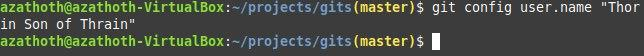

При возникновении ошибок Git обязательно сообщит вам об этом, иногда даже подскажет, как поступить дальше. 

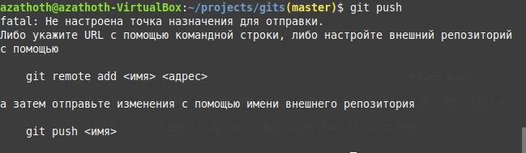

Внимательно изучая вывод программы, вы сохраняете своё время и понимаете работу программы чуть лучше. Это справедливо для всех консольных приложений.

#### Выход из программы вывода текста

Бывает, Git пытается нам сказать намного больше, чем умещается в окне терминала. Для этого он пользуется постраничным выводом и когда ему уже нечего выводить появляется метка конца данных `(END)` или `:END`. Например, конец вывода команды `git log`:

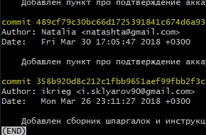

Для того чтобы покинуть программу вывода, нужно нажать клавишу `q` (сокращение от слова "quit" - покинуть) на английской раскладке клавиатуры. 

#### Копирование/вставка

Копирование и вставка из буфера обмена в терминал отличается от тех же действий в обычных текстовых редакторах. Хорошо известная последовательность `Ctrl + C` и `Ctrl + V` нужного эффекта не даст. Некоторые последовательности символов зарезервированы в терминале как управляющие, в частности, `Ctrl + C` служит для прерывания процесса. 
Для того чтобы скопировать выделенную область из терминала в буфер обмена, нужно использовать контекстное меню (правая кнопка мышки) или нажать `Ctrl + Ins`: 

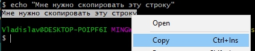

Для вставки в поле ввода терминала можно также воспользоваться контекстным меню мышки или зажать `Shift + Ins`:

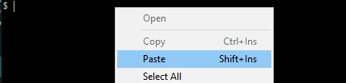

Иногда может работать вставка по нажатию на колёсико мышки (средняя кнопка).

#### "Короткий путь"

Зачастую навигация в терминале сводится к попеременному вводу команд листинга 
```shell
ls -a
```
и, после просмотра содержимого текущей директории, выбору следующей директории.
```shell
cd name
```
Но есть способ короче. Если полностью набрать имя следующей директории и нажать два раза клавишу `Tab`, мы сможем заглянуть внутрь этой директории не прерывая команду.

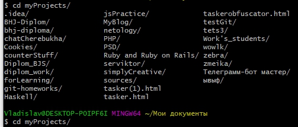

При этом уже набранный текст команды будет на новой строке, а выше мы увидим содержимое следующей директории.
