# Git. Инструкция по установке

# Оглавление
1. [Windows](#windows)
2. [Mac OS](#mac)
3. [Linux](#linux)

## Windows
 
#### Скачайте установочный файл

Перейдите по ссылке [Git Windows](https://git-scm.com/download/win). Скачивание установочного exe-файла для вашей операционной системы должно начаться автоматически. Если этого не произошло, нажмите на ссылку "click here to download manually" (как показано на скриншоте):

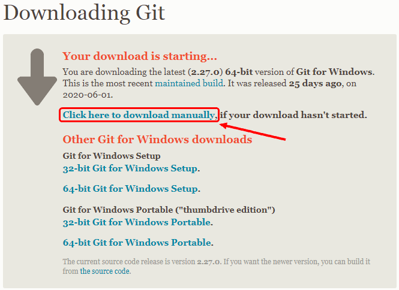

#### 1. Запустите установку
Запустите скачанный на предыдущем шаге exe-файл. Дождитесь появления экрана установки. 

#### 2. Лицензионное соглашение
На первом экране вам предложат согласиться с условиями лицензии GNU GPL. Внимательно их прочитайте, после чего нажмите кнопку `Next` (как показано на скриншоте):

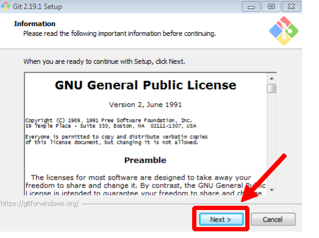

#### 3. Путь установки
Выберите путь для установки Git (лучше его оставить по умолчанию) и нажмите кнопку `Next` (как показано на скриншоте):

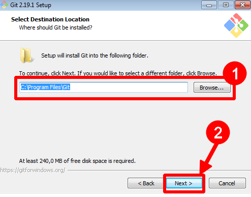

#### 4. Компоненты для установки
Удостоверьтесь, что выбранные опции (флажки) соответствуют приведённым на скриншоте (они выбраны по умолчанию) и нажмите кнопку `Next` (как показано на скриншоте):

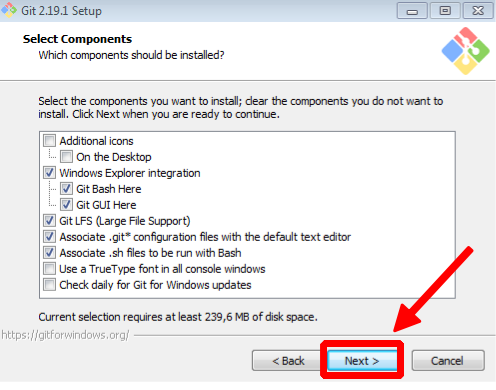

#### 5. Имя пункта меню в Пуск
Оставьте значение по умолчанию `Git` и нажмите кнопку `Next` (как показано на скриншоте):

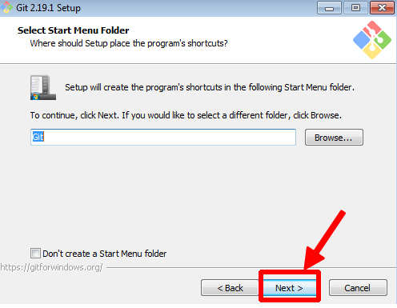

#### 6. Редактор по умолчанию
Выбранный по умолчанию редактор (Vim) достаточно тяжёл для новичков, поэтому выберите из выпадающего списка опцию `Nano Editor` и нажмите кнопку `Next` (как показано на скриншоте):

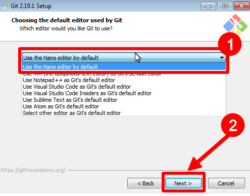

Чуть позже в рамках нашего курса настроим Git на использование другого редактора.

#### 7. Переменная окружения PATH
На данном этапе необходимо выбрать, добавлять ли Git в переменную окружения `PATH`. Это набор путей файловой системы, в которой ищутся запускаемые файлы. Если для вас это звучит не понятно - не расстраивайтесь, эта информация нам не особо нужна. Выберите опцию `Windows Promt` и нажмите кнопку `Next` (как показано на скриншоте):

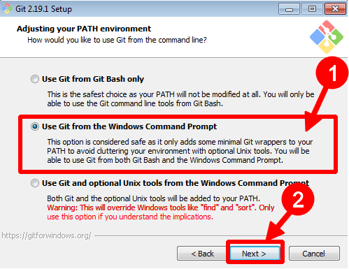

❗️ _Внешний вид этого пункта может отличаться в новых версиях. Выбирайте пункт с подписью **Recommended**_

#### 8. HTTPS
Необходимо выбрать библиотеку, которая будет использована для HTTPS-соединений. Оставьте выбранной опцию `OpenSSL` и нажмите кнопку `Next` (как показано на скриншоте):

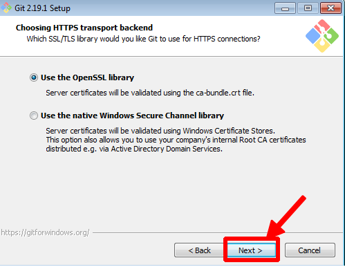

#### 9. Символы окончания строки
Символы, обозначающие окончание строки различаются в Windows и Unix-подобных ОС (Mac OS, Linux, FreeBSD), поэтому выберите опцию `Checkout Windows-style, commit Unix-style line-endings` и нажмите кнопку `Next` (как показано на скриншоте):

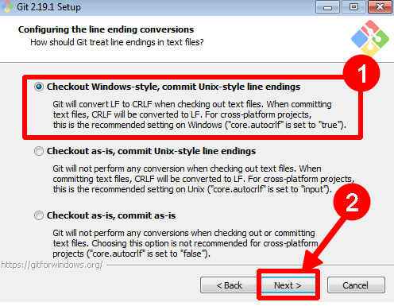

#### 10. Терминал
На данном экране вам предлагают выбрать какой терминал (командную строку) вы будете использовать с Git. Оставьте выбранной по умолчанию опцию `MinTTY` и нажмите кнопку `Next` (как показано на скриншоте):

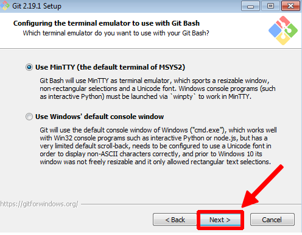

#### 11. git pull
Поведение по умолчанию для `git pull`. Оставьте выбранной опцию Default (fast-forward or merge) и нажмите кнопку `Next` (как показано на скриншоте):

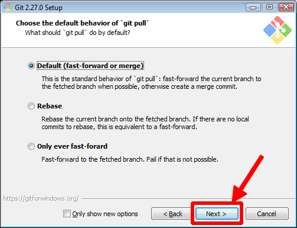

### 12. Credential Manager
Оставьте выбранную опцию по умолчанию и нажмите кнопку `Next` (как показано на скриншоте):

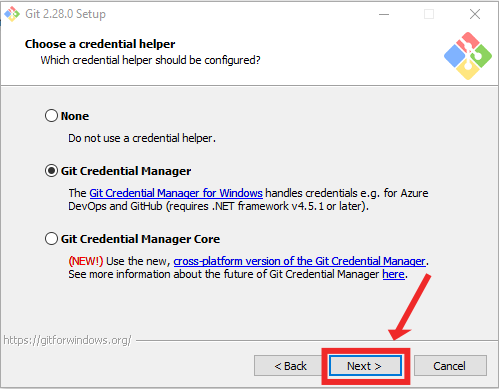

#### 13. Extra-опции
Убедитесь, что установлен флажок только на `Enable file system caching` и нажмите кнопку `Next` (как показано на скриншоте):

#### 14. Экспериментальные опции
Убедитесь, что все экспериментальные опции отключены и нажмите кнопку `Install` (как показано на скриншоте):

#### 15. Завершение установки
Дождитесь завершения установки и нажмите кнопку `Next` (как показано на скриншоте):

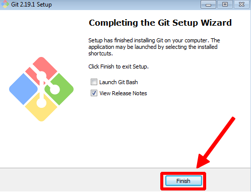

#### Проверка установки
Кликните правой кнопкой мыши на любой папке в Windows, в открывшемся контекстном меню должны появиться две новых опции (как показано на скриншоте):

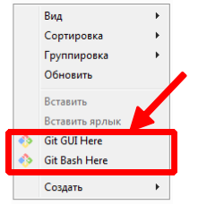

Выберите опцию `Git Bash Here`. Вы должны увидеть окошко, похожее на то, что показано на скриншоте:

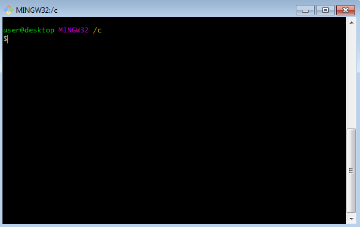

Где `user` - имя вашего пользователя, `desktop` - имя вашего компьютера.

Вы можете настроить фон, шрифты, цвета и остальные параметры кликнув на заголовке окна правой кнопкой мыши и выбрав из выпадающего меню пункт `Options` (как показано на скриншоте):

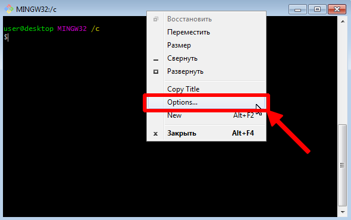

#### Если что-то пошло не так
Вы можете удалить Git через Панель Управления и установить его заново. В любом случае, обязательно сделайте скриншот ошибки и пришлите его и номер шага (на котором произошла ошибка) нашим ассистентам - они вам обязательно помогут.

## Mac OS
 
Есть несколько вариантов:
1. Если вы используете Homebrew
2. Если вы не используете Homebrew

### Установка через Hombebrew

Откройте терминал и запустите команду `brew install git`

### Установка не через Homebrew

#### Скачайте установочный файл

Перейдите по ссылке [Git Mac](https://git-scm.com/download/mac). Скачивание установочного dmg-файла для вашей операционной системы должно начаться автоматически. Если этого не произошло, нажмите на ссылку в разделе Building from Source (как показано на скриншоте).

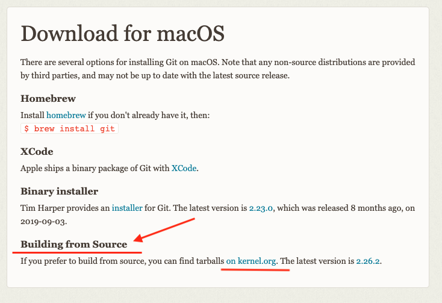

Далее нажмите кнопку Download (как на скриншоте ниже)

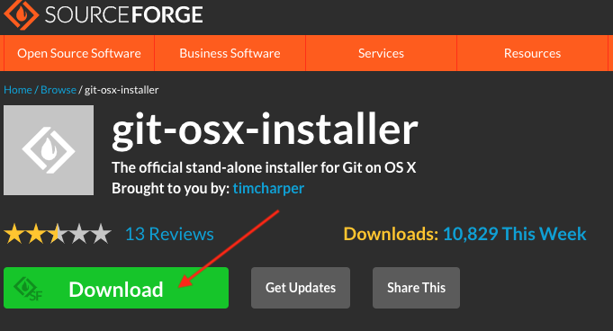

#### 1. Запустите установку

Откройте двойным кликом на скачанном dmg-файле установочный образ. Вы должны увидеть содержимое образа (как показано на скриншоте ниже). Удерживая клавишу `Ctrl` двойным кликом откройте установочный файл:

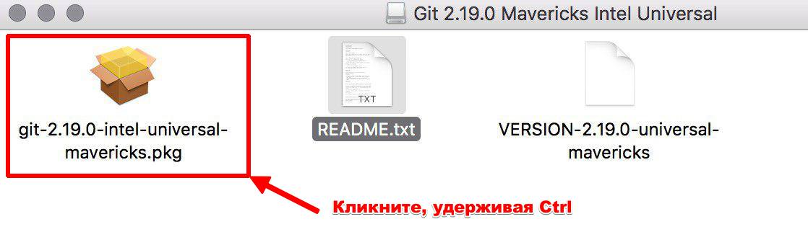

Если вы видите на экране окно, в котором нет кнопки открыть (как на скриншоте ниже), значит вы не удерживали клавишу `Ctrl` при открытии. Попробуйте ещё раз.

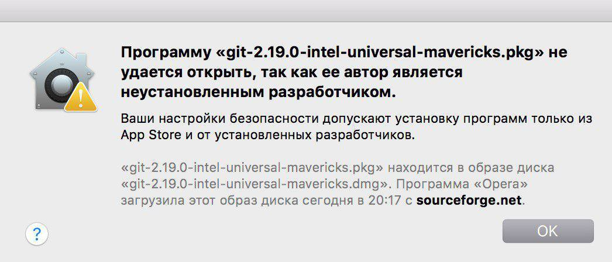

В открывшемся окне нажмите кнопку `Открыть` (как на скриншоте ниже).

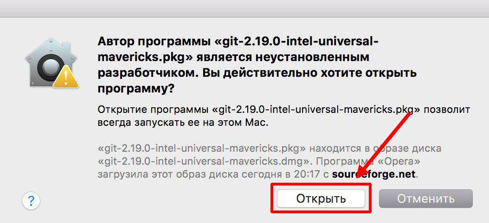

#### 2. Установите Git

В открывшемся окне нажмите кнопку `Продолжить` (как на скриншоте ниже).

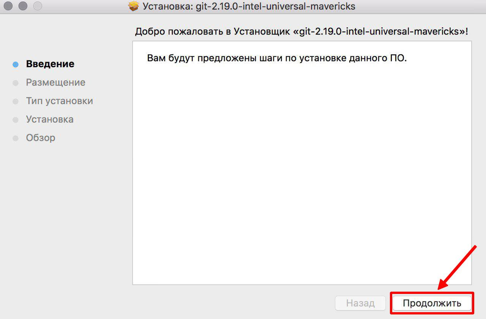

Во всех остальных окнах оставьте настройки по умолчанию и нажимайте на кнопки `Продолжить` или `Установить` (как на скриншоте ниже).

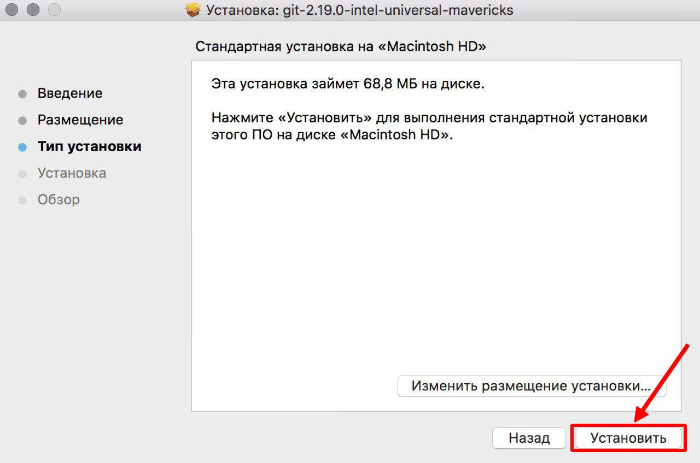

По завершении установки нажмите на кнопку `Закрыть` (как на скриншоте ниже).

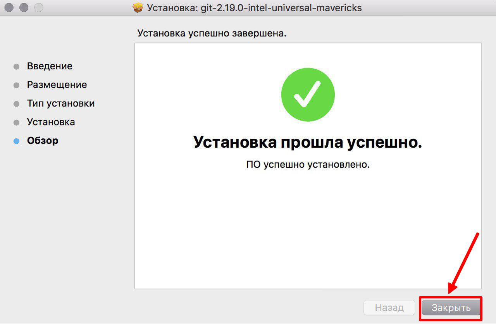

#### Проверка установки

Откройте программу `Terminal` и вбейте команду `git --version`, если вы увидели версию (как на скриншоте ниже), то установка прошла успешно. Обратите внимание, ваша версия может быть новее.

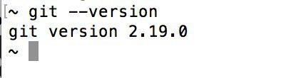

## Linux
 
Откройте терминал и в зависимости от используемого вами дистрибутива запустите от лица суперпользователя команду на установку git:

* Debian/Ubuntu: `apt-get install git`
* Fedora: `yum install git` или `dnf install git`

Дождитесь окончания установки и введите команду: `git --version`

Если на экране отобразиться версия, то установка прошла успешно.

## Если что-то пошло не так

Если вы застряли на каком-то шаге, произошла ошибка или что-то пошло не так, обязательно напишите аспирантам, приложив скриншот ошибки и указав на каком шаге она произошла. Мы вам обязательно поможем!
