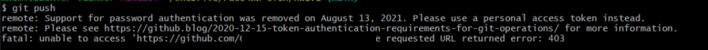

# Решение ошибки 403 при работе с репозиторием



13 августа 2021 GitHub отменил авторизацию по паролю и ввёл авторизацию по токену.

Если вы уже сгенерировали личный токен по [этой инструкции](../github-access-token/), но git закэшировал наши данные и не предлагает их ввести повторно, то вам нужно будет выполнить следующую команду:

```
echo url=https://author@github.com | git credential reject
```

Вместо `author` укажите ваш юзернейм. Обратите внимание, что он должен быть написан с учётом регистра. Большие буквы важны.

После выполнения команды попробуйте выполнить `git push` в репозиторий. Git предложит заново ввести юзернейм и пароль. Вместо пароля вводите сгенерированный токен. 

Пожалуйста, используйте стандартный терминал (командную строку). Команда не всегда срабатывает если выполнять её в терминале редактора кода или IDE. 

Для надёжности не вводите токен руками или при помощи сочетания клавиш `Ctrl` (`Command`) + `V`. Нажмите правой клавишей мыши в окне терминала и выберите пункт «Вставить».

