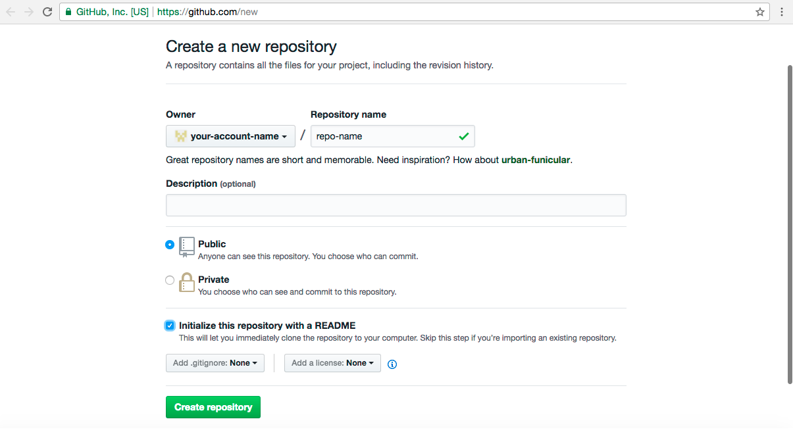
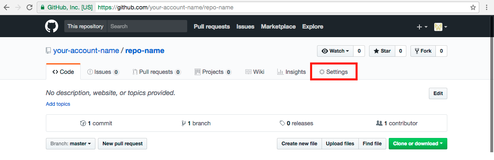
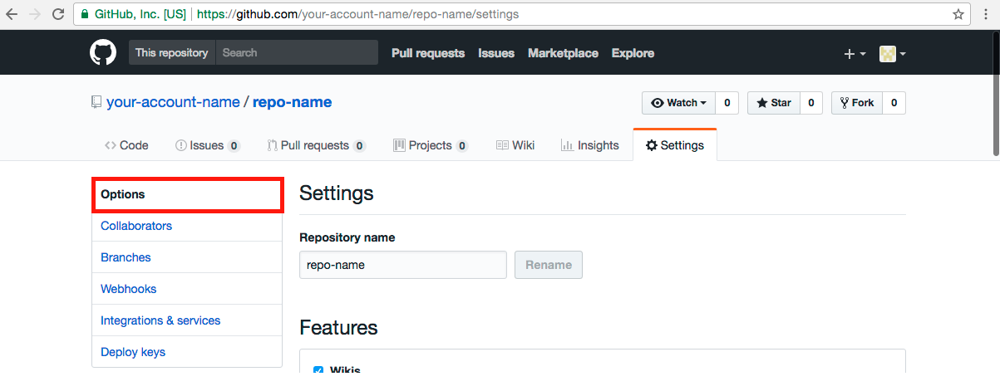
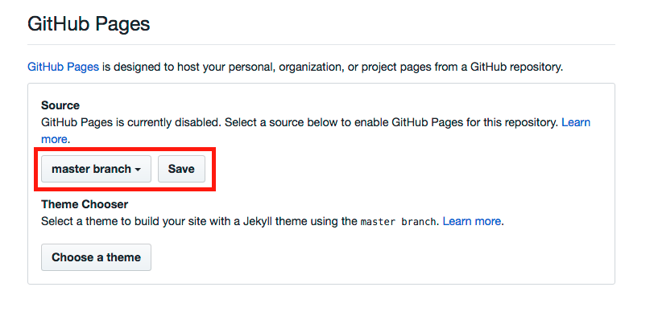
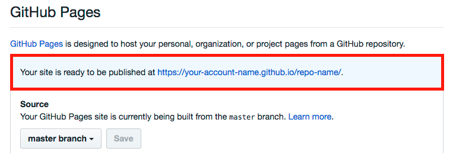
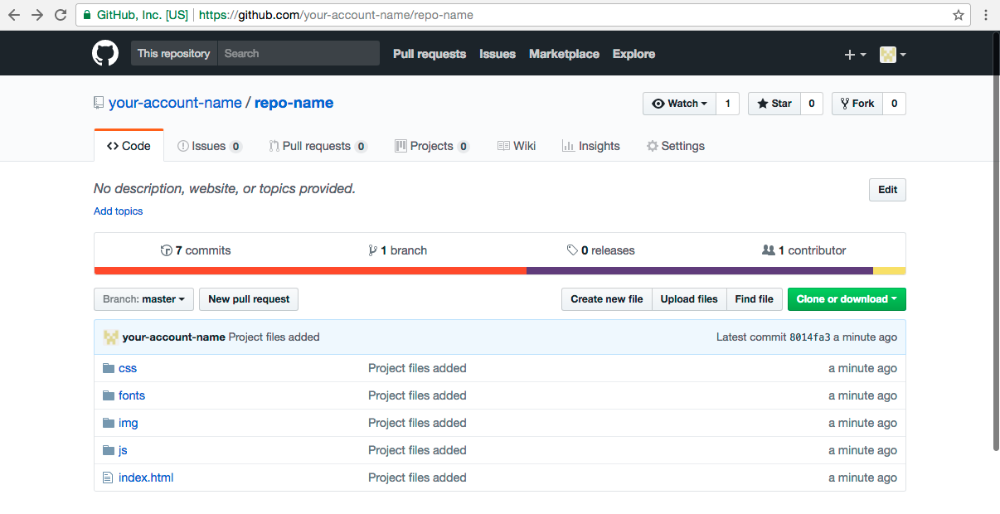

# Инструкция по размещению сайта на GitHub Pages

Для размещения статического веб-сайта можно воспользоваться сервисом [GitHub Pages](https://pages.github.com/). Статический сайт состоит из HTML-страниц с неизменным содержимым. Такие сайты могут использоваться как визитки, портфолио, презентационные страницы.

## Особенности и ограничения
Сервис Github Pages предоставляет следующие возможности для статических сайтов:

* Использование HTML, CSS, языка разметки Markdown;
* Встраивание изображений и другого медиа;
* Использование JavaScript.

Ограничения:

* Нельзя использовать на сайте PHP либо другие серверные языки;
* Серверный код и серверные скрипты выполняться не будут;
* Cookies не используются.

## Как опубликовать сайт на GitHub Pages
1. Создайте аккаунт на [GitHub](https://github.com/). Предположим, *your-account-name* — название вашего аккаунта.
2. [Cоздайте новый репозиторий](https://github.com/new) для вашего проекта. При создании введите название репозитория (например, repo-name), выберите тип репозитория **Public** и нажмите на кнопку **Create repository**:

3. Перейдите в настройки (**Settings**) созданного репозитория:

4. В настройках репозитория найдите вкладку **Options**:

5. Пролистайте вниз и найдите раздел **Github Pages**. Установите в качестве источника файлов вашей страницы ветку **master** созданного репозитория:

6. Как только вы сохраните изменения, появится сообщение о том, что сайт готов к публикации по адресу вида *your-account-name.github.io/repo-name*:

7. Далее загрузите все файлы вашего проекта в ветку **master** созданного репозитория *repo-name*. При этом файл `index.html` должен находиться в корневой директории проекта:

7. Для проверки работы сайта просто перейдите по адресу `https://your-account-name.github.io/repo-name` – и вы увидите свою страницу, загруженную на Github Pages:

