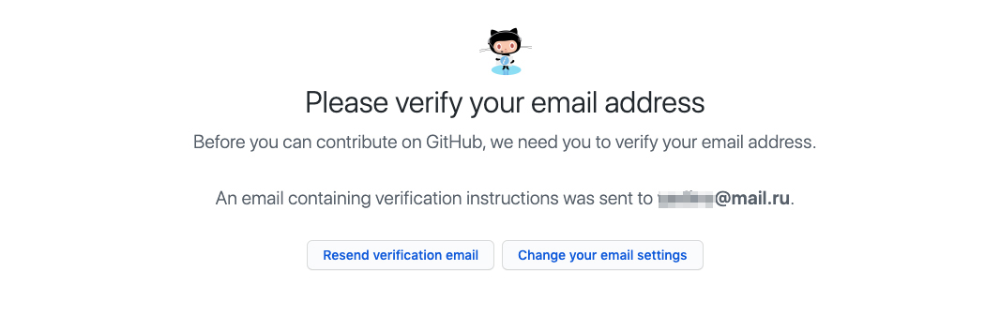

# GitHub. Инструкция по регистрации

## Шаг 0. Ввод учётных данных

Перейдите по ссылке https://github.com. В форме, расположенной в правой части экрана заполните поля:

1. Имя пользователя (под этим псевдонимом будут фиксироваться все ваши действия на GitHub);
1. Email (для регистрации);
1. Пароль (минимум 7 символов, должен содержать цифры).

После чего нажмите кнопку "Sign up for GitHub" (4):

Удостоверьтесь, что все поля прошли валидацию:

## Шаг 1. Верификация аккаунта

Если на предыдущем шаге проблем не возникло, то перед вами откроется страница верификации. Нажмите на ней кнопку "Create an account":

## Шаг 2. Выбор тарифного плана

Для работы нам достаточно будет бесплатного тарифа - Free

## Шаг 3. Анкета

Вы можете ответить на вопросы анкеты или просто нажать на ссылку "Skip this step":

## Шаг 4. Верификация Email

На почту, указанную на первом шаге придёт email со ссылкой для верификации. Необходимо подтвердить, что email принадлежит именно вам:

## Завершение

После выполнения всех описанных выше шагов вы увидите стартовую страницу:

## Если что-то пошло не так

Если вы застряли на каком-то шаге, произошла ошибка или что-то пошло не так, обязательно напишите аспирантам, приложив скриншот ошибки и указав на каком шаге она произошла. Мы вам обязательно поможем!
