# Содержание

* [Термины А–Я](https://github.com/netology-code/guides/blob/master/glossary_qa/README.md#%D0%B0),

* [Термины A–Z](https://github.com/netology-code/guides/blob/master/glossary_qa/README.md#a).

Названия элементов интерфейса:

* [Группировка данных](https://github.com/netology-code/guides/blob/master/glossary_qa/README.md#%D0%B3%D1%80%D1%83%D0%BF%D0%BF%D0%B8%D1%80%D0%BE%D0%B2%D0%BA%D0%B0-%D0%B4%D0%B0%D0%BD%D0%BD%D1%8B%D1%85),
* [Списки](https://github.com/netology-code/guides/blob/master/glossary_qa/README.md#%D1%81%D0%BF%D0%B8%D1%81%D0%BA%D0%B8),
* [Всплывающие](https://github.com/netology-code/guides/blob/master/glossary_qa/README.md#%D0%B2%D1%81%D0%BF%D0%BB%D1%8B%D0%B2%D0%B0%D1%8E%D1%89%D0%B8%D0%B5),
* [Края](https://github.com/netology-code/guides/blob/master/glossary_qa/README.md#%D0%BA%D1%80%D0%B0%D1%8F),
* [Индикаторы](https://github.com/netology-code/guides/blob/master/glossary_qa/README.md#%D0%B8%D0%BD%D0%B4%D0%B8%D0%BA%D0%B0%D1%82%D0%BE%D1%80%D1%8B),
* [Фокус](https://github.com/netology-code/guides/tree/master/glossary_qa#%D1%84%D0%BE%D0%BA%D1%83%D1%81),
* [Инструменты](https://github.com/netology-code/guides/blob/master/glossary_qa/README.md#%D0%B8%D0%BD%D1%81%D1%82%D1%80%D1%83%D0%BC%D0%B5%D0%BD%D1%82%D1%8B),
* [Кнопки](https://github.com/netology-code/guides/blob/master/glossary_qa/README.md#%D0%BA%D0%BD%D0%BE%D0%BF%D0%BA%D0%B8),
* [Счётчики](https://github.com/netology-code/guides/blob/master/glossary_qa/README.md#%D1%81%D1%87%D0%B5%D1%82%D1%87%D0%B8%D0%BA%D0%B8),
* [Ввод данных](https://github.com/netology-code/guides/blob/master/glossary_qa/README.md#%D0%B2%D0%B2%D0%BE%D0%B4-%D0%B4%D0%B0%D0%BD%D0%BD%D1%8B%D1%85),
* [Картинки](https://github.com/netology-code/guides/blob/master/glossary_qa/README.md#%D0%BA%D0%B0%D1%80%D1%82%D0%B8%D0%BD%D0%BA%D0%B8),
* [Прочее](https://github.com/netology-code/guides/blob/master/glossary_qa/README.md#%D0%BF%D1%80%D0%BE%D1%87%D0%B5%D0%B5).

# А

Автоматизация тестирования  (test automation) — использование программного обеспечения для проведения определенных тестовых процессов или помощи в их проведении. Например, управление тестированием, проектирование тестов, выполнение тестов и проверка результатов.

Авторизация — это функция определения прав доступа к ресурсам и управления этим доступом. Это не то же самое, что идентификация и аутентификация: идентификация — это называние лицом себя системе; аутентификация — это установление соответствия лица названному им идентификатору; а авторизация — предоставление этому лицу возможностей в соответствии с положенными ему правами или проверка наличия прав при попытке выполнить действие. Например, авторизацией лицензии на осуществление определённой деятельности — это авторизация.
 
Адаптивная вёрстка (adaptive layout) – вёрстка, при которой шаблоны вёрстки и функционал для различных устройств с разной шириной экрана создаются и определяются заранее. Сервер будет определять устройство пользователя и выводить нужный шаблон и контент.
 
Адрес веб-страницы (URL – Uniform Resource Locator) – уникальный адрес веб-страницы или какого-то другого ресурса в интернете.
 
Альфа-тестирование (alpha testing) — моделируемое или действительное эксплуатационное тестирование потенциальными пользователями, заказчиками или независимой командой на стороне разработчиков, но вне разрабатывающей организации. Альфа-тестирование часто применяется к коробочному программному обеспечению в качестве внутреннего приёмочного тестирования.
 
Анализ граничных значений (Boundary Value Analysis — BVA) — разработка тестов методом чёрного ящика, при котором тестовые сценарии проектируются на основании граничных значений. 
 
Анализатор трафика, или сниффер (от англ. to sniff — нюхать) — программа или устройство для перехвата и анализа своего или чужого сетевого трафика.
 
Аутентификация (от греческого αυθεντικός — реальный или подлинный) — подтверждение подлинности чего-либо или кого-либо. Например, предъявление паспорта — это подтверждение подлинности заявленного имени и отчества.
 
# Б

Баг (дефект) — изъян в компоненте или системе, который может привести к невозможности выполнить требуемую функцию, например, неверный оператор или определение данных. Дефект, обнаруженный во время выполнения, может привести к отказам компонента или системы.
Приоритет багов — важность той или иной ошибки в программном обеспечении:
* trivial — косметическая, малозаметная проблема;
* minor — очевидная, незначительная проблема;
* major — значительная проблема;
* critical — проблема, нарушающая работу c ключевыми функциями ПО;
* blocker — проблема, нарушающая функционирование ПО.

Баг-репорт — документ, описывающий ситуацию или последовательность действий, которая привела к некорректной работе объекта тестирования, с указанием причин и ожидаемого результата.

Баннер — графическое изображение рекламного характера. Баннеры размещают для привлечения клиентов или для формирования позитивного имиджа. 

Бекэнд (backend) — область веб-технологий, работающих на сервере. Внутренняя часть серверной системы, занимается обработкой данных.
 
Белый ящик (White box) — процедура разработки или выбора тестовых сценариев на основании анализа внутренней структуры компонента или системы.
 
Бета-тестирование (beta testing) —  эксплутационное тестирование потенциальными или существующими клиентами или заказчиками на внешней стороне, никак не связанными с разработчиками. Необходимо, чтобы определить, действительно ли компонент или система удовлетворяет требованиям и вписывается в бизнес-процессы. Бета-тестирование часто проводится как форма внешнего приёмочного тестирования готового программного обеспечения, чтобы получить отзывы рынка.
 
Билд (build, сборка, релиз) — сборка программного обеспечения, имеющая определённую версию. Разработчик выпускает новую версию ПО с новыми функциями или исправлениями. Весь сделанный к этому моменту код помечается (версионируется), архивируется, тестируется и собирается (build) в законченный продукт. Это и есть билд.
 
Биллинг (billing) — система выставления счетов клиентам за оказываемые компанией услуги и продаваемые товары. 

Браузер, или веб-обозреватель (browser) — программное обеспечение, предназначенное для просмотра веб-сайтов в интернете. Также может использоваться для просмотра файлов, содержимого веб-документов. Многие современные браузеры поддерживают возможность просмотра документов разных графических форматов, проигрывания аудио и видеофайлов.

Буфер обмена — место в оперативной памяти компьютера, предназначенное для промежуточного хранения любого вида информации: текста или части текста, фото и видеофайлов, аудиофайлов и прочих типов файлов.
 
Бэклог продукта (резерв продукта, product backlog) — в проекте гибкой разработки — распределённый по приоритетам список планируемых задач. Резерв может содержать пользовательские истории, бизнес-процессы, запросы на изменение и разработку инфраструктуры. Рабочие элементы из резерва назначаются на будущие итерации на основе их приоритетов.
 
 
# В
 
Валидация — доказанное объективными результатами исследования подтверждение того, что требования для конкретного использования приложения были выполнены.

Верификация — доказанное объективными результатами исследования подтверждение того, что определённые требования были выполнены.

Владелец продукта (product owner) — представляет интересы конечных пользователей и других заинтересованных в продукте сторон.

Вьюпорт (viewport) — видимая на экране область документа.

# Г

Гайд (guide) — у этого слова много синонимов: справочник, руководство, пособие, план, инструкция, путеводитель. 

Гибкая методология разработки программного обеспечения (agile software development) — группа методологий разработки программного обеспечения, основанных на итеративной поэтапной разработке, где требования и решения развиваются при сотрудничестве между самоорганизующимися межфункциональными командами. 

Гибкое тестирование (agile testing) — способ тестирования для проектов, использующих гибкие методологии разработки программного обеспечения, включающий такие техники и методы, как экстремальное программирование, рассматривающий процесс разработки как потребителя процесса тестирования и делающий упор на парадигму раннего тестирования. 

Гиперссылка (hyperlink) — указатель на веб-странице, ведущий на другие веб-страницы.

Гипертекст — набор или система текстовых страниц, имеющих перекрёстные ссылки. Яркие примеры таких систем —  веб-сайты. В рамках веб-сайтов вы можете переходить по ссылкам с одной страницы на другую. В интернете текст размечается при помощи HTML и изначально предполагает использование гиперссылок.

 
# Д
 
Декомпозиция — разделение одной объёмной сложной задачи на ряд более простых и менее объёмных взаимосвязанных задач.

Динамическое тестирование (dynamic testing) — тестирование с запуском кода на исполнение.

Драйвер  (driver) — компонент программного обеспечения или средство тестирования, которое заменяет компонент, обеспечивающий управление или вызов компонента или системы.
 
Дымовое тестирование (smoke test) — короткий цикл тестов для подтверждения, что после сборки кода, нового или исправленного, приложение стартует и выполняет основные функции.
 
# З

Заглушка (placeholder) — текст, отображаемый в поле ввода формы на сайте до того, как пользователь начинает заполнение этого поля. Обычно используется для подсказки о формате ввода данных. Реализуется при помощи атрибута placeholder для тега input.
 
# И

Идентификация (от латинского identifico — отождествлять) — присвоение субъектам и объектам идентификатора или сравнение идентификатора с перечнем присвоенных идентификаторов. Например, представление человека по имени-отчеству — это идентификация.

Иконка — миниатюрное изображение, представляющее приложение, документ, окно, компонент операционной системы, при нажатии на которое открывается соответствующий файл. Необходима для того, чтобы получить быстрый доступ к запрашиваемому файлу.

Инпут (input) — поле для ввода текста или иной элемент формы на веб-странице.

Инсталляционное тестирование (installation testing) — проверка успешной инсталляции и настройки, а также обновления или удаления программного обеспечения.
 
Инструмент захвата/воспроизведения (capture/playback tool) — инструмент выполнения тестов, в котором входная информация записывается во время ручного тестирования для создания автоматизированного сценария тестирования, который может быть выполнен позже. Эти средства часто используют для поддержки автоматизированного регрессионного тестирования.

Инструмент нагрузочного тестирования (load testing tool) — инструмент для поддержки нагрузочного тестирования, способный эмулировать увеличивающуюся нагрузку: число одновременных пользователей или транзакций во время определённого промежутка времени.

Инструмент отладки (debugging tool) — инструмент, используемый программистами для воспроизведения отказов, исследования состояния программ и поиска соответствующего дефекта. Отладчики позволяют программистам исполнять программу пошагово для останова на любом операторе программы и для установки и проверки программных переменных.
 
Интеграционное тестирование  (integration testing) — тестирование, выполняемое для обнаружения дефектов в интерфейсах и во взаимодействии между интегрированными компонентами или системами. 
 
Исследовательское тестирование (exploratory testing) —  неформальный метод проектирования тестов, при котором тестировщик активно контролирует процесс, пока эти тесты выполняются, и использует полученную во время тестирования информацию для проектирования новых и улучшенных тестов.

Итерация — однократное выполнение тела цикла.
 
# К
 
Кеширование — технология, при которой документ загружается один раз и результат загрузки сохраняется. В следующий раз при обращении к документу, если он не был обновлён, будет загружена сохранённая версия. Это помогает сократить время ожидания.
 
Консольное тестирование — тестирование приложений, предназначенных для консолей.
 
Контекстное меню (context menu) — элемент графического интерфейса операционной системы, представляющий собой список команд, вызываемый пользователем для выбора необходимого действия над выбранным объектом. Команды контекстного меню относятся к тому объекту, над которым это меню было вызвано.

Концепция дизайна (эскиз, макет, mockup) — графический файл, который состоит из наиболее мелких картинок-слоёв элементов общего рисунка.
 
Конфигурационное тестирование (configuration testing) — специальный вид тестирования, направленный на проверку работы программного обеспечения при различных конфигурациях системы: заявленных платформах, поддерживаемых драйверах, при различных конфигурациях компьютеров и т. д.
 
Краш-лог (crash log) — файл, в котором хранится вся информация об ошибке неработоспособности или экстренного завершения работы программы.
 
# Л

Логин (login) — сетевое имя пользователя. Как часть реквизитов доступа к закрытым данным, логин почти всегда сопровождается паролем. У каждого пользователя может быть много логинов для доступа к разным данным. Они могут использоваться для доступа к системе управления сайтом, электронной почте и другим ресурсам.
 
Лейаут — одна из составляющих графического дизайна, расположение визуальных элементов страницы или интерфейса, структурированное отображение информации на плоскости.

# М

Матрица соответствия требований (traceability matrix) — это двумерная таблица, содержащая соответствие функциональных требований (functional requirements) продукта и подготовленных тестовых сценариев (test cases).

Метод проектирования тестов (test design technique) — методика, используемая для создания или выбора тест-кейсов.
 
Мобильное тестирование — тестирование мобильных приложений.

Мобильное приложение (mobile application) — специально разработанное приложение под конкретную мобильную платформу (iOS, Android, Windows Phone).

Мобильный веб-сайт (mobile website) — специализированный сайт, адаптированный для просмотра и функционирования на мобильном устройстве.

Мобильная операционная система (mobile OS) — операционная система для смартфонов, планшетов, КПК или других мобильных устройств.

Модульное (компонентное) тестирование (component testing) — тестирование отдельных компонентов программного обеспечения.

Мультитач (multi-touch) —  функция сенсорных систем ввода — сенсорный экран, сенсорная панель — осуществляющая одновременное определение координат двух и более точек касания.

# Н

Набор тестов (test suite, тест сьют) — комплект тестовых наборов для исследуемого компонента или системы, в котором обычно постусловие одного теста используется в качестве предусловия для последующего.
 
Нагрузочное тестирование (load testing) — вид тестирования производительности, проводимый с целью оценить поведение компонента или системы под увеличивающейся нагрузкой для определения максимально допустимого уровня нагрузки для исследуемого компонента или системы. 
 
Негативное тестирование (negative testing) — тестирование, нацеленное на демонстрацию того, что система или компонент не работают. Негативное тестирование относится в большей степени к позиции тестировщика, нежели к определённому подходу к тестированию или методу проектирования тестов. Например, тестирование с некорректными входными значениями или тестирование обработки исключений.
 
Нефункциональное тестирование (non-functional testing) — тестирование атрибутов компонента или системы, не относящихся к функциональности, то есть надёжность, эффективность, практичность, сопровождаемость и переносимость.
 
# О
 
Обеспечение качества (quality assurance — QA) — совокупность мероприятий, охватывающих все технологические этапы разработки, выпуска и эксплуатации программного обеспечения.

Отказ (failure) — отклонение компонента или системы от ожидаемого выполнения, эксплуатации или результата. 
 
Отладка, или дебаг (debugging) — процесс, позволяющий получить программное обеспечение, функционирующее с требующимися характеристиками в заданной области входных данных.
 
Отчёт о дефекте (defect/bug/problem report) — документ, содержащий отчёт о любом недостатке в компоненте или системе, который может привести компонент или систему к невозможности выполнить требуемую функцию. 
 
Ошибка (error) — действие, которое порождает неправильный результат.

# П

Пароль (password) — условное слово или набор знаков, предназначенный для подтверждения личности или полномочий. Пароли часто используются для защиты информации от несанкционированного доступа.

Парсер — скрипт или программа, используемые для сбора информации с сайтов.
 
Повторное тестирование, или подтверждающее тестирование (confirmation testing) — тестирование, при котором выполняются тестовые сценарии, которые были не пройдены при последнем запуске, с целью подтвердить успешность исправлений.
 
Пользовательская история, или юзер стори (user story) — высокоуровневое пользовательское или бизнес-требование, обычно использующееся в гибких методологиях разработки программного обеспечения. Обычно состоит из одного или нескольких предложений на разговорном или формальном языке, включающих в себя критерии приёмки и описывающих функциональность, необходимую пользователю, любые нефункциональные требования. 
 
Пользовательский опыт (user experience — UX) — совокупность впечатлений и субъективных ощущений от взаимодействия с интерфейсом программы или сайта.
 
Позитивное тестирование (positive testing) — тестирование ПО на то, как оно должно работать.
 
Предугадывание ошибки (error guessing — EG) — метод проектирования тестов, когда опыт тестировщика используется для предугадывания того, какие дефекты могут быть в тестируемом компоненте или системе в результате сделанных ошибок, а также для разработки тестов специально для их выявления.

Программное обеспечение (software) — компьютерные программы, алгоритмы и зачастую документация и данные, относящиеся к функционированию компьютерной системы. 
 
Продакшн (production, prod, прод) — сервер, обычно подразумевают железо или как минимум виртуализированную операционную систему, на котором приложение выполняется для нужд конечных клиентов. Может существовать и тестовый сервер, на котором, в отличие от боевого, приложение просто тестируют.

Приёмочное тестирование (acceptance testing) — формальное тестирование по отношению к потребностям, требованиям и бизнес-процессам пользователя, проводимое для определения соответствия системы критериям приёмки, чтобы дать возможность пользователям, заказчикам или иным авторизированным лицам определить, принимать систему или нет. 

Причина/следствие (cause/effect — CE) — это, как правило, ввод комбинаций условий (причин), для получения ответа от системы (следствия).

# Р

Регрессионное тестирование (regression testing) — тестирование уже протестированной программы, проводящееся после модификации для уверенности в том, что процесс модификации не внёс или не активизировал ошибки в областях, не подвергавшихся изменениям. Проводится после изменений в коде программного продукта или его окружении.
 
Редирект — автоматическое перенаправление пользователей с одного сайта на другой или с одной страницы сайта на другую.
 
Релиз (release) — выпуск или выход в свет какого-либо продукта, компьютерной программы, а также окончательная версия программы. 

Релиз-кандидат (release candidate — RC) — пре-релиз, иногда «гамма-версия» — стадия-кандидат на то, чтобы стать стабильной.

Релиз ноут, или сопроводительная записка (release note) — документ, идентифицирующий объекты для тестирования, их конфигурацию, текущий статус и полную необходимую информацию, предоставляемую разработчиками тестировщикам и иным заинтересованным лицам в начале этапа выполнения тестов. 
 
Ручное тестирование (manual testing) — тестирование без использования программных средств, для проверки программы или сайта путём моделирования действий пользователя.

# С
 
Санитарное тестирование (sanity testing) — это узконаправленное тестирование, достаточное для доказательства того, что конкретная функция работает согласно заявленным в спецификации требованиям.
 
Сбой (failure) – несоответствие фактического результата работы компонента или системы ожидаемому результату.

Свободное тестирование (ad hoc testing) — тестирование, выполняемое неформально, без формальной подготовки тестов, формальных методов проектирования тестов, определения ожидаемых результатов и руководства по выполнению тестирования.

Серьёзность (severity) — это атрибут, характеризующий влияние дефекта на работоспособность приложения.

Сенсорный экран (touchscreen) — устройство ввода информации, представляющее собой экран, реагирующий на прикосновения к нему.
 
Сервер — в веб-разработке чаще всего под этим термином подразумевают набор серверного программного обеспечения, выполняющего сервисные, то есть обслуживающие задачи по запросу пользователя. В итоге работы сервер должен предоставить пользователю доступ к определённым функциям или услугам.

Сессия (session) — механизм однозначной идентификации браузера, при котором на сервере создаётся файл для данного сеанса, в котором хранятся данные.

«Сначала мобильные» (mobile first) — подход к разработке адаптивных веб-сайтов, при котором проектирование и вёрстка интерфейса начинаются с версии для мобильных устройств.

Сниппет — небольшой отрезок текстовой информации, который выводится рядом с ссылкой в поисковой выдаче. Другими словами, это краткое описание страницы сайта, релевантное поисковому запросу.

Событие в веб-аналитике — это действие пользователя на сайте, которое невозможно отследить в системах веб-аналитики с помощью задания URL-страниц, количества просмотров или длительности посещения. Например, событие позволяет отслеживать клики по кнопкам, которые не переводят пользователя на другой URL; скроллинг на странице; взаимодействие с чатом или баннером на сайте. Чтобы отследить событие, надо прописать его код в том элементе, который необходимо отслеживать.

Страницы пагинации — ограниченный показ части информации, используемый для того, чтобы разбить большой массив данных на веб-странице и представить результаты по нескольким страницам. Например, когда в категории товаров размещён список товаров, разбитый постранично для показа пользователю.
 
Симуляторы — программные и аппаратные средства, создающие впечатление действительности, отображая часть реальных явлений и свойств в виртуальной среде.
 
Смартфон (smartphone) — мобильный телефон, дополненный функциональностью карманного персонального компьютера.

Спецификация — детальное описание того, как должно работать ПО.

Стадии разработки ПО — это этапы, которые проходят команды разработчиков ПО, прежде чем программа станет доступной для широкого круга пользователей.

Сплит-тестирование, (A/B testing, А/В тестирование, split testing) — метод маркетингового исследования, позволяющий сравнивать контрольную группу элементов с тестовой, в которой один или несколько показателей были изменены, чтобы выяснить, какие же из изменений могут улучшить целевой показатель. Пример A/B тестирования — исследование влияния размеров элементов интерфейса и их расположения на конверсию сайта.

Стрессовое тестирование (stress testing) — вид тестирования производительности, оценивающий систему или компонент на граничных значениях рабочих нагрузок или за их пределами, или же в состоянии ограниченных ресурсов, таких как память или доступ к серверу. 

Система отслеживания ошибок (англ. bug tracking system) — программа учёта и контроля багов. Например:
* Atlassian Jira,
* Bugzilla,
* YouTrack,
* Redmine.

 
Системное тестирование  (system testing) — процесс тестирования системы в целом с целью проверки того, что она соответствует установленным требованиям.
 
Статическое тестирование (static testing) — тестирование без запуска кода на исполнение.

 
# Т
 
Тестирование — процесс проверки соответствия заявленных к продукту требований и реально реализованной функциональности, осуществляемый путем наблюдения за его работой в искусственно созданных ситуациях и на ограниченном наборе тестов, выбранных определенным образом.

Тестирование удобства использования — тестирование, направленное на исследование того, насколько конечному пользователю понятно, как работать с продуктом, а также на то, насколько ему нравится использовать продукт.

Тестирование доступности  (accessibility testing) -  Тестирование, которое определяет степень легкости, с которой пользователи с ограниченными способностями могут использовать систему или ее компоненты

Тестирование интерфейса  (interface testing) - Тип интеграционного тестирования, связанный с тестированием интерфейсов между компонентами или системами.

Тестирование безопасности (safety testing) — тестирование, направленное на проверку способности приложения противостоять злонамеренным попыткам получения доступа к данным или функциям

Тестирование локализации (localisation testing) — тестирование, направленное на проверку корректности и качества адаптации продукта к использованию на том или ином языке с учётом национальных и культурных особенностей.

Тестирование совместимости или тестирование взаимодействия (compatibility testing) — тестирование, направленное на проверку способности приложения работать в указанном окружении (браузер, мобильное ус-во и т.д.).

Тестирование использования ресурсов — (resource utilization testing): Процесс тестирования, исследующий использование ресурсов программным продуктом. 

Тестирование восстанавливаемости (recoverability testing) Процесс тестирования, исследующий восстанавливаемость программного продукта. 

Тестирование отказоустойчивости (failover testing) -  Тестирование при помощи эмуляции отказов системы или реально вызываемых отказов в управляемом окружении. После вызванного отказа проверяется механизм отказоустойчивости с целью удостовериться, что данные не потеряны или не испорчены, и достигнут оговоренный уровень обслуживания (например, доступности функций или время отклика).

Тестирование производительности — (performance testing): Процесс тестирования с целью определить производительность программного продукта.

Тестирование сборки (англ. Build Verification Test) — тестирование направленное на определение соответствия, выпущенной версии, критериям качества для начала тестирования.

Тестирование пользовательского интерфейса (англ. UI Testing) — тестирование, выполняемое с целью определения, удобен ли некоторый искусственный объект (такой как веб-страница, пользовательский интерфейс или устройство) для его предполагаемого применения.

Тест кейс (англ. Test Case) — Набор входных значений, предусловий выполнения, ожидаемых результатов и постусловий выполнения, разработанный для определенной цели или тестового условия, таких как выполнения определенного пути программы или же для проверки соответствия определенному требованию.

Тест дизайн (англ. Test design) — это этап процесса тестирования ПО, на котором проектируются и создаются тестовые случаи (тест кейсы).

Тест план (англ. Test Plan) — Документ, описывающий цели, подходы, ресурсы и график запланированных тестовых активностей. Он определяет объекты тестирования, свойства для тестирования, задания, ответственных за задания, степень независимости каждого тестировщика, тестовое окружение, метод проектирования тестов, определяет используемые критерии входа и критерии выхода и причины их выбора, а также любые риски, требующие планирования на случай чрезвычайных обстоятельств
 
# У
 
Утилита (англ. utility) — дополнительная компьютерная программа, входящая в состав общего программного обеспечения и предназначенная для специализированных задач, которые расширяют возможности операционных систем и оборудования.
 
# Ф

Фавикон (FAVorites ICON, в переводе — «значок для избранного») -  небольшое изображение отображается во вкладке браузера, в которой открыт сайт, рядом с title открытой страницы. Также его можно увидеть в результатах выдачи поисковой системы Яндекс слева от заголовка страницы.
 
Фокус-тест (англ. Focus test) — тестирование, проводимое с целью получения первичной реакции игроков. Необходимо для оценки удобства использования и того, как продукт принимается целевой аудиторией или сторонними людьми.

Фронтенд (frontend) область технологий для разработки веб-интерфейсов, включает вспомогательные инструменты и технологии, работающие в браузере.
Внешняя часть серверной системы, отвечающая за приём данных, отправку ответов и генерацию кода для браузера.

Фидбек - отзыв пользователя.

Фронт-офис — отделы компании, которые в первую очередь напрямую работают с клиентами и для клиентов.
 
Функциональное тестирование  (functional testing):  - Тестирование, основанное на анализе спецификации функциональности компонента или системы. 

Футер Footer (подвал) – область в самом конце страницы. Подвал располагается в самом низу и чаще всего (но не обязательно) дублирует пункты меню, логотип.
 
# Х

Хлебные крошки (от англ. breadcrumbs) — дополнительная навигация на сайте, отображающая последовательность страниц, указывающих на местоположение пользователя на сайте относительно главной страницы.

Хостинг -  Предоставление ресурсов для размещения информации (сайта) на сервере в сети интернет.
  
# Ч

Чек-лист (англ. Check list) — это документ, описывающий что должно быть протестировано.
 
Черный ящик (англ. Black box) — Процедура создания и/или выбора тестовых сценариев, основанная на анализе функциональной или нефункциональной спецификации компонента или системы без знания внутренней структуры.
 
# Ш

Шапка сайта (header) - Характерная повторяющаяся на всех страницах часть сайта, расположенная в самом верху страницы. Часто включает в себя логотип, навигацию, контакты.
 
# Э

Эквивалентное Разделение (англ. Equivalence Partitioning — EP).  Разработка тестов методом черного ящика, в которой тестовые сценарии создаются для проверки элементов эквивалентной области. 

Экстеншн - маленькая программа, которая модифицирует и дополняет функциональность браузера 

Эмулятор  (emulator): Устройство, компьютерная программа или система, которая принимает те же самые входные данные и выдаёт те же самые выходные данные, что и данная система

Эквайринг — приём к оплате платежных карт через банк-эквайрер с помощью установленных на местах продаж платёжных терминалов. Интернет-экваринг позволяет совершить оплату картой через интернет с использованием веб-интерфейса, предоставляемого банком или платежной системой.

# Ю

Юникод (Unicode) — принцип кодирования символов, позволяющий представить почти любой знак существующих письменных языков

[Вернуться к содержанию](https://github.com/netology-code/guides/blob/master/glossary_qa/README.md#%D1%81%D0%BE%D0%B4%D0%B5%D1%80%D0%B6%D0%B0%D0%BD%D0%B8%D0%B5)

 
# A

ADB (Android Debug Bridge, отладочный мост Андроид) – компонент Android SDK, который устанавливает связь между устройством и компьютером и позволяет прямо на компьютере выполнять различные манипуляции с системой Android.

API (Application Programming Interface) — описание классов, методов, функций и переменных, которые приложение использует для выполнения поставленной задачи.

# В

Breakpoints (переломные/контрольные точки) —  изменение условий с одного на другое, при котором внешний вид сайта (раскладка) изменяется. 

# С

Completely Automatic Public Turing Test to Tell Computers and Humans Apart — полностью автоматический тест Тьюринга для различения компьютеров и людей — это задача, которую легко решает человек, но которую невозможно (или крайне трудно) научить решать компьютер. Применяются CAPTCHA для того, чтобы предотвратить множественные автоматические регистрации и отправления сообщений программами-роботами. Задача CAPTCHA — защита от спама, флуда и захвата аккаунтов.

Cookies -  Создаваемые веб-страницей фрагменты данных, которые сохраняются после посещения того или иного сайта на компьютере пользователя в виде файлов. Всякий раз при открытии посещённых ранее страниц, веб-браузер пересылает эти файлы серверу. Cookies используются для аутентификации пользователей, хранения настроек и персональных данных, ведения статистики и др.
 
# I

iTools – аналог iTunes, программа для просмотра и управления информацией на устройстве, снятия логов, установки билдов и снятия видео/скриншотов на базе iOS.

iTunes – программа для синхронизации устройств на базе iOS.

# K

Kanban — система организации работы над проектами, в основе которой лежит принцип «точно в срок». Данная система способствует равномерному распределению нагрузки. Задачи по проекту заносятся в отдельный список по мере поступления. Выделяют несколько состояний задач: сделать, в работе, на проверке, завершены. В каждом состоянии есть ограниченное количество слотов. Пока слот не освободится, нельзя перенести задачу в заполненный список, что стимулирует не затягивать с выполнением задач. Весь процесс выполнения задач и ход работы должен быть прозрачен для каждого члена команды.

# L

Landing Page, LP — целевая или посадочная страница— одностраничный сайт, который содержит описание продвигаемых продукта или услуги и стимулирует на целевое действие: покупку, регистрацию, звонок, заполнение анкеты.

# M

Material Design — дизайн интерфейса приложений операционной системы Android. Создан для унификации всех продуктов Google. Основная идея заключается в использовании простых форм и взаимодействии между отдельными частями экрана.

# N

NaN (Not A Number) — специальное значение, относится к числовому типу данных, возвращается когда математический оператор или функция не может вернуть результат вычисления.

# R

Retina-экран — экран с таким количеством пикселей, при котором глаз человека на обычном для просмотра расстоянии уже не может различить отдельные точки, составляющие это изображение. Используется в устройствах Apple.
 
# S

SDK (от англ. Software Development Kit) –  набор разработчика программного обеспечения, который позволяет создавать приложения для определенного пакета, фрэймворка, игровой консоли, операционной системы или платформы.

Scrum — гибкая методология разработки. Основной акцент на качестве разработки. Процесс разработки делится на итерации, которые называются спринтами. По результатам спринта заказчику предоставляется рабочий продукт с наиболее приоритетными возможностями. Короткие промежутки времени (спринт длится 2-4 недели) делают процесс разработки гибким, позволяют быстро получать обратную связь от заказчика.
 
# X

XPath (XML path) – язык запросов к элементам XML-документа, позволяет обращаться к частям документа. XPath призван реализовать навигацию по DOM в XML.

Xcode – интегрированная среда разработки программного обеспечения под OS X и iOS, разработанная корпорацией Apple.
 
# W

Web-тестирование (Браузерное тестирование) — тестирование браузерных приложений.
 
# U

UDID (Unique Device Identifier) – это уникальный идентификатор устройства, состоящий из 40 символов (для устройств: iPad, iPhone или iPod Touch).
 
UX (англ. User eXperience — опыт пользователя) — ощущение, испытываемое пользователем во время использования цифрового продукта.

UI (англ. User Interface — пользовательский интерфейс) — это инструмент, позволяющий осуществлять взаимодействие «пользователь — приложение».
 
 
[Вернуться к содержанию](https://github.com/netology-code/guides/blob/master/glossary_qa/README.md#%D1%81%D0%BE%D0%B4%D0%B5%D1%80%D0%B6%D0%B0%D0%BD%D0%B8%D0%B5)

# Названия элементов интерфейса:

____________________________

## Группировка данных

####  Accordion — аккордеон

   

####  Carousel — Просмотр с помощью прокрутки

   
 

#### Grid — Сетка 

 

#### Slideshow — слайд-шоу, крутилка,  показ слайдов, прокрутка изображений
 
 

#### Tree list/view — дерево, иерархический список 

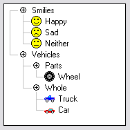 

#### Tile — плитка

   

[Вернуться к содержанию](https://github.com/netology-code/guides/blob/master/glossary_qa/README.md#%D1%81%D0%BE%D0%B4%D0%B5%D1%80%D0%B6%D0%B0%D0%BD%D0%B8%D0%B5)
____________________________

## Списки

#### Check box list — галки, флажки

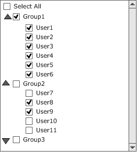   
 

#### Combo box / Drop down list - выпадающий/раскрывающийся список

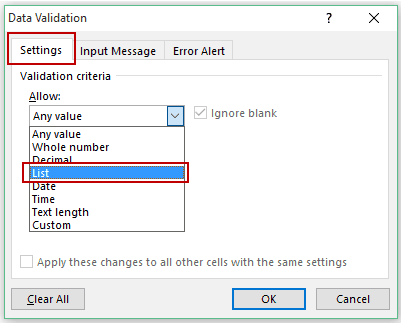   

#### List box - Линейный список

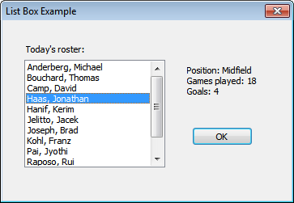   

 
#### Radio button list - Список с переключателями

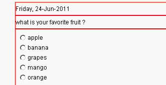 

[Вернуться к содержанию](https://github.com/netology-code/guides/blob/master/glossary_qa/README.md#%D1%81%D0%BE%D0%B4%D0%B5%D1%80%D0%B6%D0%B0%D0%BD%D0%B8%D0%B5)
_____________________________

## Всплывающие 

#### Flyout - всплывающий элемент, например в меню

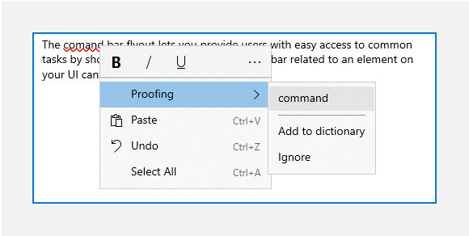   
 
 
#### Popup window - всплывающее окно, попап

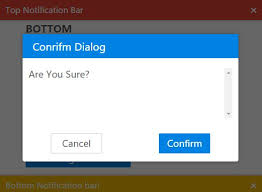   

#### Tooltip - Всплывающая подсказка

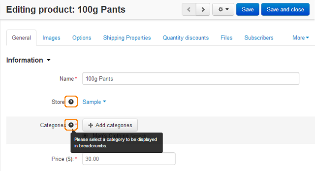   

[Вернуться к содержанию](https://github.com/netology-code/guides/blob/master/glossary_qa/README.md#%D1%81%D0%BE%D0%B4%D0%B5%D1%80%D0%B6%D0%B0%D0%BD%D0%B8%D0%B5)
_______________________________
## Края 
 
 
#### Border - рамка

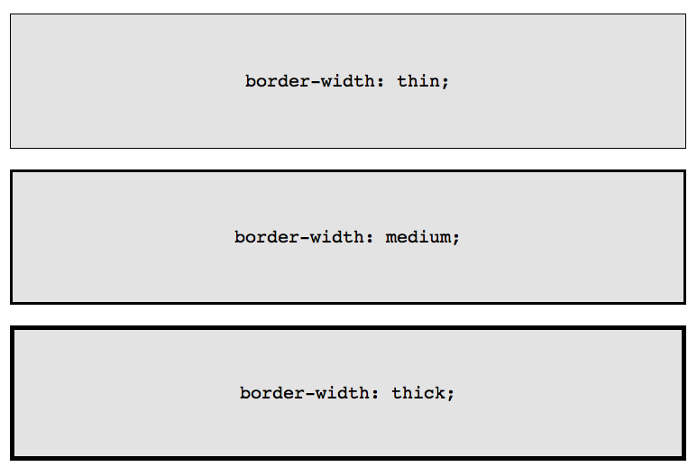   
 
#### Frame - рамка

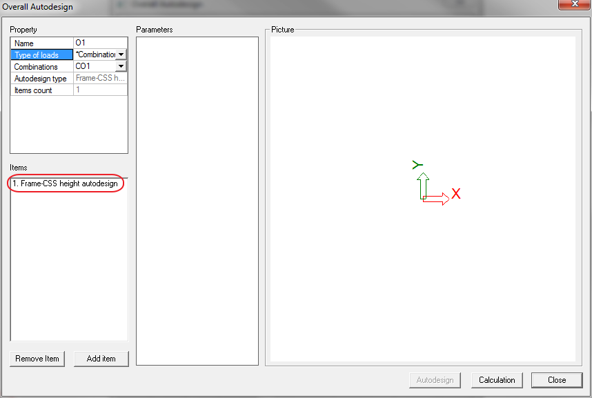   
 
#### Scroll bar - полоса прокрутки

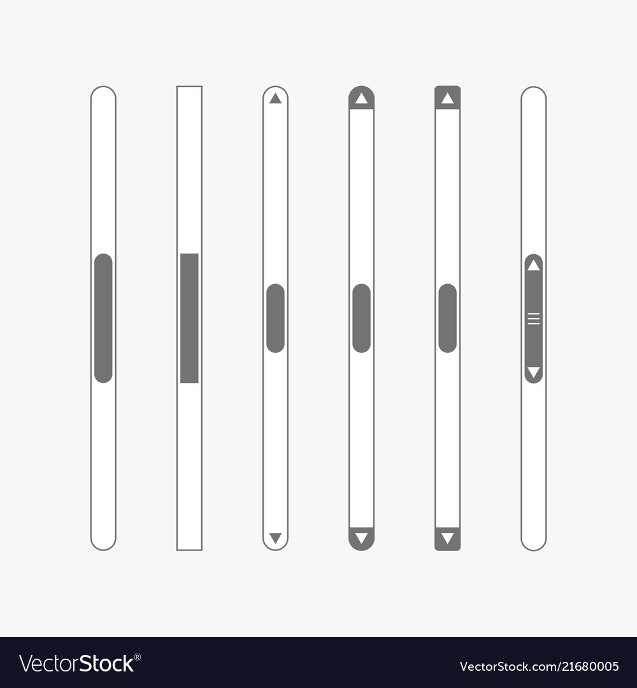   
 
#### Separator - разделитель

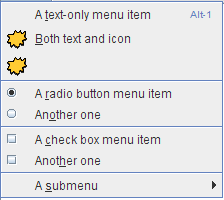   
 
#### Splitter - разделитель

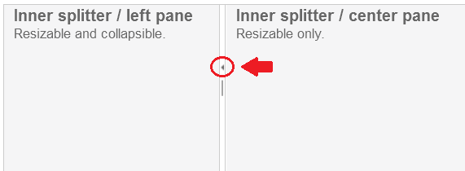   

[Вернуться к содержанию](https://github.com/netology-code/guides/blob/master/glossary_qa/README.md#%D1%81%D0%BE%D0%B4%D0%B5%D1%80%D0%B6%D0%B0%D0%BD%D0%B8%D0%B5)
__________________________

## Индикаторы 
 
 
##### Busy indicator - индикатор занятости

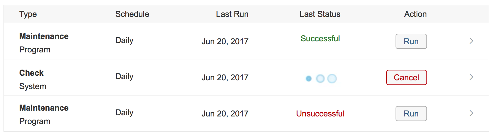   
 
#### Progress bar - индикатор прогресса

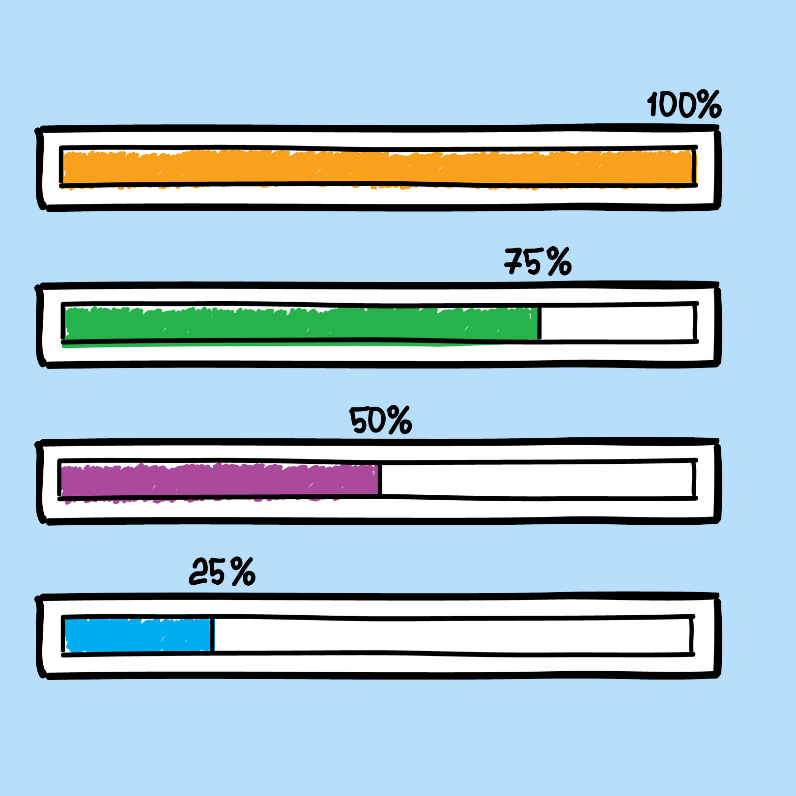   
 
#### Status bar - строка состояния

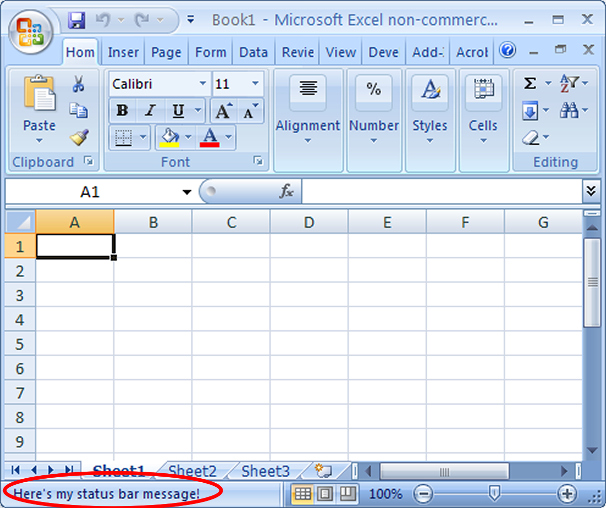   

[Вернуться к содержанию](https://github.com/netology-code/guides/blob/master/glossary_qa/README.md#%D1%81%D0%BE%D0%B4%D0%B5%D1%80%D0%B6%D0%B0%D0%BD%D0%B8%D0%B5)
__________________________

## Фокус 
 
#### Cursor - курсор

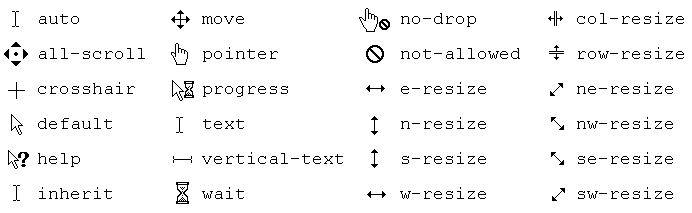   
 
#### Pointer - указатель

   

[Вернуться к содержанию](https://github.com/netology-code/guides/blob/master/glossary_qa/README.md#%D1%81%D0%BE%D0%B4%D0%B5%D1%80%D0%B6%D0%B0%D0%BD%D0%B8%D0%B5)
__________________________

## Инструменты 
 

#### Ribbon - Лента/закладка

   
 
#### Toolbar - панель инструментов

   

[Вернуться к содержанию](https://github.com/netology-code/guides/blob/master/glossary_qa/README.md#%D1%81%D0%BE%D0%B4%D0%B5%D1%80%D0%B6%D0%B0%D0%BD%D0%B8%D0%B5)

___________________________

## Кнопки 
 
#### Button - кнопка

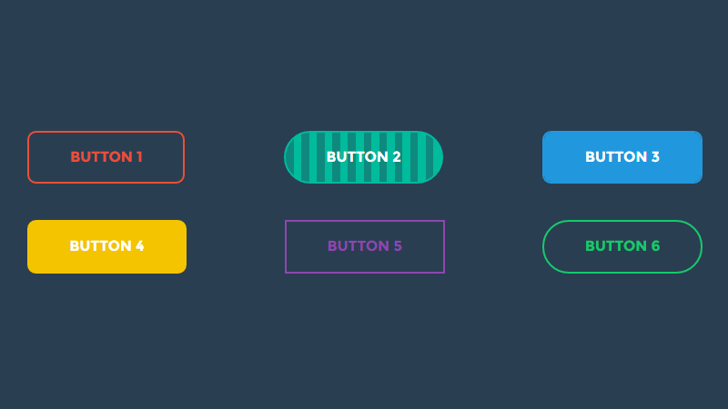   
 
#### Check box - галка, флажок

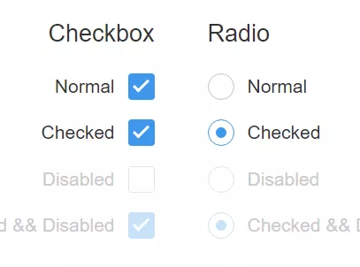   

#### Radio button - переключатель

См. выше

#### Toggle button - Двухпозиционный переключатель, тогл

[Вернуться к содержанию](https://github.com/netology-code/guides/blob/master/glossary_qa/README.md#%D1%81%D0%BE%D0%B4%D0%B5%D1%80%D0%B6%D0%B0%D0%BD%D0%B8%D0%B5)

____________________________

## Счетчики 
 

#### Slider - ползунок

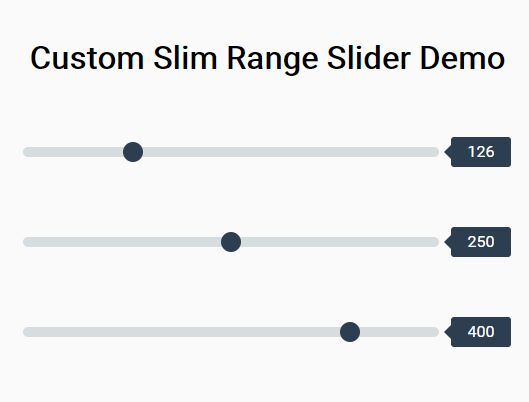   

#### Spinner / Numeric up and down - Спиннер, крутилка

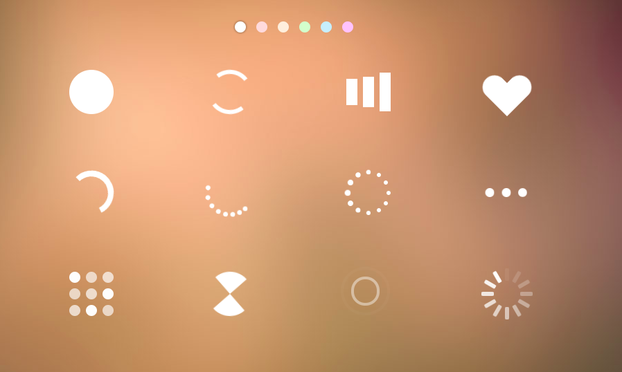   

#### Timeline - временная шкала

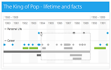   

[Вернуться к содержанию](https://github.com/netology-code/guides/blob/master/glossary_qa/README.md#%D1%81%D0%BE%D0%B4%D0%B5%D1%80%D0%B6%D0%B0%D0%BD%D0%B8%D0%B5)
_____________________________

## Ввод данных 
 
 
#### Autocomplete - автоподсказка

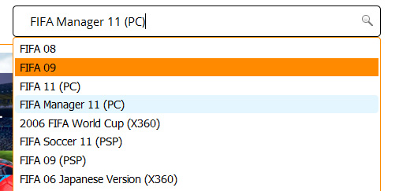   
 
#### Masked input - поле ввода с фильтром

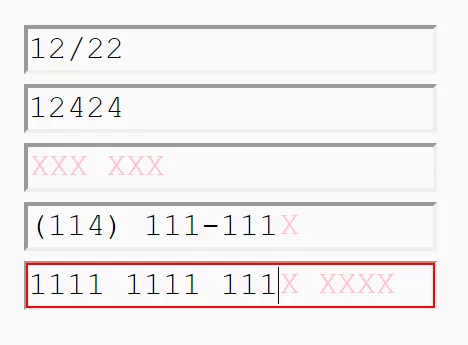   

#### Rich text - форматируемый текст

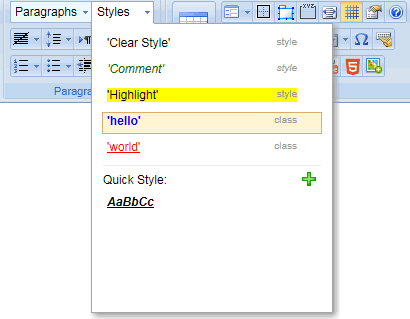   
 
#### Text box / input - поле ввода

   
 
#### Captcha - Капча

   

[Вернуться к содержанию](https://github.com/netology-code/guides/blob/master/glossary_qa/README.md#%D1%81%D0%BE%D0%B4%D0%B5%D1%80%D0%B6%D0%B0%D0%BD%D0%B8%D0%B5)
_______________________________

## Картинки 
 

#### Canvas - холст, канва

  
 
#### Chart - диаграмма

   

#### Color picker - палитра

   
 
#### Icon - иконка, пиктограмма, значок

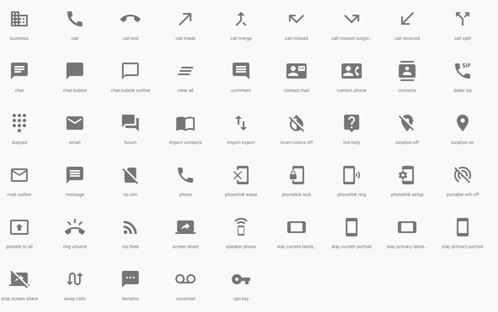   

[Вернуться к содержанию](https://github.com/netology-code/guides/blob/master/glossary_qa/README.md#%D1%81%D0%BE%D0%B4%D0%B5%D1%80%D0%B6%D0%B0%D0%BD%D0%B8%D0%B5)
_______________________________

## Прочее 
 
 
#### Date/Time picker - календарь

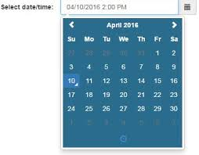 

#### Dock panel - панель закрепления

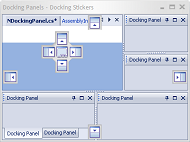   
 
#### Draggable element - перетаскиваемый элемент

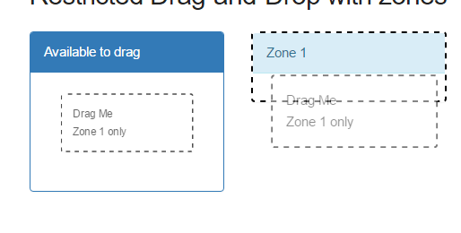   

#### Expander - Экспандер, расширяющийся элемент

   

#### Gauge - метр (манометр, спидометр, фаллометр), измерительный прибор

   
 
#### Label - надпись

#### Spreadsheet - электронная таблица

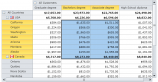   
 
#### Tab - вкладка, закладка

 
#### Upload file - загрузка файла

 
### Wizard - мастер

[Вернуться к содержанию](https://github.com/netology-code/guides/blob/master/glossary_qa/README.md#%D1%81%D0%BE%D0%B4%D0%B5%D1%80%D0%B6%D0%B0%D0%BD%D0%B8%D0%B5)
