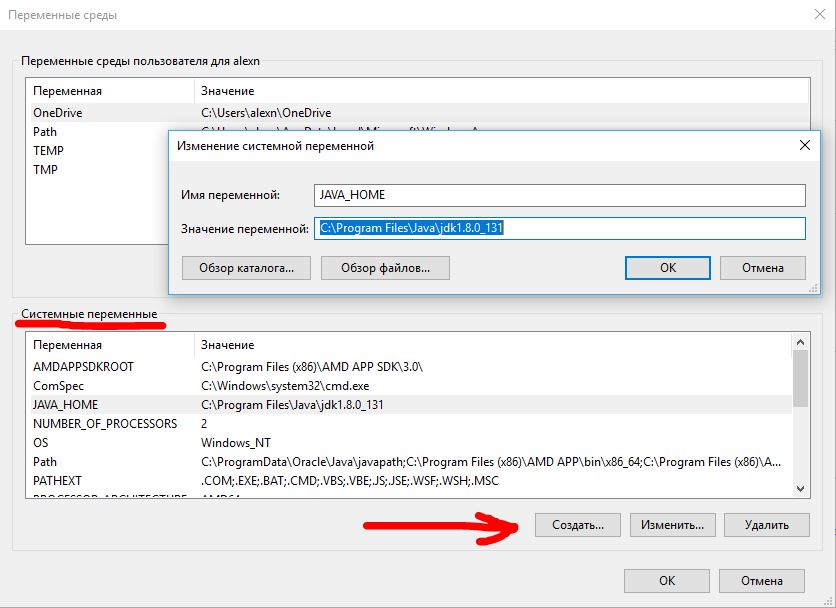
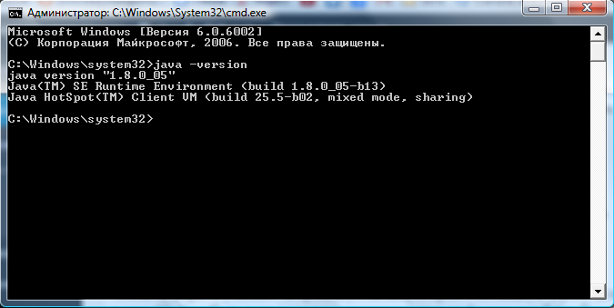
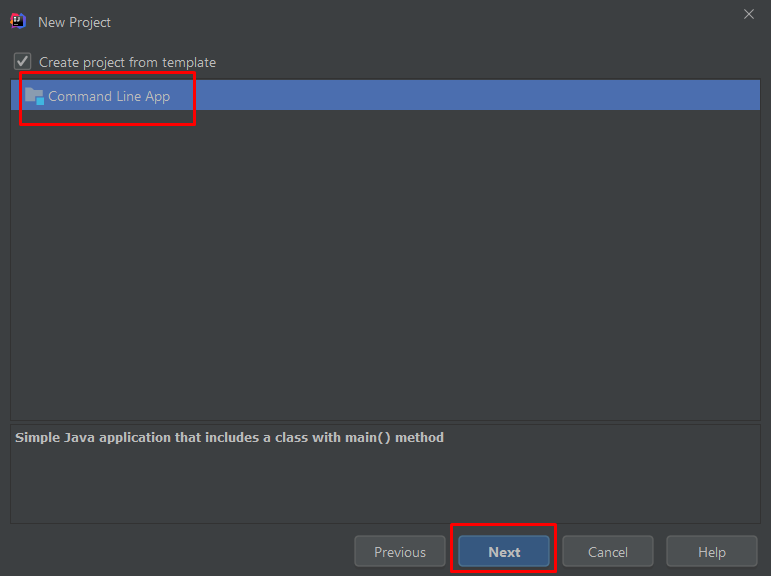
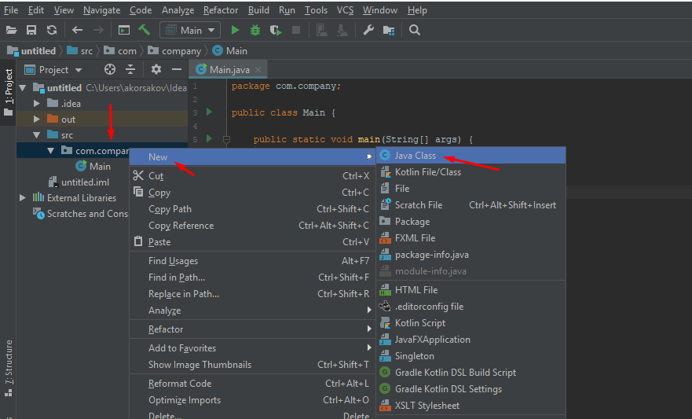

# Что такое IDE

[IDE](https://ru.wikipedia.org/wiki/%D0%98%D0%BD%D1%82%D0%B5%D0%B3%D1%80%D0%B8%D1%80%D0%BE%D0%B2%D0%B0%D0%BD%D0%BD%D0%B0%D1%8F_%D1%81%D1%80%D0%B5%D0%B4%D0%B0_%D1%80%D0%B0%D0%B7%D1%80%D0%B0%D0%B1%D0%BE%D1%82%D0%BA%D0%B8) — это среда разработки, где вы пишете код. 

Почему лучше работать в IDE?
* ускоряет работу, 
* есть подсветка ошибок, 
* есть отладка по шагам,
* вызов документации,
* интеграция с Git и GitHub.

Рекомендуем IDE Intellij Idea, версия Community.

# Как установить и&nbsp;настроить IntelliJ IDEA 
Рекомендуем установить JDK 8&nbsp;для тех, кто будет работать в&nbsp;Android Studio для разработки андроид-приложений (для студентов курса Android-разработчик). Все остальные могут использовать версию [JDK 11](https://www.oracle.com/technetwork/java/javase/downloads/jdk11-downloads-5066655.html).
1. Предварительно скачайте Java Development Kit [по&nbsp;ссылке](https://www.oracle.com/technetwork/java/javase/downloads/jdk8-downloads-2133151.html). Выберите версию для любой операционной системы. 

2. Запустите установку:

3. Следуйте подсказкам установщика и&nbsp;подождите несколько минут.

Инсталлятор Java не выполняет настройку переменных окружения, поэтому придётся нам это делать вручную после установки.

**JAVA_HOME** — переменная, указывающая на директорию, в которую установлена Java. Программы её используют чтобы определить, где установлена Java.

Для создания данной переменной комбинацией клавиш Win+R открываем окно «Выполнить«. Набираем команду: «control /name microsoft.system« без кавычек.

Или откройте Панель управления -> Система.

Затем нужно выбрать «**Дополнительные параметры системы**» и в открывшемся окне «**Свойства системы**»  нажимаем кнопку «**Переменные среды**». Если Вы ничего не меняли при установке JDK, то путь будет таким: «C:\Program Files\Java\ <jdkНомерВерсии>».

Далее необходимо отредактировать значение переменной **Path**, добавив туда путь к директории, где находятся исполняемые файлы Java, то есть
`%JAVA_HOME%\bin`

Будьте внимательны при редактировании PATH — она содержит важную информацию. Не надо ее целиком стирать и оставлять только свою строку. Надо просто добавить строку до каталога с JDK (+ строка «\bin»).
После того, как были прописаны переменные, установку Java можно считать завершенной! 

Чтобы проверить, успешно ли прошла установка, откройте командную строку. Для этого в меню Windows Пуск  в строке поиска введите команду cmd и нажмите Enter. После этого откроется командное окно, в котором нужно ввести следующую команду.

`java -version`
После чего, если отобразится информация об установленной версии java, то установка прошла успешно.

4. Скачайте Community Edition-версию программы [по&nbsp;ссылке](https://www.jetbrains.com/idea/download/). Можно выбрать версию для любой операционной системы&nbsp;&mdash; Windows, MacOS или Linux. 

5. Установите, следуйте подсказкам инсталлятора и&nbsp;подождите несколько минут.

6. При первом запуске программа предложит импортировать настройки. Так как установленных ранее версий не&nbsp;было, выберите Don&rsquo;t import settings.

7. Программа предложит выбрать цветовую схему и&nbsp;дополнительные возможности. Выберите подходящую схему и&nbsp;нажмите на&nbsp;кнопку &laquo;Skip Remaining and Set Defaults&raquo;

8. Запустите программу. Когда откроется окно проекта, выберите Create New Project.

9. Далее откроется окно создания проекта. В&nbsp;левой части в&nbsp;качестве типа проекта выберем Java. Кроме того, в&nbsp;поле Project SDK с&nbsp;помощью кнопки New... установим папку, куда установлен JDK.

10. После этого нажем на&nbsp;кнопку Next. Далее будет предложено отметить шаблон проекта. Command Line App&nbsp;&mdash; шаблон, который предполагает запуск приложения как консольного. Выберите его в &nbsp;качестве шаблона. На&nbsp;следующем шаге выберите папку, в&nbsp;которую нужно сохранить проект.

11. В&nbsp;левой части мы&nbsp;можем увидеть структуру проекта. Все файлы с&nbsp;исходным кодом помещаются в&nbsp;папку src. По&nbsp;умолчанию она содержит каталог, который называется по&nbsp;имени пакета и&nbsp;который имеет один файл Main.java.
В&nbsp;центральной части программы открыт исходный код программы в&nbsp;виде класса Main.
В&nbsp;верхней части можно использовать зеленую кнопку Play и&nbsp;нажать ее&nbsp;&mdash; вы&nbsp;запустили первую скомпилированную программу. Либо это&nbsp;же самое можно сделать нажав на&nbsp;зеленую кнопку слева от&nbsp;строки с&nbsp;методом main.

12. И&nbsp;внизу IntelliJ IDEA отобразится окно вывода, где мы&nbsp;можем увидить результат работы нашей программы.

13. Для создания нового класса необходимо нажать правой кнопкой на&nbsp;имя пакета и&nbsp;выбрать New -&gt; Java Class

