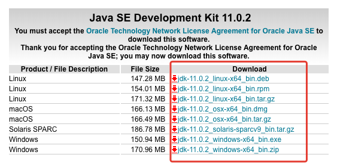
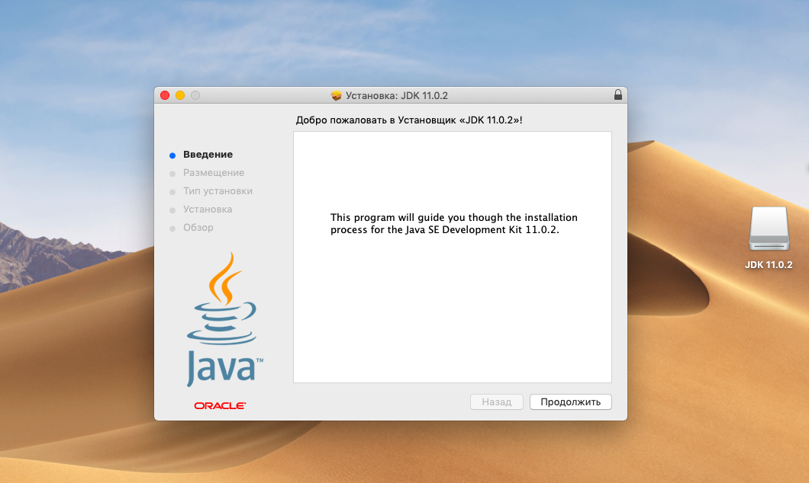
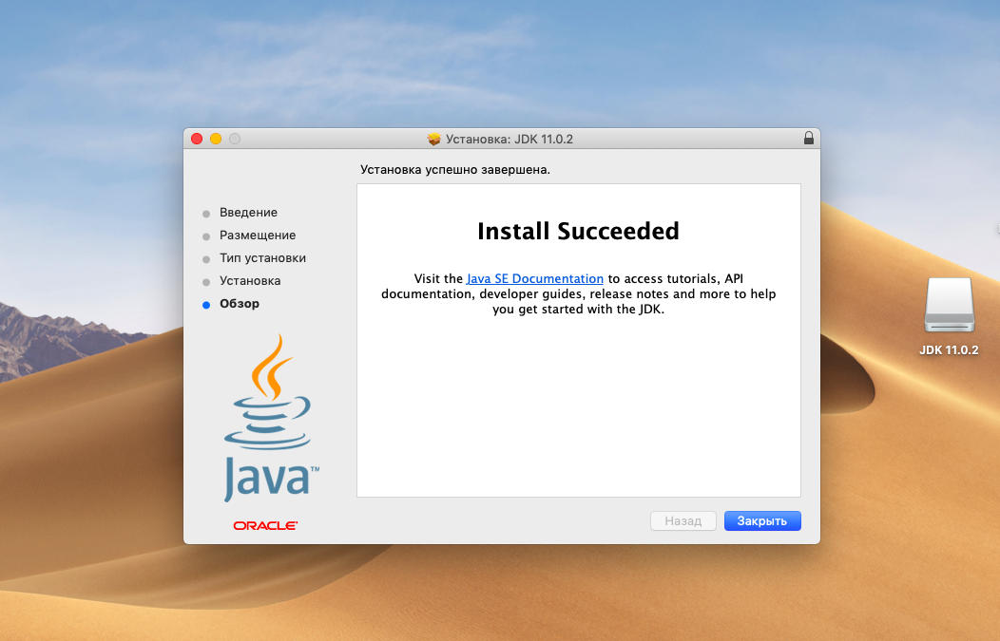
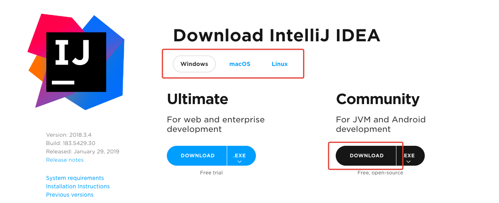
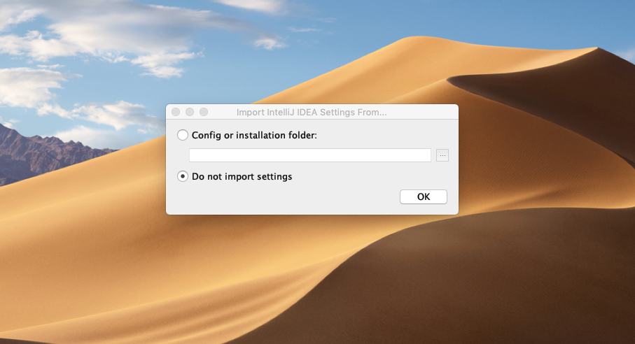
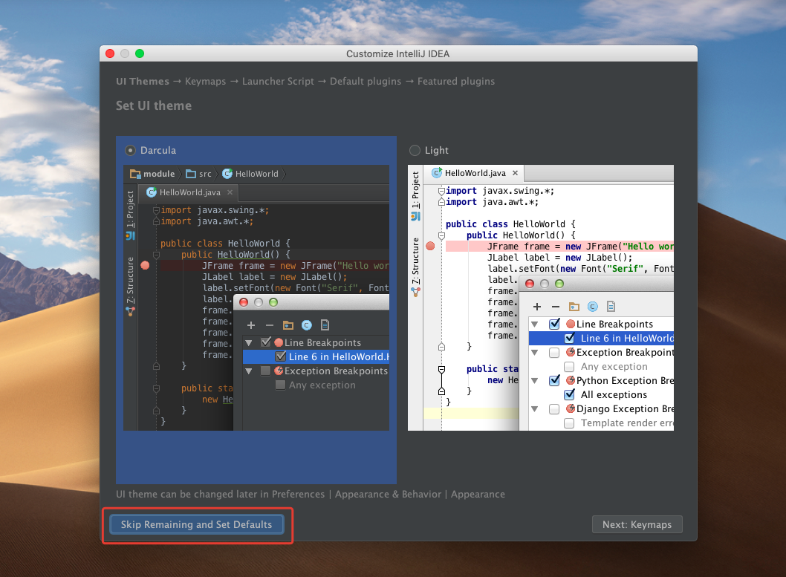
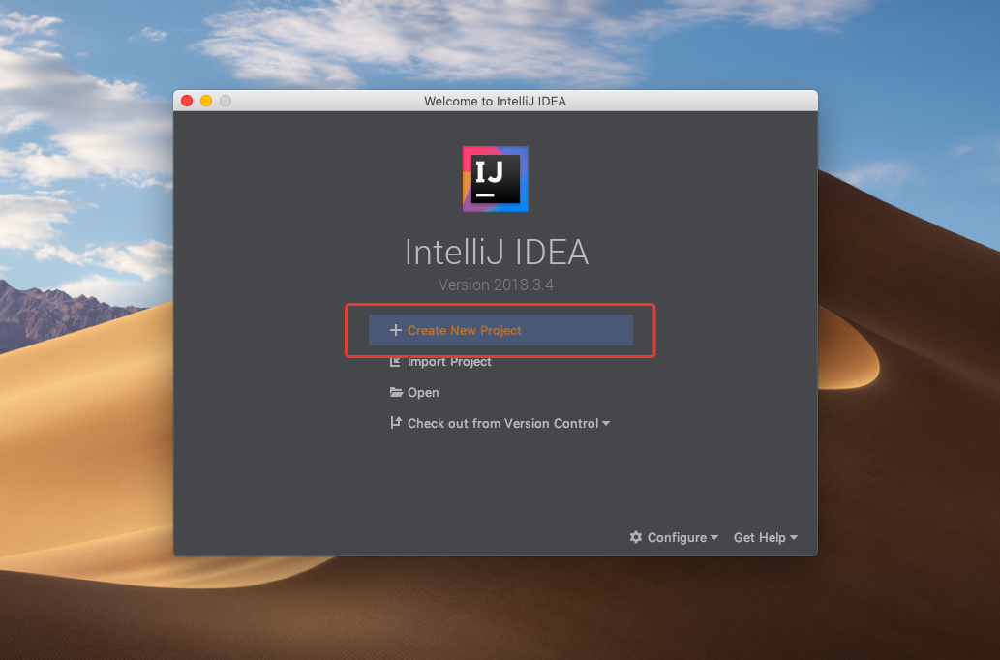
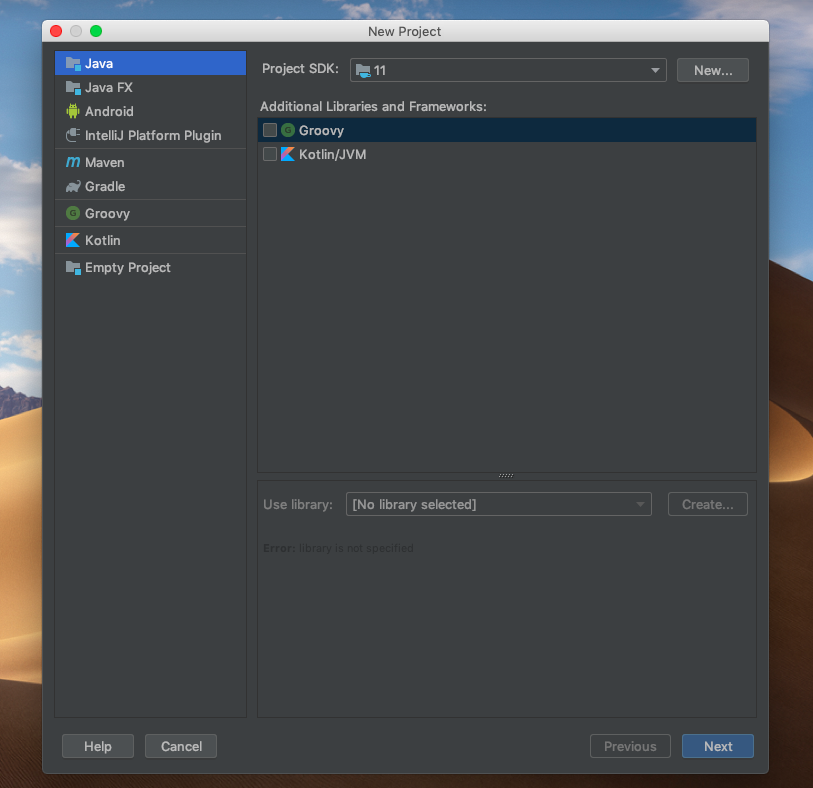
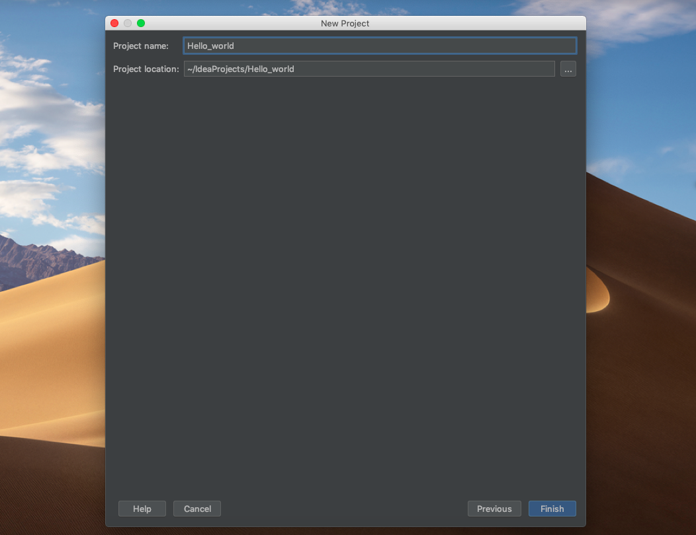
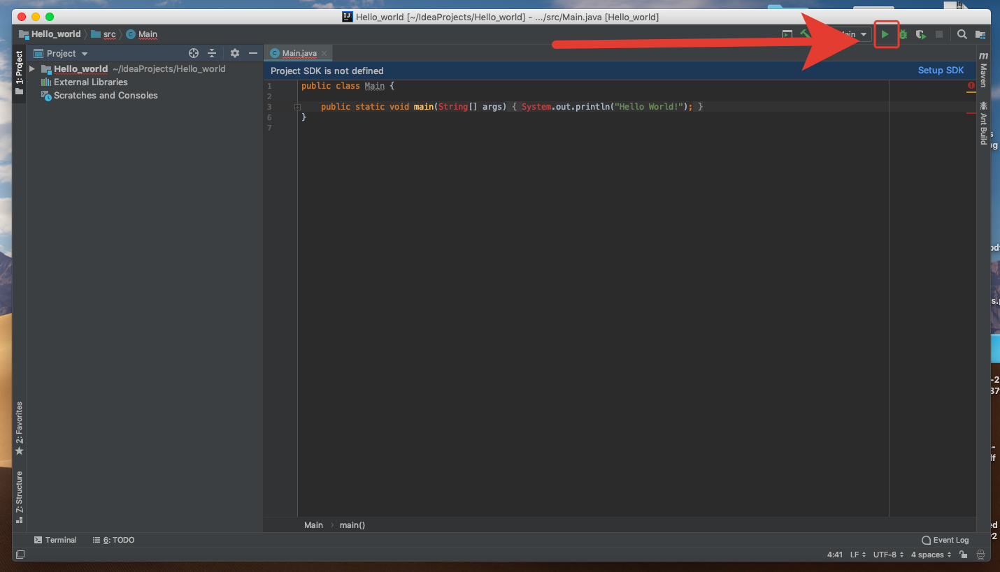

# Как установить и настроить IntelliJ IDEA 

1. Предварительно скачайте Java Development Kit [по ссылке](https://www.oracle.com/technetwork/java/javase/downloads/jdk11-downloads-5066655.html). Выберите версию для любой операционной системы. 

2. Запустите установку:

3. Следуйте подсказкам установщика.

4. Скачайте Community Edition-версию программы по ссылке. Можно выбрать версию для любой операционной системы — Windows, MacOS или Linux. 

5. Установите, следуйте подсказкам инсталлятора.
При первом запуске программа предложит импортировать настройки. Так как установленных ранее версий не было, выберите Don’t import settings.

6. Программа предложит выбрать цветовую схему и дополнительные возможности. Выберите настройки по умолчанию и пропустите эти шаги..

7. Запустите программу. Когда откроется окно проекта, выберите Create New Project.

8. В верхнем левом углу выберите Java, нажмите Next.

9. В качестве шаблона выберите Java Hello World.

10. Выберите папку, в которую нужно сохранить проект.

11. В правом верхнем углу найдите зеленую кнопку Play и нажмите ее — вы запустили первую скомпилированную программу.

