# Что такое IDE

[IDE](https://ru.wikipedia.org/wiki/%D0%98%D0%BD%D1%82%D0%B5%D0%B3%D1%80%D0%B8%D1%80%D0%BE%D0%B2%D0%B0%D0%BD%D0%BD%D0%B0%D1%8F_%D1%81%D1%80%D0%B5%D0%B4%D0%B0_%D1%80%D0%B0%D0%B7%D1%80%D0%B0%D0%B1%D0%BE%D1%82%D0%BA%D0%B8) — это среда разработки, где вы пишете код. 

Почему лучше работать в IDE?
* ускоряет работу, 
* есть подсветка ошибок, 
* есть отладка по шагам,
* вызов документации,
* интеграция с Git и GitHub.

Рекомендуем IDE Intellij Idea, версия Community.

# Как установить и&nbsp;настроить IntelliJ IDEA 

1. Предварительно скачайте Java Development Kit&nbsp;11 [по&nbsp;ссылке](https://www.oracle.com/technetwork/java/javase/downloads/jdk11-downloads-5066655.html). Выберите версию для любой операционной системы. 
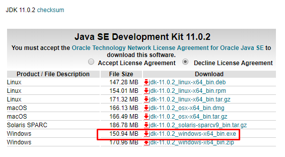

2. Запустите установку:

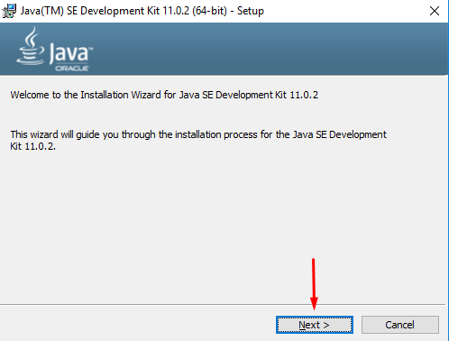

3. Выберите папку для установки или оставьте&nbsp;ту, что по&nbsp;умолчанию и&nbsp;нажмите Next

4. Следуйте подсказкам установщика и&nbsp;подождите несколько минут до&nbsp;окончания установки.

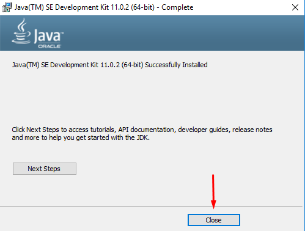

5. Скачайте Community Edition-версию программы [по&nbsp;ссылке](https://www.jetbrains.com/idea/download/). Можно выбрать версию для любой операционной системы&nbsp;&mdash; Windows, MacOS или Linux. 

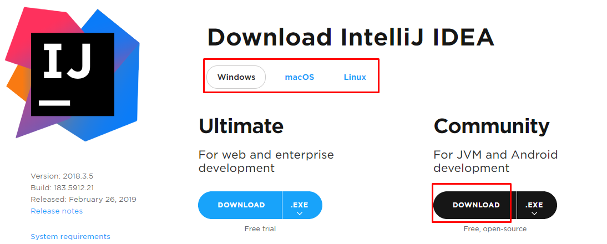

6. Установите, следуйте подсказкам инсталлятора и&nbsp;подождите несколько минут.
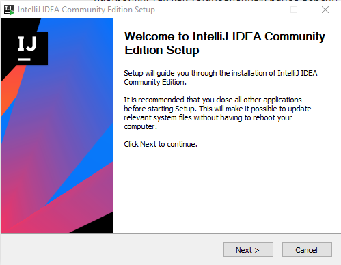
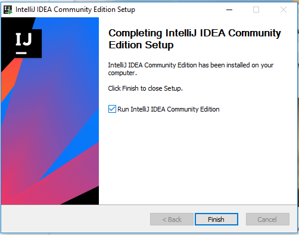

7. При первом запуске программа предложит импортировать настройки. Так как установленных ранее версий не&nbsp;было, выберите Don&rsquo;t import settings.
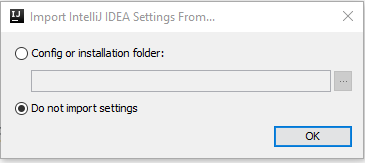

8. Программа предложит выбрать цветовую схему и&nbsp;дополнительные возможности. Выберите подходящую схему и&nbsp;нажмите на&nbsp;кнопку &laquo;Skip Remaining and Set Defaults&raquo;

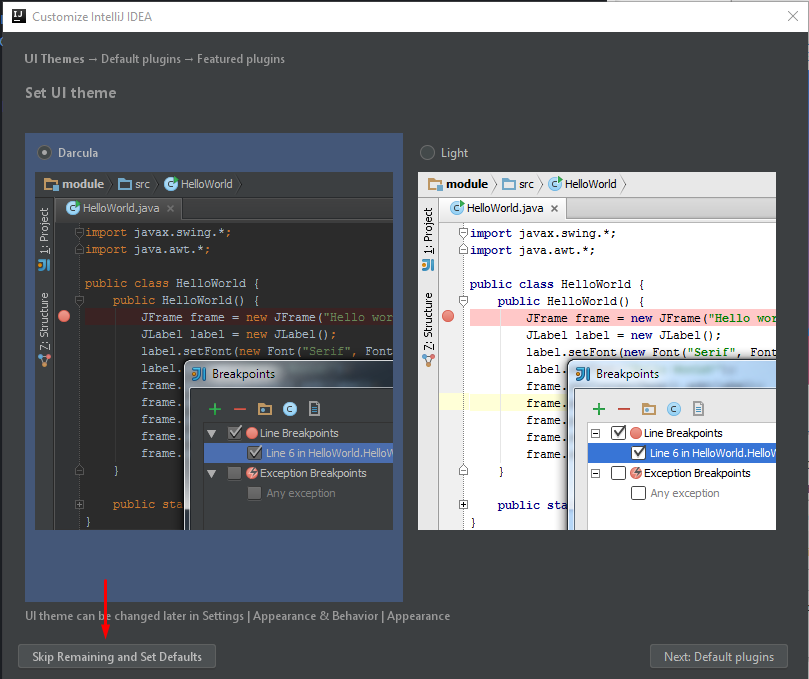

9. Запустите программу. Когда откроется окно проекта, выберите Create New Project.

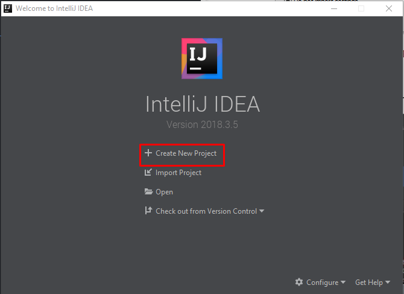

10. Далее откроется окно создания проекта. В&nbsp;левой части в&nbsp;качестве типа проекта выберем Java. Кроме того, в&nbsp;поле Project SDK с&nbsp;помощью кнопки New... установим папку, куда установлен JDK.
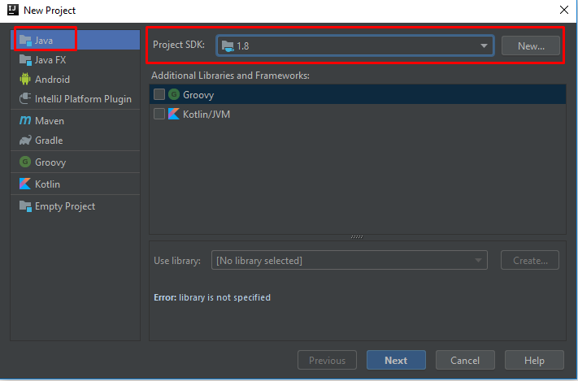

11. После этого нажем на&nbsp;кнопку Next. Далее будет предложено отметить шаблон проекта. Command Line App&nbsp;&mdash; шаблон, который предполагает запуск приложения как консольного. В&nbsp;качестве шаблона выберите Java Hello World. На&nbsp;следующем шаге выберите папку, в&nbsp;которую нужно сохранить проект.
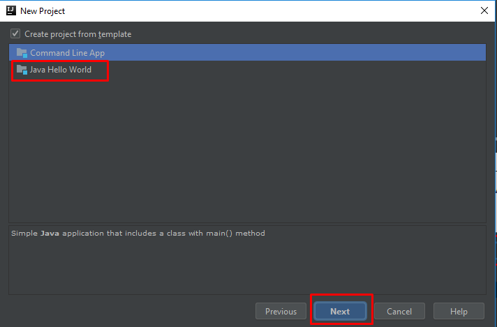

12. В&nbsp;левой части мы&nbsp;можем увидеть структуру проекта. Все файлы с&nbsp;исходным кодом помещаются в&nbsp;папку src. По&nbsp;умолчанию она содержит каталог, который называется по&nbsp;имени пакета и&nbsp;который имеет один файл Main.java.
В&nbsp;центральной части программы открыт исходный код программы в&nbsp;виде класса Main.
В&nbsp;верхней части можно использовать зеленую кнопку Play и&nbsp;нажать ее&nbsp;&mdash; вы&nbsp;запустили первую скомпилированную программу. Либо это&nbsp;же самое можно сделать нажав на&nbsp;зеленую кнопку слева от&nbsp;строки с&nbsp;методом main.

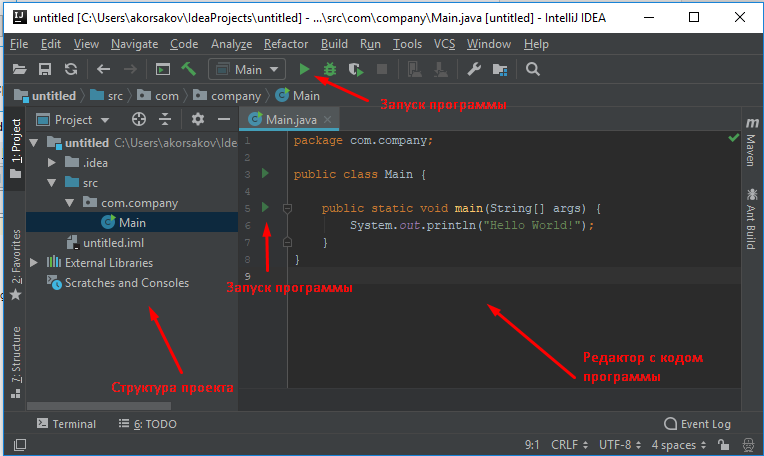

13. И&nbsp;внизу IntelliJ IDEA отобразится окно вывода, где мы&nbsp;можем увидить результат работы нашей программы.
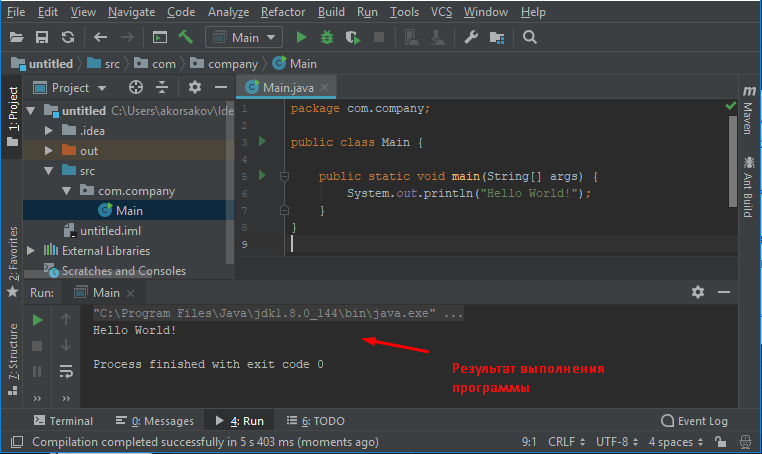

14. Для создания нового класса необходимо нажать правой кнопкой на&nbsp;имя пакета и&nbsp;выбрать New -&gt; Java Class
