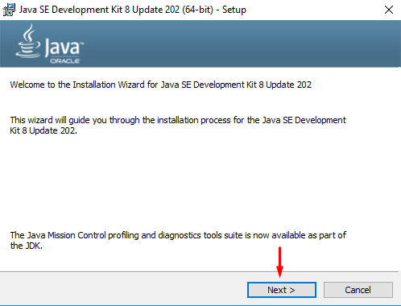
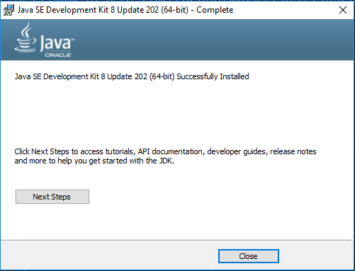
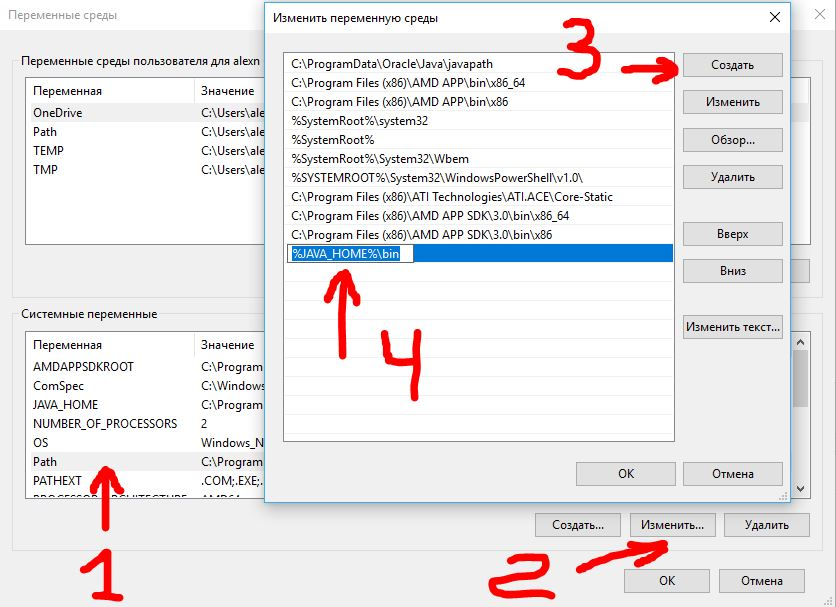

# Как установить и настроить Java Development Kit (JDK) 
Рекомендуем установить JDK 8&nbsp;для тех, кто будет работать в&nbsp;Android Studio для разработки андроид-приложений (для студентов курса Android-разработчик). Все остальные могут использовать версию [JDK 11](https://www.oracle.com/technetwork/java/javase/downloads/jdk11-downloads-5066655.html).
1. Предварительно скачайте Java Development Kit [по&nbsp;ссылке](https://www.oracle.com/technetwork/java/javase/downloads/jdk8-downloads-2133151.html). Выберите версию для любой операционной системы. 

2. Запустите установку:

3. Следуйте подсказкам установщика и&nbsp;подождите несколько минут.

Инсталлятор Java не выполняет настройку переменных окружения, поэтому придётся нам это делать вручную после установки.

**JAVA_HOME** — переменная, указывающая на директорию, в которую установлена Java. Программы её используют чтобы определить, где установлена Java.

Для создания данной переменной комбинацией клавиш Win+R открываем окно «Выполнить«. Набираем команду: «control /name microsoft.system« без кавычек.

Или откройте Панель управления -> Система.

Затем нужно выбрать «**Дополнительные параметры системы**» и в открывшемся окне «**Свойства системы**»  нажимаем кнопку «**Переменные среды**». Если Вы ничего не меняли при установке JDK, то путь будет таким: «C:\Program Files\Java\ <jdkНомерВерсии>».

Далее необходимо отредактировать значение переменной **Path**, добавив туда путь к директории, где находятся исполняемые файлы Java, то есть
`%JAVA_HOME%\bin` (если такой переменной нет нужно ее создать, так же как переменную JAVA_HOME)

> В некоторых версиях ОС Windows переменную нужно называть большими буквами `PATH`

Будьте внимательны при редактировании PATH — она содержит важную информацию. Не надо ее целиком стирать и оставлять только свою строку. Надо просто добавить строку до каталога с JDK (+ строка «\bin»).
После того, как были прописаны переменные, установку Java можно считать завершенной! 

Чтобы проверить, успешно ли прошла установка, откройте командную строку. Для этого в меню Windows Пуск  в строке поиска введите команду cmd и нажмите Enter. После этого откроется командное окно, в котором нужно ввести следующую команду.

`java -version`
После чего, если отобразится информация об установленной версии java, то установка прошла успешно.

