# Знакомство с jsBin

1. Перейдите по ссылке на [jsbin](https://jsbin.com/).
2. Создайте аккаунт 

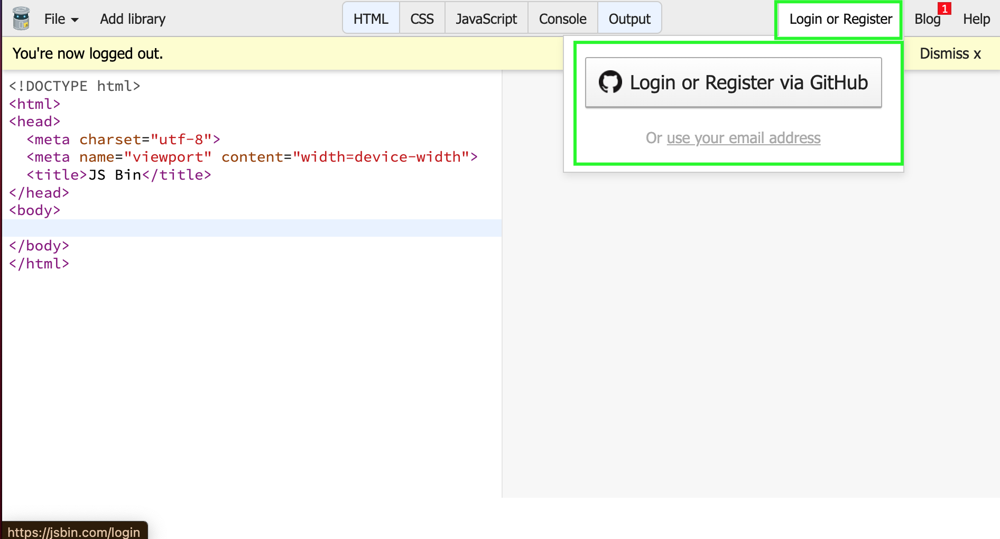

Вы можете зарегистрироваться используя аккаунт Github. Либо, вы можете создать аккаунт без привязки к гитхабу используя email

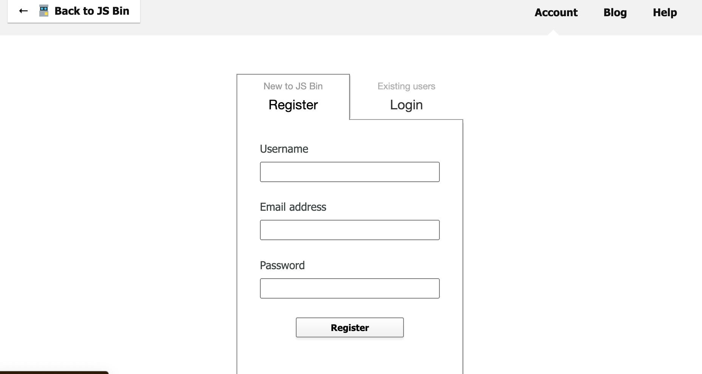

3. Вы будете работать с 3 вкладками html, css, output

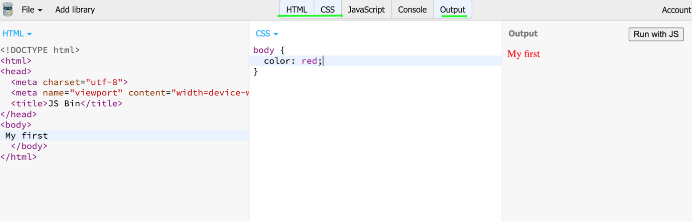

4. Попробуйте добавить немного контента и стилей в ваш bin
5. Добавьте описание

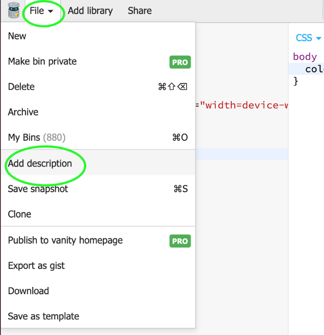

6. Сохраните результат

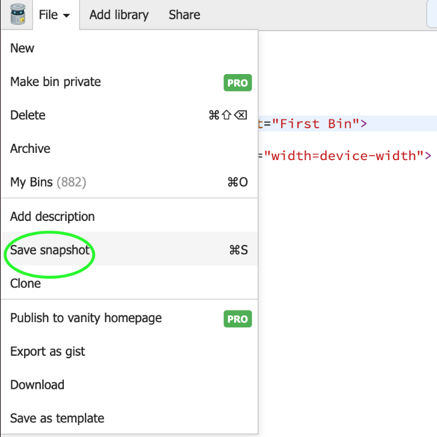

7. Теперь ваши работы будут хранится в myBins (если вы не залогинены, то тогда они не будут отображаться в аккаунте)

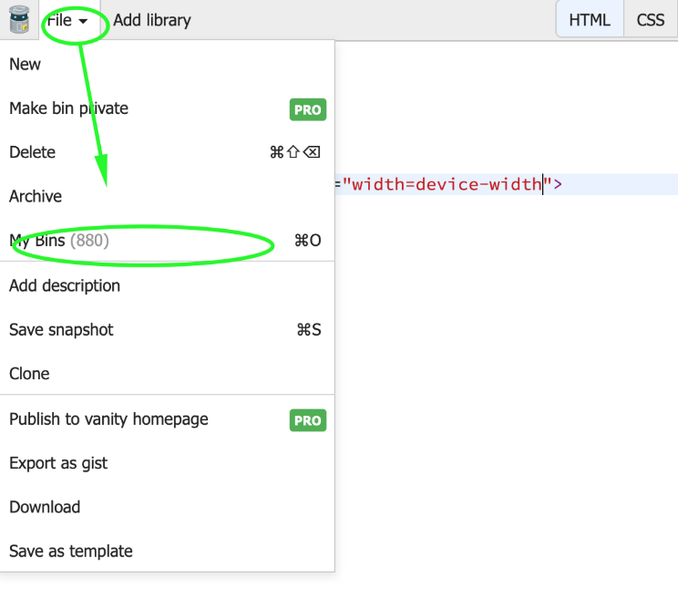

8. Добавленное описание будет отображаться в спике бинов

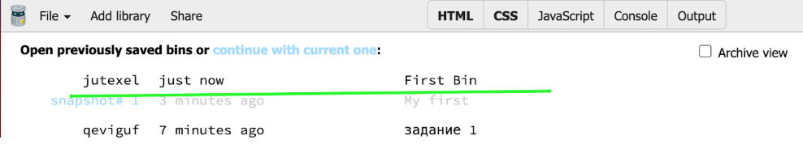

# Подготовка к выполнению дз ##

1. Создайте новый бин 

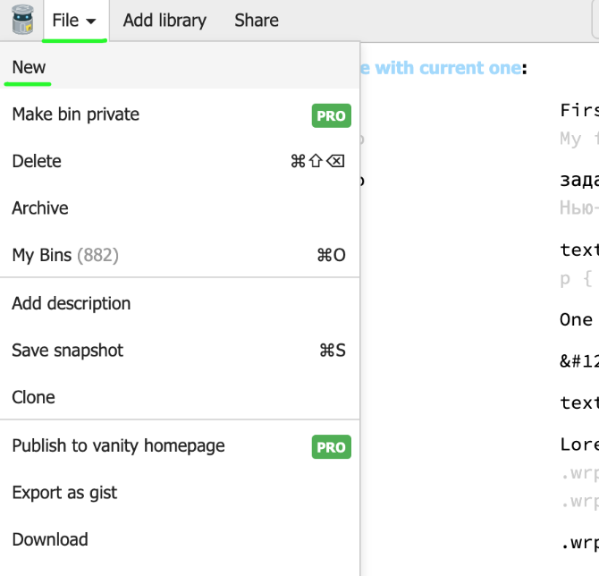

2. Добавьте в описание название задания -название темы и название задание, например, flex-elements-positioning-Фиксированное меню (где flex-elements-positioning - тема, а Фиксированное меню - задание)

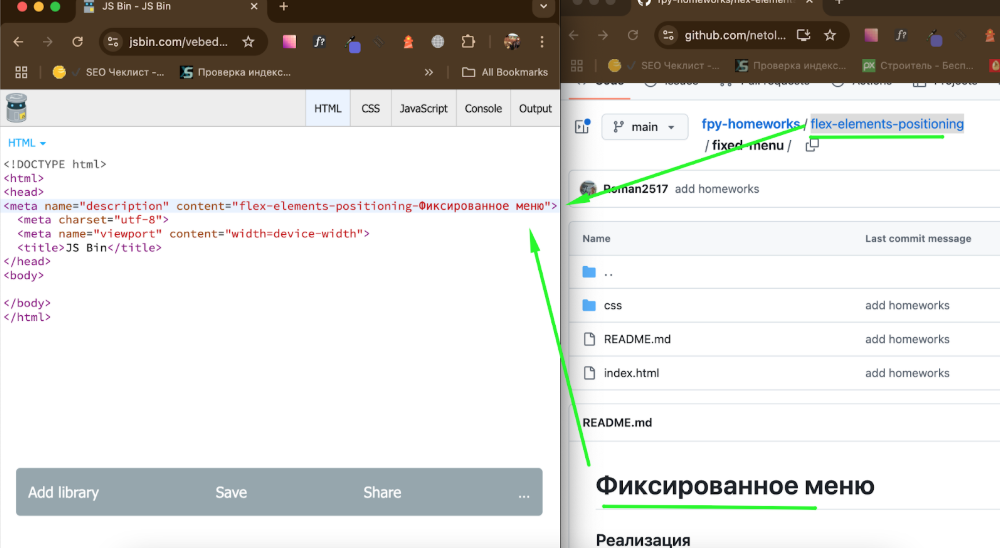

3. Скопируйте body & title к себе в бин из index.html 

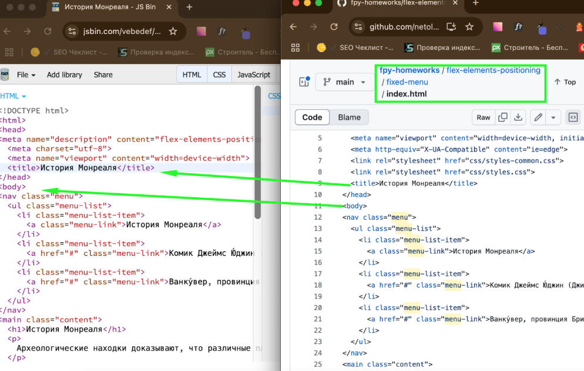

4. Если есть в папке css стили с припиской common, то надо их подключить через тег link (если там только style.css то переходите к пункту 8)

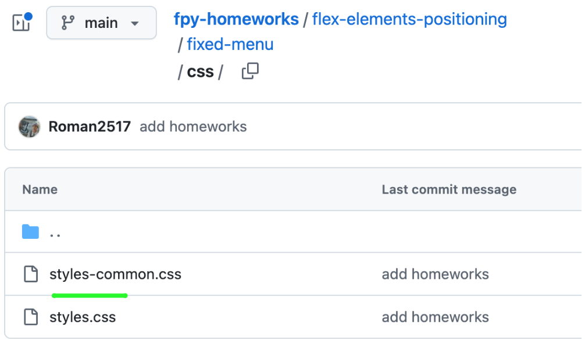

5. Скпируйте адрес стилей https://github.com/netology-code/html-2-homeworks/blob/master/flex-elements-positioning/fixed-menu/css/styles-common.css
и заменитев адресе начало пути https://github.com/netology-code/html-2-homeworks/blob/master/ на путь в гитхабпейджес https://netology-code.github.io/
то есть адрес получиться (https://netology-code.github.io/путь_до_стиля)- https://netology-code.github.io/html-2-homeworks/flex-elements-positioning/fixed-menu/css/styles-common.css

6. Откройте ссылку и убедитесь, что там находятся стили

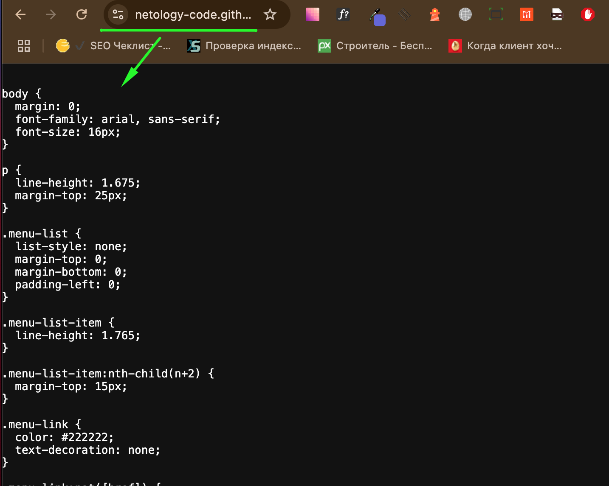

7. Подключите css при помощи тега link. Если все сделано верно, то вы заметите изменения в бине

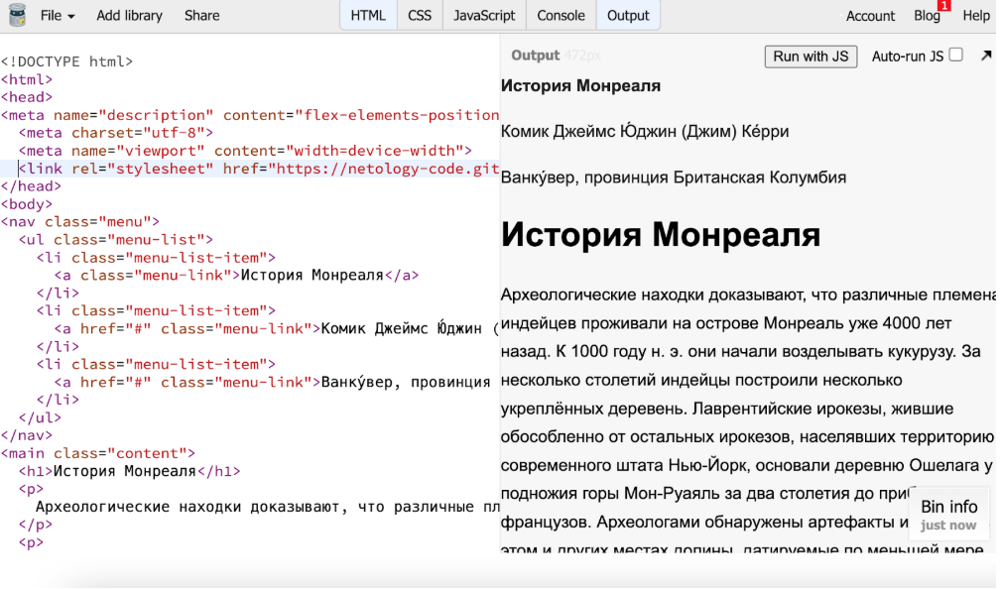

8. Скопируйте обычные стили (без приписки common) в свой бин во вкладку css

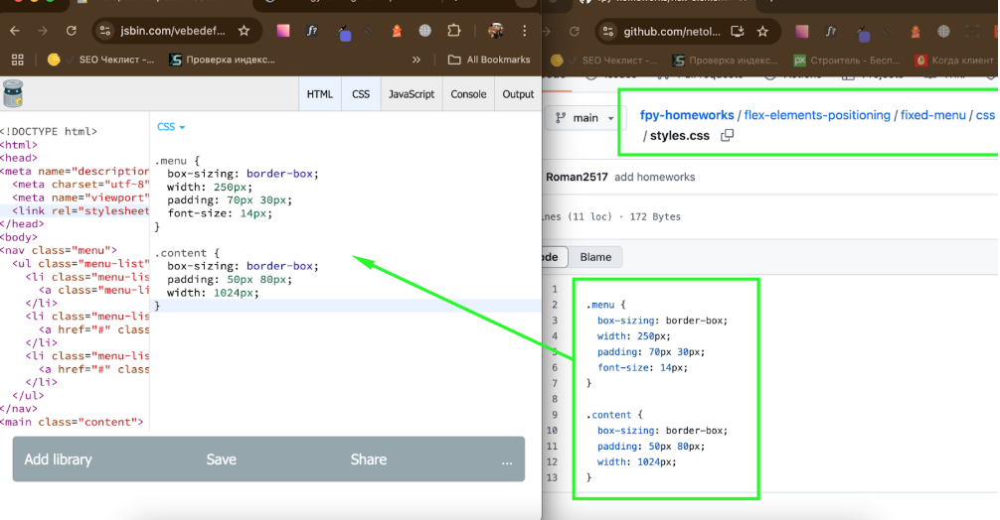

8. **Сохраните результат** - теперь вы готовы выполнить домашнее задание. 

Успехов!
