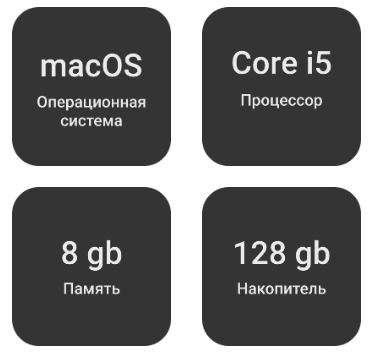
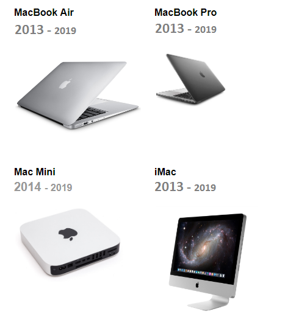

# На чем программировать под iOS?

Для комфортной разработки рекомендуем вам использовать MacBook, iMac или Mac Mini, так как разработка приложений под iOS возможна только на операционной системе macOS.

## Минимальные требования

## Рекомендуемые модели

Для обучения рекомендуем вам приобрести MacBook или iMac старше 2013 года модельного ряда, а Mac Mini — старше 2014 года. Важно, чтобы могла быть установлена последняя версия macOS.

## Где приобрести

### Новые модели
Новые модели вы можете найти на [Яндекс.Маркете](https://market.yandex.ru). Для вас мы уже установили необходимые критерии поиска. Чтобы подобрать нужное устройство, перейдите по ссылке.

* [MacBook Air / MacBook Pro (2012+)](https://market.yandex.ru/catalog--noutbuki/54544/list?hid=91013&glfilter=5085104%3A12106116&glfilter=7893318%3A153043&glfilter=13904377%3A15987695&glfilter=15938685%3A15938706%2C15938699&onstock=1&local-offers-first=0&how=aprice)
* [iMac (2012+)](https://market.yandex.ru/catalog--monobloki/61323/list?hid=12382295&glfilter=7893318%3A153043&glfilter=12396045%3A12396066%2C12396068%2C12396067%2C12396064&glfilter=12396333%3A15028774&glfilter=15051075%3A15051342%2C15347736%2C15051351%2C15051355%2C16340680%2C15051359%2C16340814%2C16701215%2C15051401%2C15051405&onstock=1&local-offers-first=0)
* [Mac Mini (2014+)](https://market.yandex.ru/catalog--nastolnye-kompiutery/54542/list?hid=91011&glfilter=6050807%3A6050815&glfilter=6050883%3A15007400%2C15007398&glfilter=7893318%3A153043&glfilter=16230863%3A16230867%2C16230866&onstock=1&local-offers-first=0)

### Подержанные модели
Подержанные компьютеры вы можете найти на [Юле](https://youla.ru/). Минимальная цена будет варьироваться в районе 20 000 — 30 000 рублей. Устройства модельного ряда 2013 — 2014 годов будет достаточно, чтобы успешно обучаться на курсе. Чтобы выбрать устройство, перейдите по ссылке и найдите подходящий модельный ряд.     
* [MacBook Air / MacBook Pro (2012+)](https://youla.ru/moskva/kompyutery/noutbuki?attributes[notebook_brand][0]=9241&attributes[notebook_tip][0]=9236&attributes[ram_memory][0]=166202&attributes[sort_field]=date_published)
* [iMac (2012+)](https://youla.ru/moskva/kompyutery/nastolnye-monobloki/monobloki?attributes%5Bram_memory%5D%5B0%5D=166202&attributes%5Bram_memory%5D%5B1%5D=166203&attributes%5Bram_memory%5D%5B2%5D=166204&attributes%5Bram_memory%5D%5B3%5D=166205&attributes%5Bram_memory%5D%5B4%5D=166206&attributes%5Bram_memory%5D%5B5%5D=166207&attributes%5Bram_memory%5D%5B6%5D=166210&q=imac)
* [Mac Mini (2014+)](https://youla.ru/moskva/kompyutery/nastolnye-monobloki?attributes[ram_memory][0]=166202&attributes[ram_memory][1]=166203&attributes[ram_memory][2]=166204&attributes[ram_memory][3]=166205&attributes[ram_memory][4]=166206&attributes[ram_memory][5]=166207&attributes[ram_memory][6]=166210&q=mac%20mini)

 
## Альтернативные варианты

Альтернативными вариантами могут быть:
* установка macOS на виртуальную машину в Windows (VMware, VirtualBox);
* «хакинтош» — установка macOS на железо других производителей (Intel). 

Сразу стоит предупредить, что у вас будет отсутствовать часть клавиш, которые есть на mac-клавиатурах, а также не исключены появления трудностей при установке macOS и работе в ней (сбои, зависания). Такой вариант стоит рассматривать как крайний, не являющийся оптимальным для комфортного обучения.

**Поэтому мы не рекомендуем использовать этот вариант. Сами попробовали установить на компьютер с Windows виртуалку и macOS, она постоянно вылетала.**

Если у вас возникли вопросы или вам нужна помощь, напишите нам на email: [a.avtonomova@netology.ru](mailto:a.avtonomova@netology.ru)

