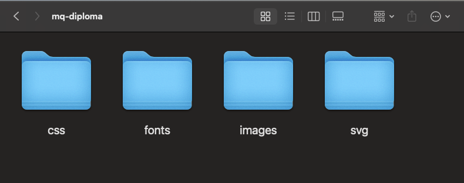
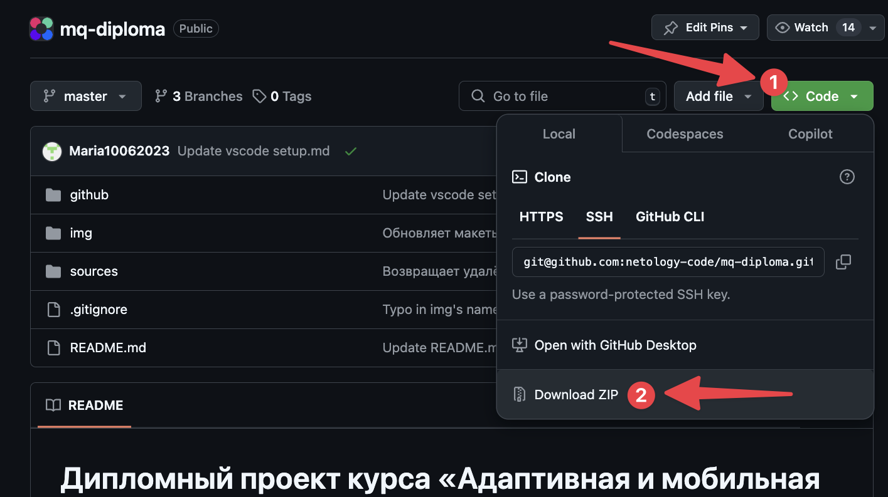
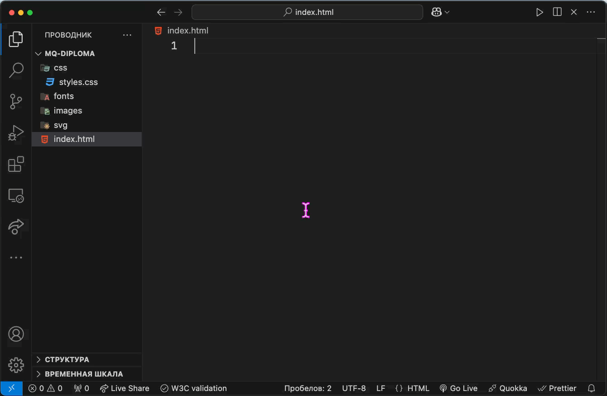
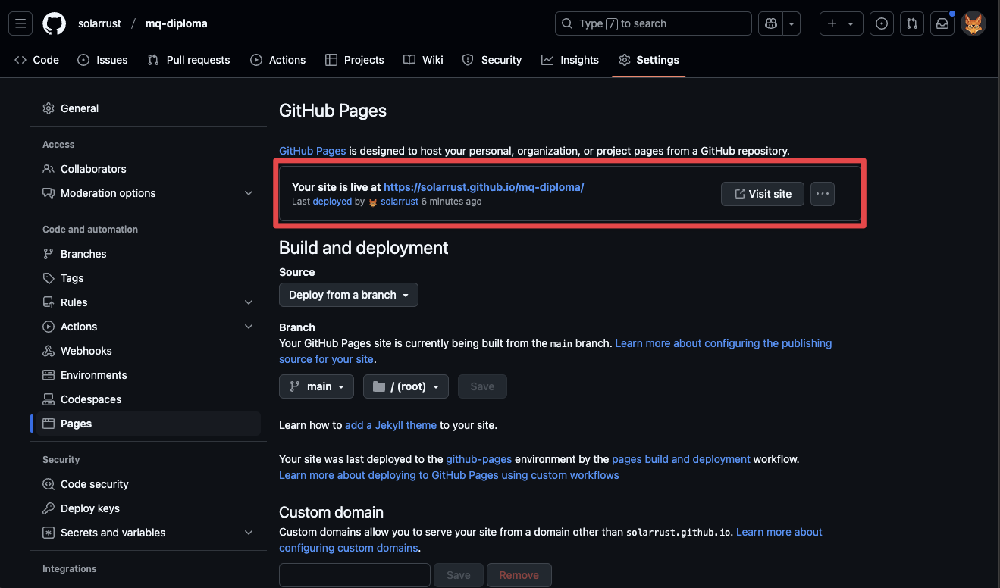
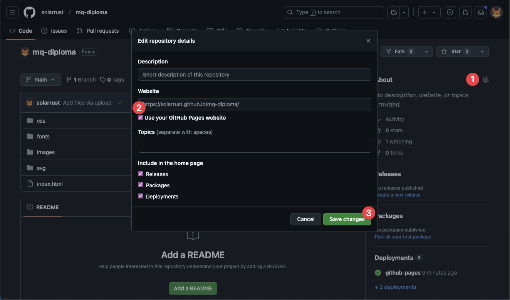

# Работа над дипломом MQ

- [Локальная разработка](https://github.com/netology-code/guides/tree/mq-gh/mq-gh-pages#%D0%BB%D0%BE%D0%BA%D0%B0%D0%BB%D1%8C%D0%BD%D0%B0%D1%8F-%D1%80%D0%B0%D0%B7%D1%80%D0%B0%D0%B1%D0%BE%D1%82%D0%BA%D0%B0)
  - [Текстовый редактор](https://github.com/netology-code/guides/tree/mq-gh/mq-gh-pages#%D1%82%D0%B5%D0%BA%D1%81%D1%82%D0%BE%D0%B2%D1%8B%D0%B9-%D1%80%D0%B5%D0%B4%D0%B0%D0%BA%D1%82%D0%BE%D1%80)
  - [Подготовка папки для диплома](https://github.com/netology-code/guides/tree/mq-gh/mq-gh-pages#%D0%BF%D0%BE%D0%B4%D0%B3%D0%BE%D1%82%D0%BE%D0%B2%D0%BA%D0%B0-%D0%BF%D0%B0%D0%BF%D0%BA%D0%B8-%D0%B4%D0%BB%D1%8F-%D0%B4%D0%B8%D0%BF%D0%BB%D0%BE%D0%BC%D0%B0)
  - [Создание файлов](https://github.com/netology-code/guides/tree/mq-gh/mq-gh-pages#%D1%81%D0%BE%D0%B7%D0%B4%D0%B0%D0%BD%D0%B8%D0%B5-%D1%84%D0%B0%D0%B9%D0%BB%D0%BE%D0%B2)
  - [Скачивание файлов с Github](https://github.com/netology-code/guides/tree/mq-gh/mq-gh-pages#%D1%81%D0%BA%D0%B0%D1%87%D0%B8%D0%B2%D0%B0%D0%BD%D0%B8%D0%B5-%D1%84%D0%B0%D0%B9%D0%BB%D0%BE%D0%B2-%D1%81-github)
  - [Копирование файлов](https://github.com/netology-code/guides/tree/mq-gh/mq-gh-pages#%D0%BA%D0%BE%D0%BF%D0%B8%D1%80%D0%BE%D0%B2%D0%B0%D0%BD%D0%B8%D0%B5-%D1%84%D0%B0%D0%B9%D0%BB%D0%BE%D0%B2)
  - [Настройка автосохранения](https://github.com/netology-code/guides/tree/mq-gh/mq-gh-pages#%D0%BD%D0%B0%D1%81%D1%82%D1%80%D0%BE%D0%B9%D0%BA%D0%B0-%D0%B0%D0%B2%D1%82%D0%BE%D1%81%D0%BE%D1%85%D1%80%D0%B0%D0%BD%D0%B5%D0%BD%D0%B8%D1%8F)
  - [Создание HTML-разметки](https://github.com/netology-code/guides/tree/mq-gh/mq-gh-pages#%D1%81%D0%BE%D0%B7%D0%B4%D0%B0%D0%BD%D0%B8%D0%B5-html-%D1%80%D0%B0%D0%B7%D0%BC%D0%B5%D1%82%D0%BA%D0%B8)
  - [Подключение стилей](https://github.com/netology-code/guides/tree/mq-gh/mq-gh-pages#%D0%BF%D0%BE%D0%B4%D0%BA%D0%BB%D1%8E%D1%87%D0%B5%D0%BD%D0%B8%D0%B5-%D1%81%D1%82%D0%B8%D0%BB%D0%B5%D0%B9)
  - [Предварительный просмотр](https://github.com/netology-code/guides/tree/mq-gh/mq-gh-pages#%D0%BF%D1%80%D0%B5%D0%B4%D0%B2%D0%B0%D1%80%D0%B8%D1%82%D0%B5%D0%BB%D1%8C%D0%BD%D1%8B%D0%B9-%D0%BF%D1%80%D0%BE%D1%81%D0%BC%D0%BE%D1%82%D1%80)
- [Публикация сайта](https://github.com/netology-code/guides/tree/mq-gh/mq-gh-pages#%D0%BF%D1%83%D0%B1%D0%BB%D0%B8%D0%BA%D0%B0%D1%86%D0%B8%D1%8F-%D1%81%D0%B0%D0%B9%D1%82%D0%B0)
  - [Регистрация на Github](https://github.com/netology-code/guides/tree/mq-gh/mq-gh-pages#%D1%80%D0%B5%D0%B3%D0%B8%D1%81%D1%82%D1%80%D0%B0%D1%86%D0%B8%D1%8F-%D0%BD%D0%B0-github)
  - [Создание репозитория](https://github.com/netology-code/guides/tree/mq-gh/mq-gh-pages#%D1%81%D0%BE%D0%B7%D0%B4%D0%B0%D0%BD%D0%B8%D0%B5-%D1%80%D0%B5%D0%BF%D0%BE%D0%B7%D0%B8%D1%82%D0%BE%D1%80%D0%B8%D1%8F)
  - [Загрузка файлов](https://github.com/netology-code/guides/tree/mq-gh/mq-gh-pages#%D0%B7%D0%B0%D0%B3%D1%80%D1%83%D0%B7%D0%BA%D0%B0-%D1%84%D0%B0%D0%B9%D0%BB%D0%BE%D0%B2)
  - [Обновление файлов](https://github.com/netology-code/guides/tree/mq-gh/mq-gh-pages#%D0%BE%D0%B1%D0%BD%D0%BE%D0%B2%D0%BB%D0%B5%D0%BD%D0%B8%D0%B5-%D1%84%D0%B0%D0%B9%D0%BB%D0%BE%D0%B2)
  - [Публикация диплома](https://github.com/netology-code/guides/tree/mq-gh/mq-gh-pages#%D0%BF%D1%83%D0%B1%D0%BB%D0%B8%D0%BA%D0%B0%D1%86%D0%B8%D1%8F-%D0%B4%D0%B8%D0%BF%D0%BB%D0%BE%D0%BC%D0%B0)

## Локальная разработка

### Текстовый редактор

До сегодняшнего дня вы выполняли все задания в так называемой «песочнице» [Codepen.io](https://codepen.io/). Это был удобный способ писать код и делится им с преподавателем, не разбираясь при этом с тонкостями публикации сайтов в интернете.

Вся работа над дипломом будет вестись локально, на вашем компьютере. Для этого вам понадобиться редактор кода.

**Скачайте [VS Code](https://code.visualstudio.com/Download)** под вашу систему.

**Установите VS Code** на компьютер.

### Подготовка папки для диплома

На рабочем столе **создайте папку с названием _mq-diploma_**.

Внутри неё создайте папки для разных типов файлов вашего диплома:

- **css** — для стилей проекта;
- **images** — для картинок;
- **fonts** — для шрифтов;
- **svg** — для SVG-файлов.

В итоге должна получиться такая структура:

### Создание файлов

1. Откройте VS Code.
2. Откройте в нём только что созданную папку _mq-diploma_.
3. В корне папки создайте файл **_index.html_** (для HTML-разметки).
4. Внутри папки _css_ создайте файл **_styles.css_** (для CSS-стилей).

В файлах _index.html_ и _styles.css_ будет вестись основная работа.

### Скачивание файлов с Github

Для вас уже подготовлены файлы, с которыми вам нужно будет работать — картинки, иконки, шрифты. Они лежат на Github вместе с описанием диплома.

**Откройте ссылку [https://github.com/netology-code/mq-diploma](https://github.com/netology-code/mq-diploma) и нажмите зелёную кнопку «Code», выберите «Download ZIP»**.

ZIP-архив со всеми материалами будет скачан на ваш компьютер. **Распакуйте его на Рабочий стол**.

### Копирование файлов

Внутри папки, появившейся после распаковки архива, откройте папку **_sources_** — именно в ней лежат все нужные для работы файлы.

Скопируйте файлы из папки _fonts_ в папку с тем же названием в вашем проекте.

Скопируйте файлы из папки _img_ в папку с названием _images_ в вашем проекте.

Скопируйте файлы из папки _svg_ в папку с тем же названием в вашем проекте.

Это можно сделать перетаскиванием (как показано в видео ниже) или при помощи <kbd>CTRL</kbd>+<kbd>A</kbd> (выбрать всё), <kbd>CTRL</kbd>+<kbd>C</kbd> (скопировать), <kbd>CTRL</kbd>+<kbd>V</kbd>(вставить).

### Настройка автосохранения

1. Откройте VS Code.
2. В верхнем меню нажмите Файл (File).
3. В списке найдите пункт Автосохранение (Auto Save), нажмите на него.
4. Убедитесь, что рядом с этим пунктом появилась галочка.

Теперь все файлы будут сохраняться автоматически.

### Создание HTML-разметки

Чтобы быстро создать основную разметку страницы воспользуемся встроенным в VS Code плагином Emmet. Он позволяет не писать все теги руками.

Откройте файл _index.html_.
В первой строке этого файла **напечатайте «!» (восклицательный знак) и нажмите <kbd>Tab</kbd>**.

Появится вся базовая HTML-разметка.

Разметку для дипломной работы нужно будет писать внутри тега `<body>`.

### Подключение стилей

Сразу под тегом `<title>` **напечатайте слово «link» и нажмите <kbd>Tab</kbd>**.

Задайте для атрибута `href` значение `css/styles.css`.

Таким образом CSS-файл теперь связан с HTML-разметкой и все стили, написанные в нём, будут применяться к тегам на странице.

Обратите внимание, что все пути до файлов при работе локально должны быть **относительными**.

[Шпаргалка по работе с относительными путями](../relative-link/README.md)

### Предварительный просмотр

Во время работы над дипломом вам понадобиться постоянно видеть результат.

**Для этого в браузере откройте файл _index.html_**.

В меню выберите Файл — Открыть файл, найдите нужную папку, выберите _index.html_.

Чтобы увидеть не белый лист, напишем в HTML-разметке заголовок первого уровня (`<h1>`) с любым текстом. А в _styles.css_ зададим заголовку красный цвет текста и рамку.

После внесения изменений сохраняйте файл (<kbd>CTRL</kbd> + <kbd>S</kbd>) и обновляйте страницу в браузере.

## Публикация сайта

### Регистрация на Github

Действуйте по инструкции → «[Регистрация на Github](../github/README.md)»

**Внимание!** При регистрации указывайте почту на иностранных сервисах. Например, Gmail или Hotmail. Участились случаи блокировки профилей с почтами на Yandex и Mail.ru.

### Создание репозитория

1. Откройте ссылку [https://github.com/new](https://github.com/new).
2. Введите название репозитория. Например, «mq-diploma».
3. Убедитесь, что выбран пункт «Public».
4. Нажмите кнопку «**Create repository**».

### Загрузка файлов

1. На открывшейся странице нажмите ссылку «**Uploading an existing file**».
2. Перетащите все файлы из папки на вашем компьютере в окно браузер, в специальную область.
3. Когда все файлы будут загружены нажмите внизу страницы «**Commit changes**».

### Обновление файлов

Если вы изменили файлы локально, то их нужно обновить и на Github чтобы дипломный руководитель видел актуальную версию вашей страницы.

Скорее всего вам понадобиться обновлять только _index.html_ и _styles.css_.

1. На главной странице репозитория нажмите кнопку «**Add file**», в выпадающем меню выберите «Upload files». Откроется страница как на предыдущем шаге.
2. Перетащите те файлы, которые изменились, в специальную область. Если файл находится в папке, как _styles.css_ внутри папки _css_, то перетаскивайте всю папку целиком.
3. После загрузки файлов нажмите внизу страницы «**Commit changes**».

### Публикация диплома

Чтобы преподаватель увидел готовый сайт, его нужно опубликовать. Для этого будем использовать встренный в Github сервис Pages.

1. На главной странице репозитория нажмите на вкладку «**Settings**».
2. В левой колонке найдите пункт «**Pages**».
3. Под заголовком «Branch» в выпадающем списке выберите **main** и нажмите рядом кнопку «**Save**»
4. Через несколько минут обновите страницу, вверху появится ссылка на сайт с вашим дипломом. Её и отправляете на проверку.

Если вдруг на странице с настройками Pages ссылка не появилась, то вернитесь на главную, нажмите на **иконку шестерёнки** (⚙️) в правой части окна и поставьте галочку напротив «**Use your GitHub Pages website**». Нажмите «**Save changes**». Теперь ссылка на ваш диплом всегда будет под рукой.

**Если в ходе работы над дипломом на любом из шагов у вас возникла проблема — пишите в канал курса. Аспиранты и преподаватели обязательно вам помогут.**