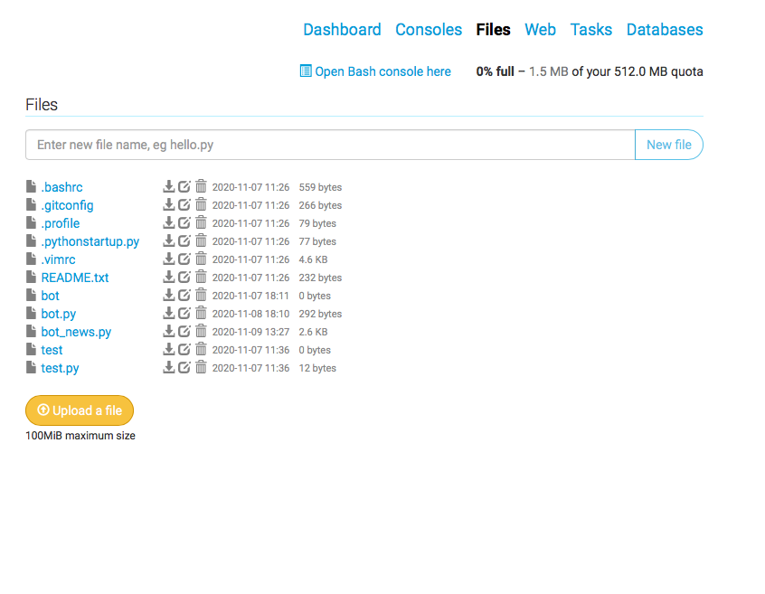
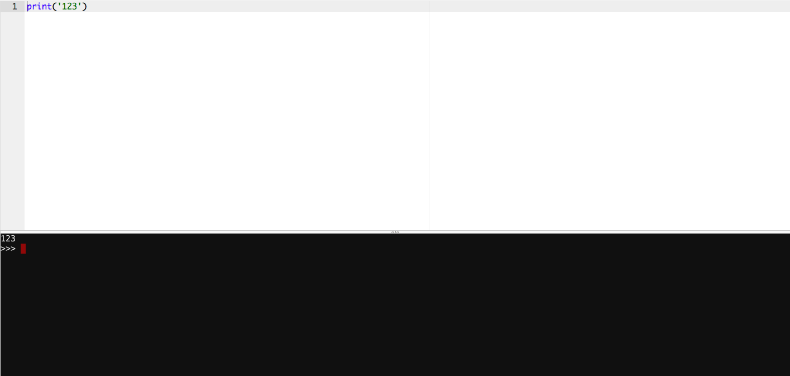
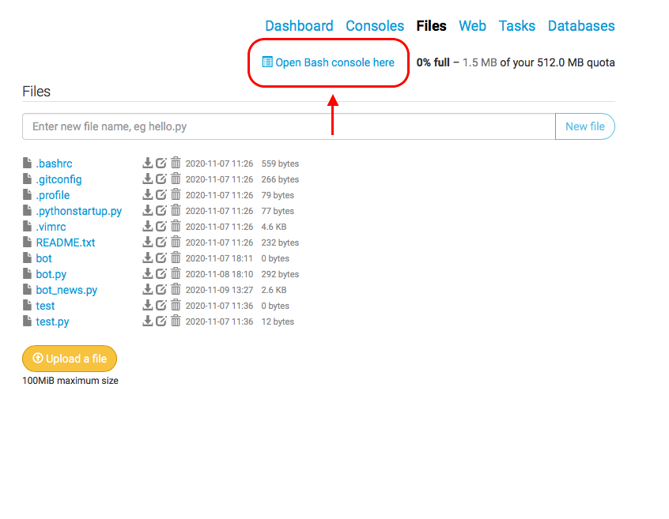

## Инструкция по работе с PythonАnywhere

1. Зайдите на сайт https://www.pythonanywhere.com/. Нажмите на кнопку **Start running Python online in less than a minute!**

2. Нажмите на кнопку **Create a Beginner account**

3. Зарегистрируйтесь. 

4. Нажмите на кнопку **+Оpen another file**, чтобы создать новый файл.

5. Если нажать на кнопку **Browse files**, то вы попадете в каталог ваших файлов на этом ресурсе. Вы можете создать новый файл, загрузить файл с компьютера или открыть уже имеющиеся файлы.

6. После выбора файла вы попадаете в его рабочую область. Слева вы можете писать программный код. Чтобы его выполнить, нажмите на **Run**.

7. Внизу вы увидите результат выполнения программы.

8. Для того, что установить дополнительные библиотеки в вашу рабочую область на данном ресурсе, перейдите в консоль. Для этого нажмите **Open Bash console here**.

