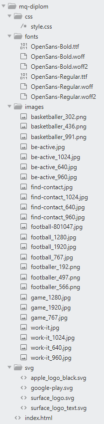
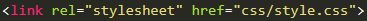
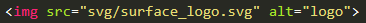
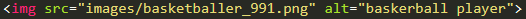
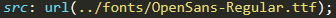
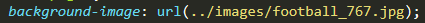

# 	Относительные пути

1. 	Как обратиться к `style.css` из `index.html`:

* Где `css` название папки
2. 	Как обратиться к `.svg` из `index.html`:

* Или вы всегда можете вставить `svg` в код
3. 	Как обратиться к картинке из `index.html`

* `images/` -папка с картинками
4.	Как обратиться из `style.css` к определенному шрифту:

* Где `../` выход из папки `css` в корень папки
* `fonts/` обращение к папке с шрифтами
5. 	Как обратиться из `style.css` к определенной картинке?

* Где `../` выход из папки `css` в корень папки
* `images/` переход в папку с картинками