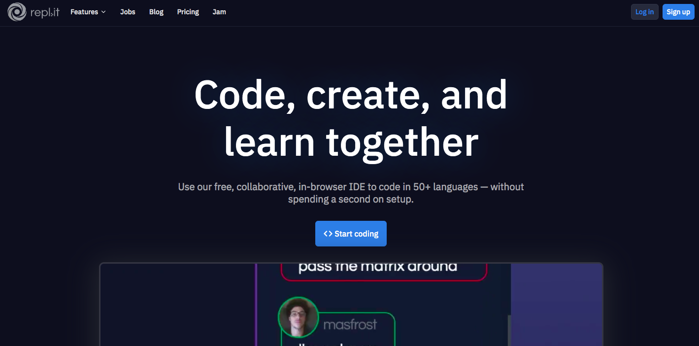
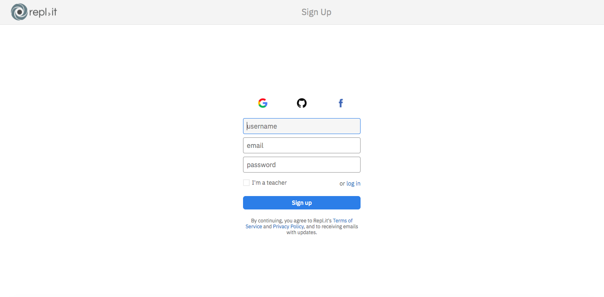
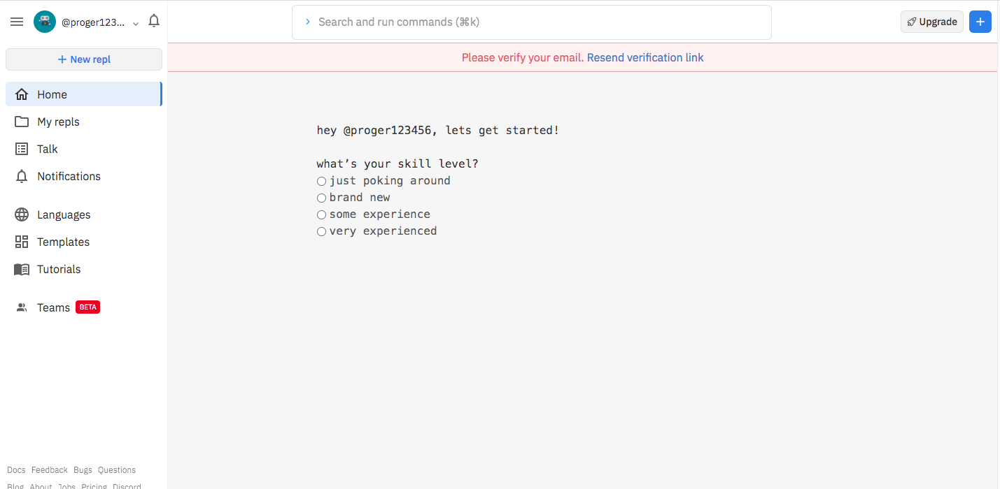
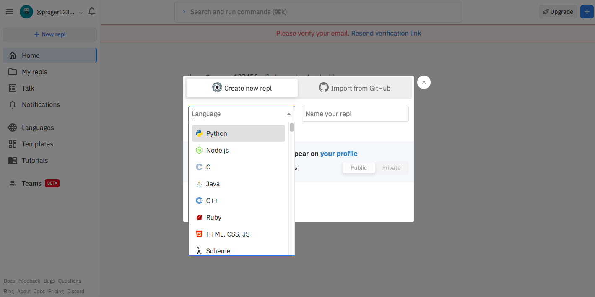
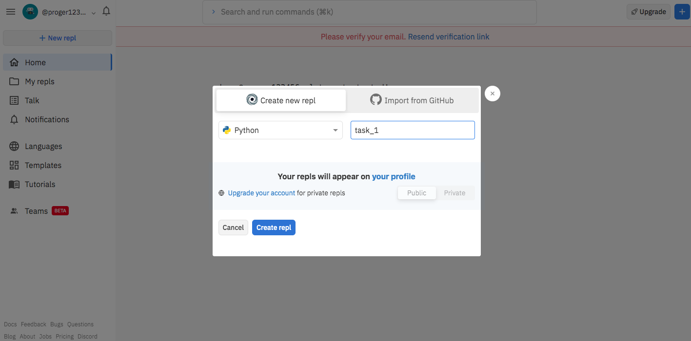
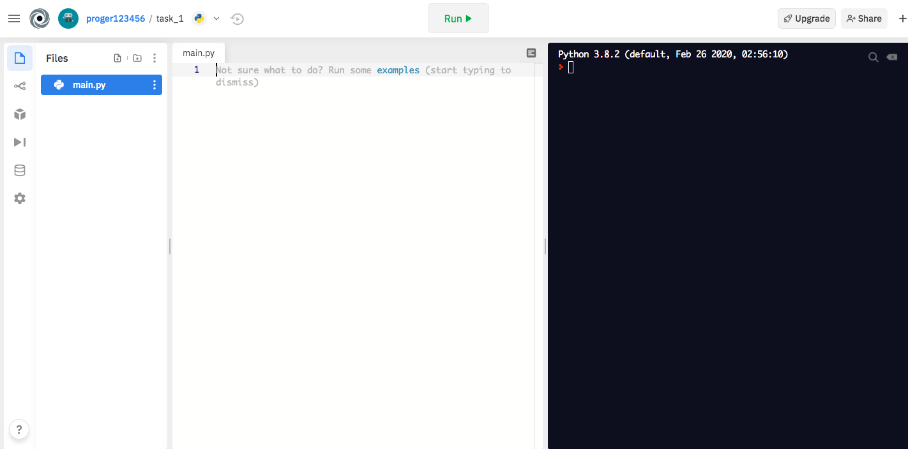
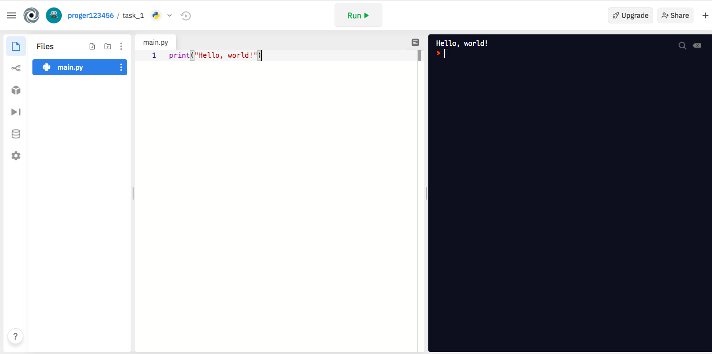
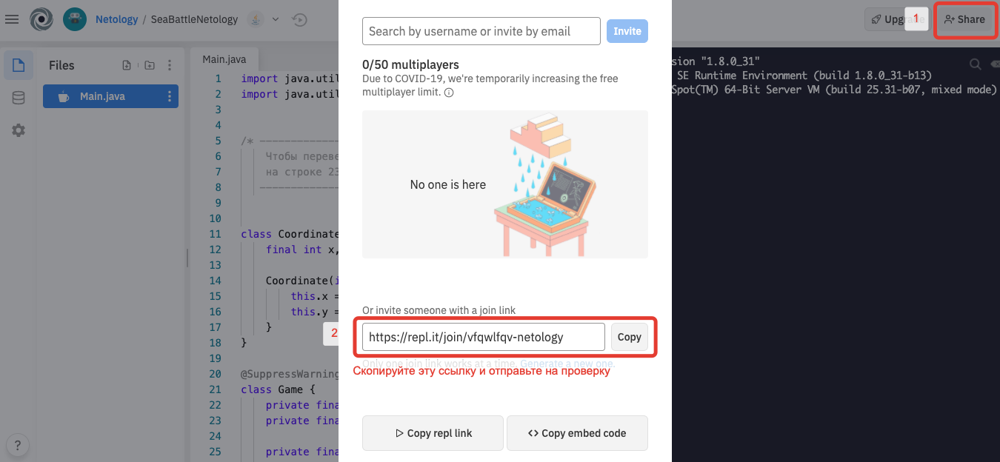

# Инструкция по работе с онлайн-редактором Repl.it

1. Перейдите по ссылке на [Repl.it](https://repl.it).

2. На открывшейся странице перейдите в форму регистрации, нажав одну из кнопок: **Sign up** или **Start coding**

3. Зарегистрируйтесь на сайте.

4. Подтвердите свой аккаунт. Для этого надо перейти по ссылке из вашей электронной почты.

5. Нажмите одну из кнопок: **+ New repl** в левом верхнем углу или **+** в правом верхнем углу.

6. Выберете необходимый вам язык программирования и придумайте название для вашей будущей программы.

7. После этого Вы попадете в рабочую область вашей программы. В центре вы можете писать код, справа будут видны результаты выполнения вашей программы. 

8. Скопируйте ссылку на ваш repl (ваш код).

