<h1> Инструкция по настройке рабочего пространства для комфортного обучения на курсе </h1>

Версия для пользователей Mac OS [здесь](https://github.com/korytoff/install-php-on-mac).

<h2>Подготовительные работы</h2>

Для работы очень желательно иметь файловый менеджер, позволяющий создавать файлы с любыми расширениями, либо, что еще лучше, редактор кода, например <a href="https://atom.io/">Atom</a> или <a href="https://www.jetbrains.com/phpstorm/">PhpStorm</a>.

Структура папок может быть различной, однако данная инструкция написана под определенную структуру и, если ей следовать, всё гарантированно заработает.

Перед тем как начать, создайте на диске C папку server, внутри которой создайте 3 подпапки:  php, mysql, domains. Именно так. Без указания номеров версий.

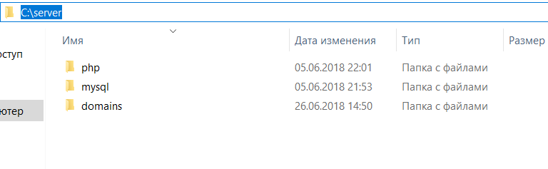

В каталоге domains создаем еще 2 папки: localhost и phpmyadmin

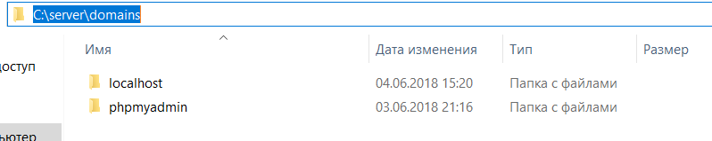

Создаем индексные файлы (при помощи файлового менеджера или редактора кода), которые будут нужны для проверки того, что все работает и помещаем их в папку localhost:

<ul>
    <li>index.html с содержимым: It works!</li>
    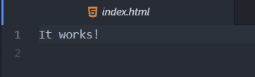
    <li>index.php с содержимым:
        <?php phpinfo(); ?>
    </li>
    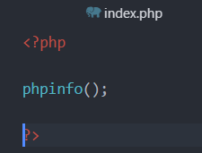
</ul>

Так же в папку host (C:\Windows\System32\drivers\etc), добавьте следующие строки (без знака <b>#</b>):  127.0.0.1 localhost  
127.0.0.1 phpmyadmin

В будущем, если вы решите создавать свои домены не забудте их прописать в файле host по аналогии.

<h2> Установка PHP </h2>

<ol>
    <li>
        
<a href="https://windows.php.net/download#php-7.2">Скачать</a> архив (Zip)   x86 — версия для 32-битной ОС, x64 — 64-битная версия. Из Thread Safe и Non Thread Safe выбираем Thread Safe (c поддержкой многопоточности).  
            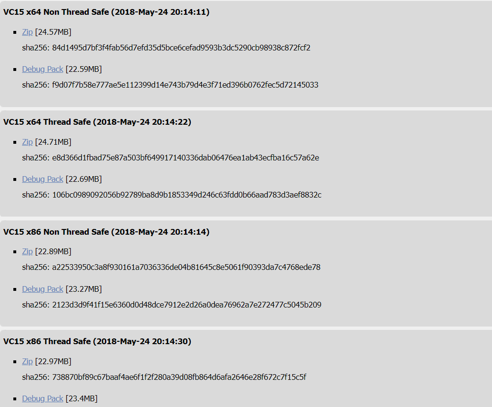

    </li>
    <li>Чтобы установить PHP, просто распакуй скачанный архив в папку php, C:\server\php   Как должно выглядеть:   </li>
</ol>

<h2>Настройка PHP</h2>

Перейдем в c:/server/php и найдем файл php.ini (возможно у вас  их будет 2 и они будут с префиксами, тогда просто переимнуйте php.ini-development в php.ini)

Открывем его и нажимаем Ctrl+F, в строке поиска прописываем extension_dir

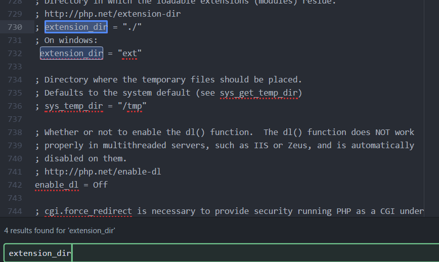

В строке  ;extension_dir = "ext" убираем ";", чтобы получилось как на скриншоте выше.(732 строка)

Далее в строке поиска прописываем "extension=mysqli" и так же убираем ";", чтобы получилось как на скриншоте снизу

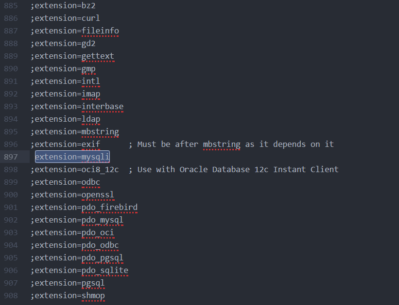

Сохраняем изменения и закрываем файл.

Так же нужно добавить папку с PHP в переменную окружения PATH. Для этого:

<ul>
	<li>Открываем Панель управления->Система->Дополнительные параметры системы->Переменные среды</li>
	
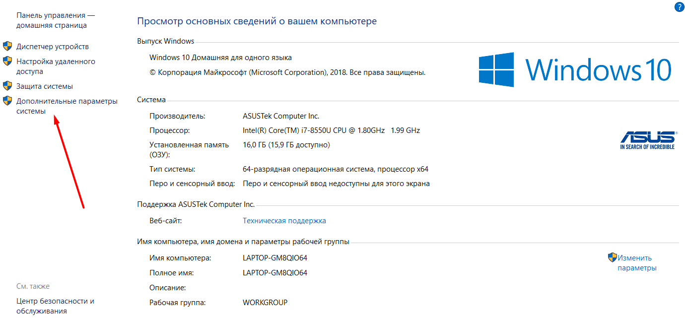

	
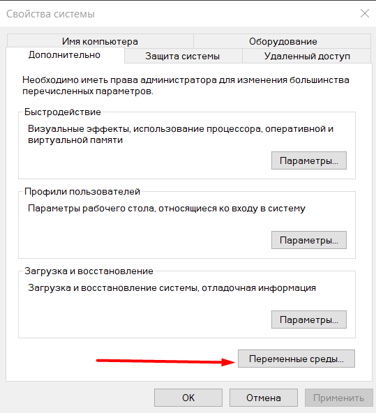

	<li>Выбираем переменную Path и нажимаем изменить</li>
	
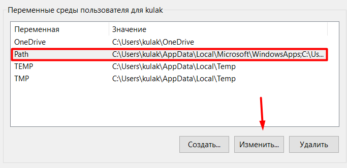

	<li>Нажимаем создать и пишем путь к папке php</li>
	
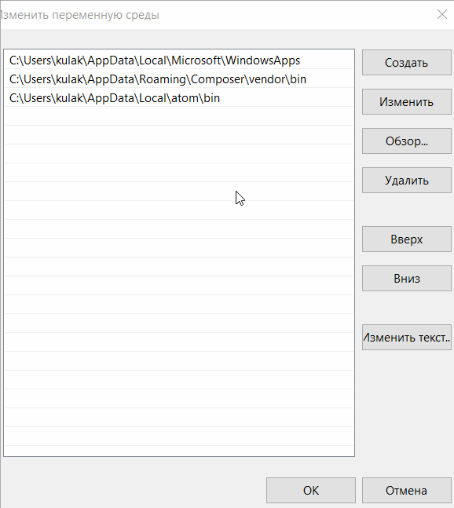

</ul>

<h2>Запуск и остановка сервера.</h2>

Для запуска наших скриптов будем использовать встроенный веб-сервер.

Откроем командную строку, для этого нажмите сочетание клавиш Windows + R и пропишите команду cmd

Чтобы запустить веб-сервер пропишем следующие команды:

<ul>
	<li>
		<code>
			cd ../../../server/domains/localhost - переходим в папку с нашими скриптами
		</code>
	</li>
	<li>
		<code>
			php -S localhost:8000 - запускаем веб-сервер
		</code>
		
В консоли выведется:  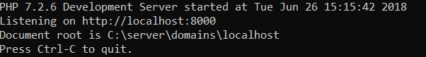

	</li>
</ul>

В браузере прописываем http://localhost:8000/index.php и если все сделали правильно, то вы увидите ваш скрипт, который  создали в самом начале 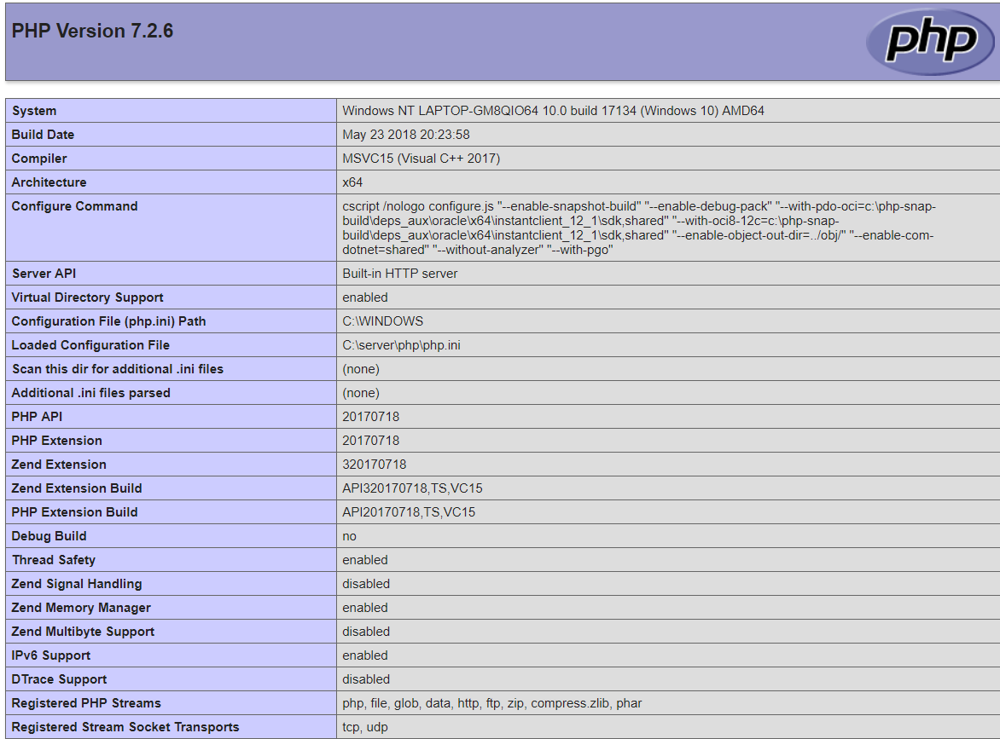

Для остановки сервера нажмите сочетание клавиш Ctrl+C

<h2> Установка MySQL </h2>
<ol>
    <li>
Переходим на <a href="https://dev.mysql.com/downloads/mysql/">Официальный сайт MySQL</a> и скачиваем MySQLInstaller MSI 
</li>
    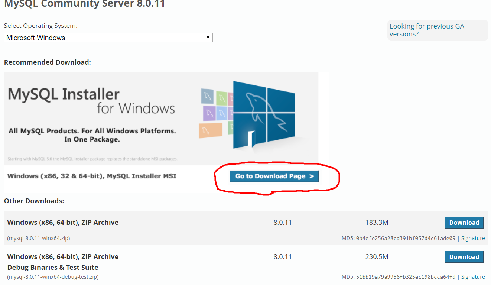
    

    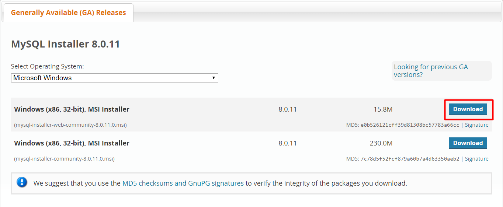
    <li>Запускаем установочный файл и выбираем пункт Custom</li>
    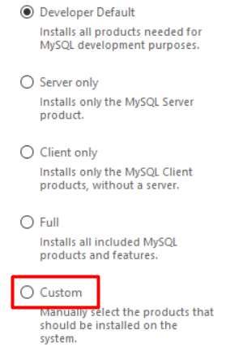
    <li>В следующем окне выбираем MySQL Server, а так же путь к папке mysql </li>
    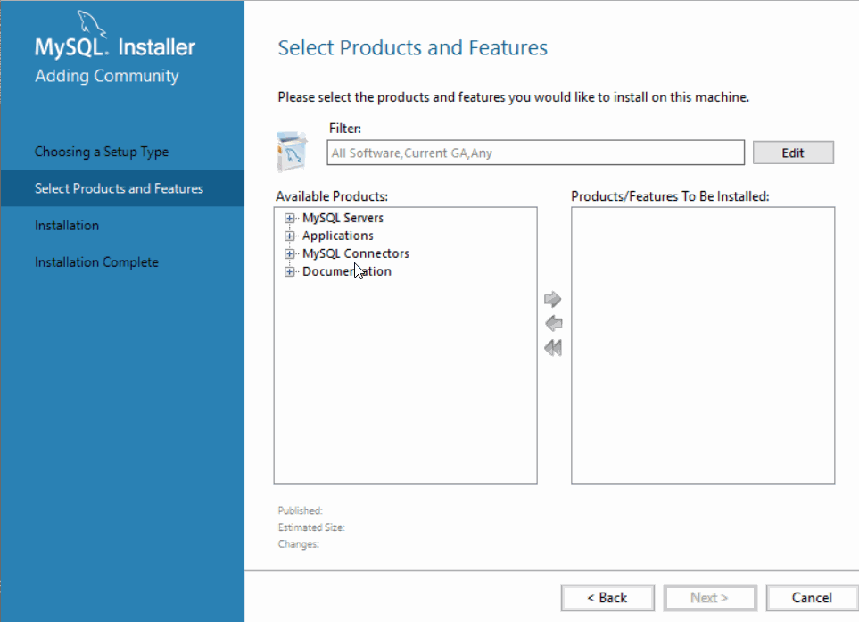
    <li>Далее игнорируем конфликт путей и проcто нажимаем Next</li>
    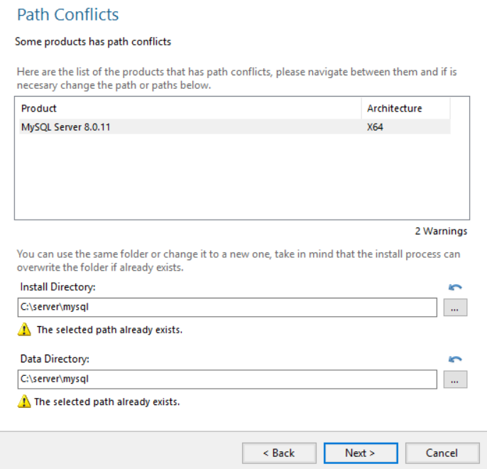
    <li>И выполняем установку</li>
    
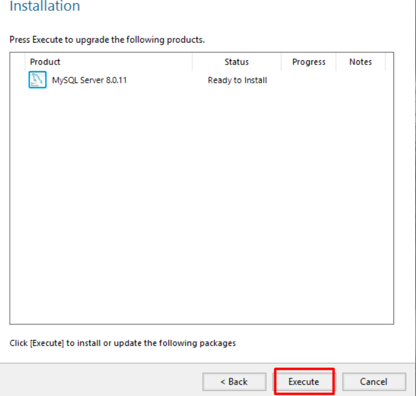

    
Далее следует конфигурация нашего MySQL

    
Все разделы оставляем по умолчанию кроме <b>Authentication Method и Accounts and Roles</b>

    
В первом случае выбираем второй пункт

    
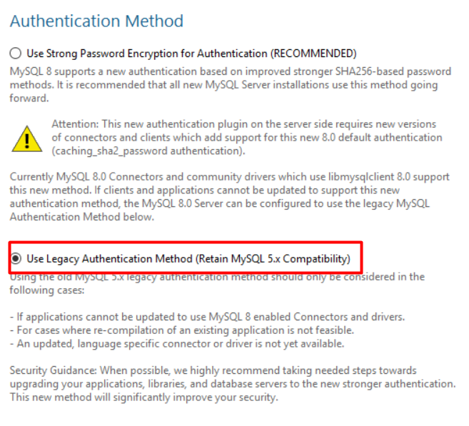

    
В разделе <b>Accounts and Roles</b> нужно ввести пароль который нужно запомнить! В последующем он нам понадобится для входа в phpmyadmin

    
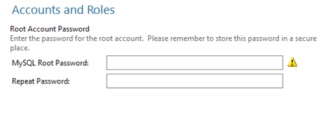

    
В конце конфигурирования должно быть так:

    
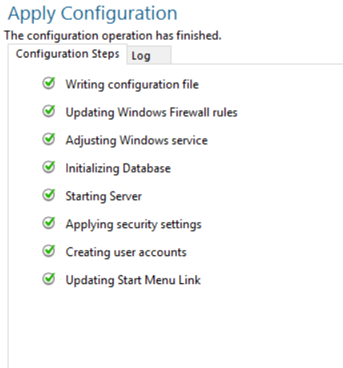

</ol>

На этом с установкой все.

<h2>Установка Phpmyadmin</h2>

Переходим на <a href="https://php-myadmin.ru/download/">сайт</a> и скачиваем архив.

Файлы из архива распакуем в папку phpmyadmin (c:/server/domains/phpmyadmin)

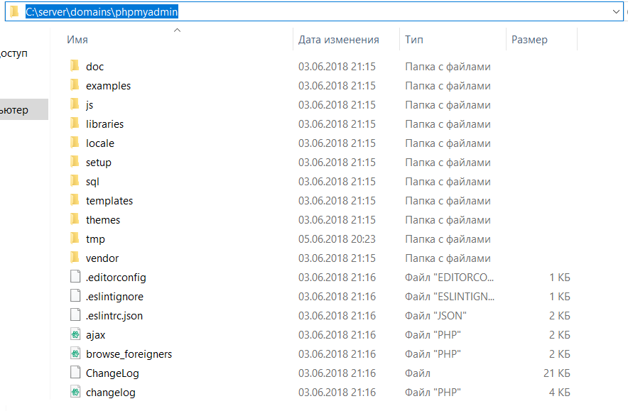

Логин для входа - root  Пароль - тот который указали при установке MySQL

Чтобы запустить Phpmyadmin нужо:

<ul>
	<li>
		Перейти в папку где у нас лежит pma
		
<code>cd../phpmyadmin</code>

	</li>
	<li>
		
Запустить веб-сервр и ввести адрес в браузер, как это описано выше.

	</li>
</ul>
