# Установка PHP на MacOS

#### Воспользуемся бесплатным приложением MAMP, которое включает MySQL. Этого приложения будет достаточно для прохождения курса.

1. Скачайте приложение MAMP на странице: https://www.mamp.info/en/ 

2. Установите MAMP.

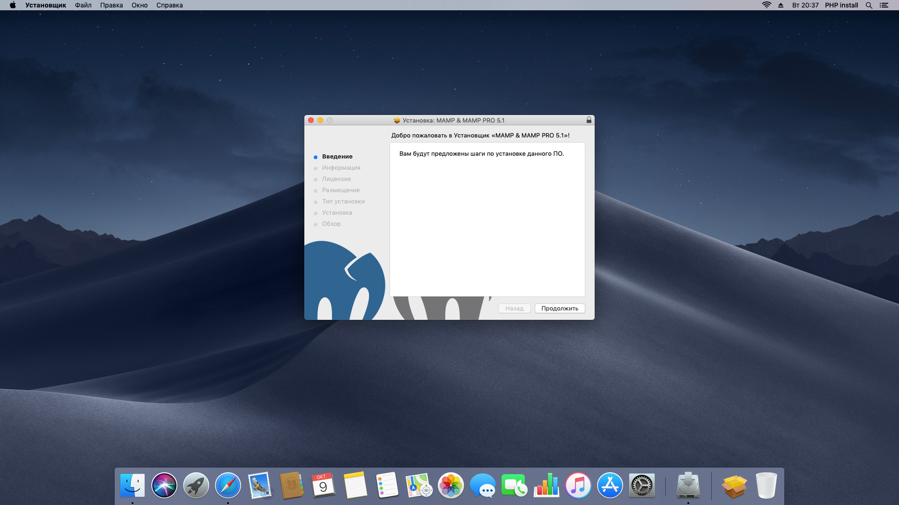

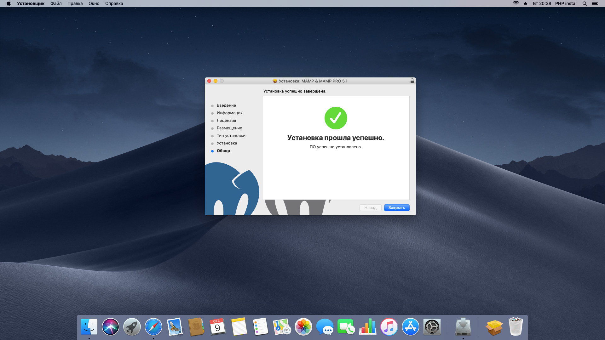

3. Запустите приложение MAMP из папки Программы (Applications).

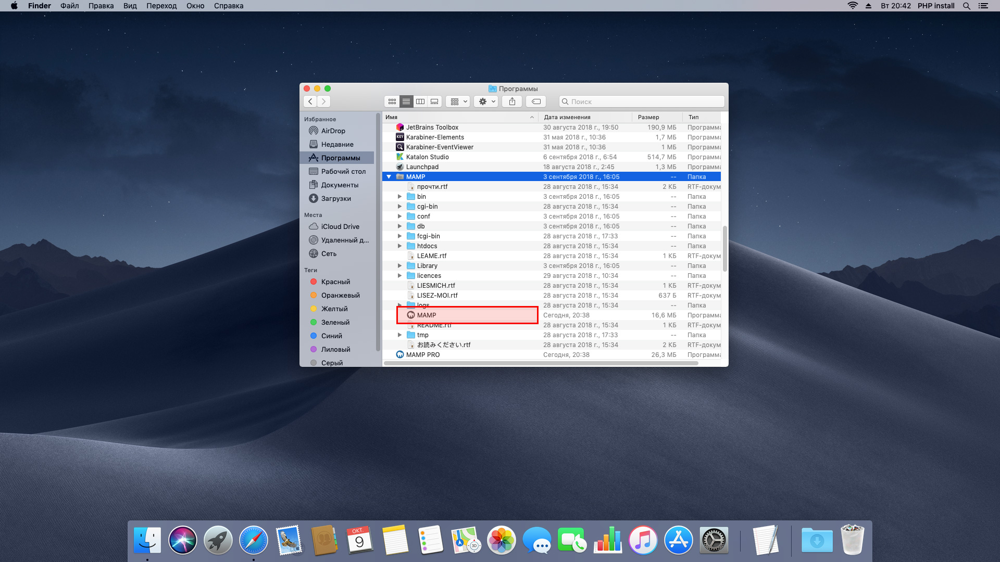

4. Вы увидите путь к директории Документы (Documents) в Настройках.

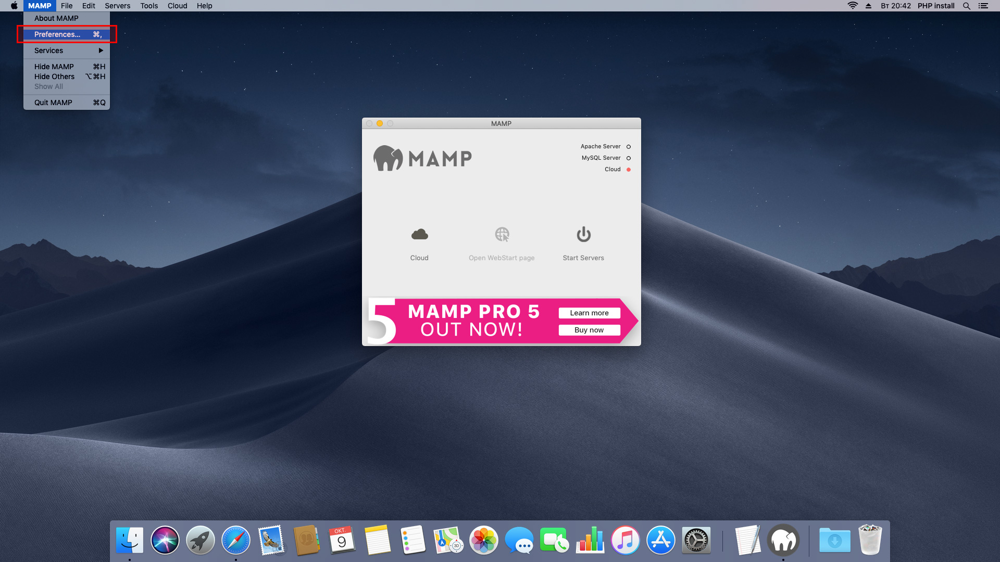

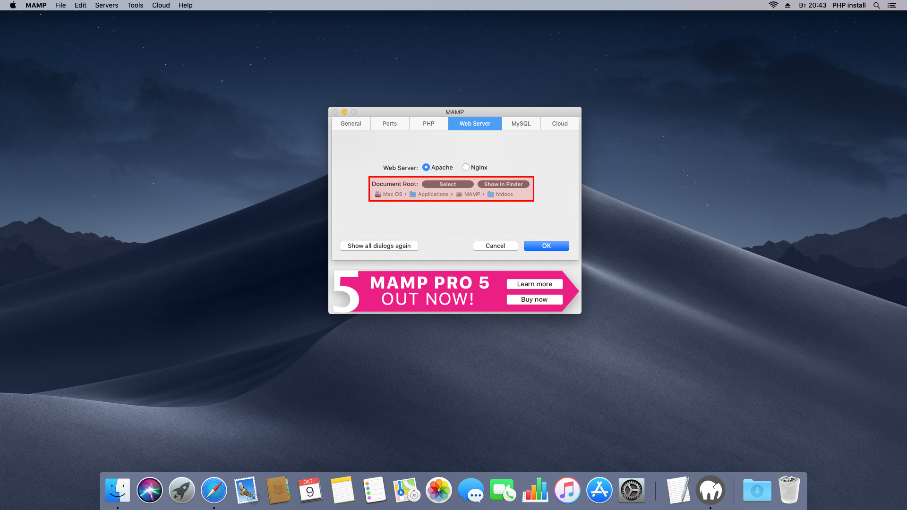

5. Запустите веб-сервер (Start servers).

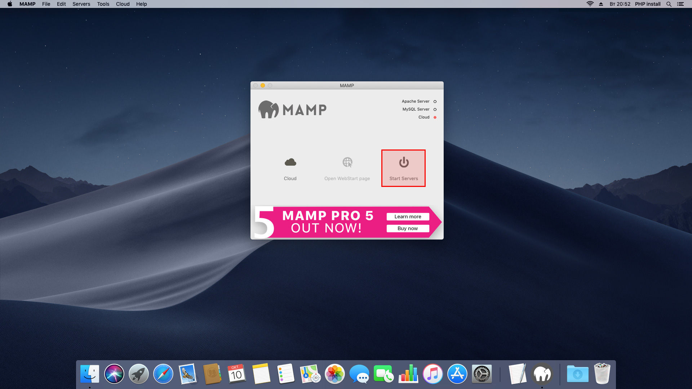

6. Разместите ваш файлы вашего проекта в директории Документы (Documents). По умолчанию это папка: file:///Applications/MAMP/htdocs 

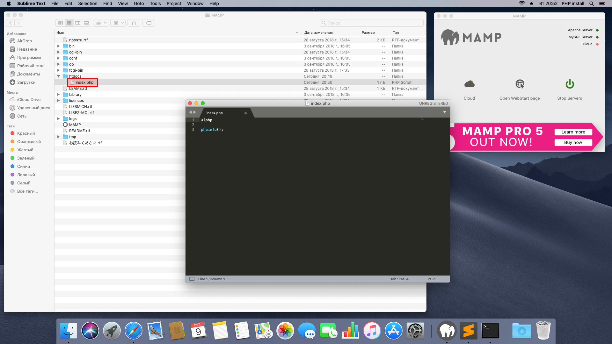

7. Убедитесь, что веб-сервер запущен и открыта стартовая страница (WebStart). По умолчанию это: http://localhost:8888/MAMP/ 

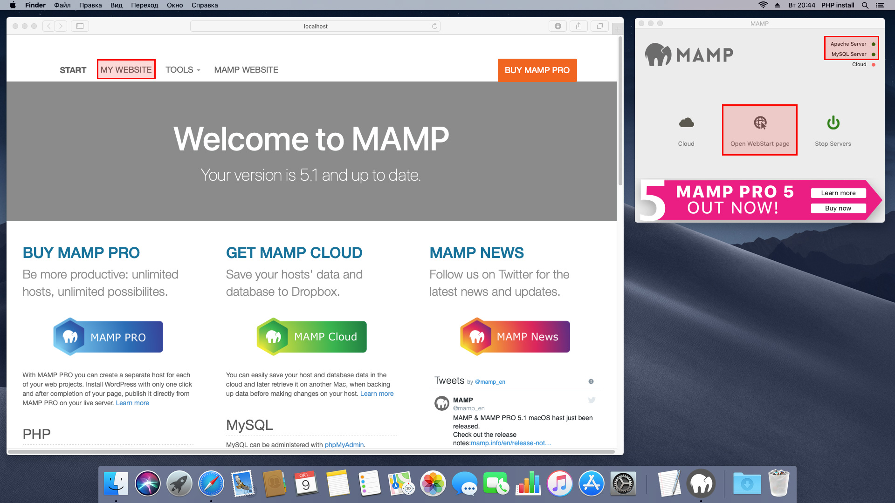

8. Убедитесь, что ваш браузер отображает полный веб-адрес.

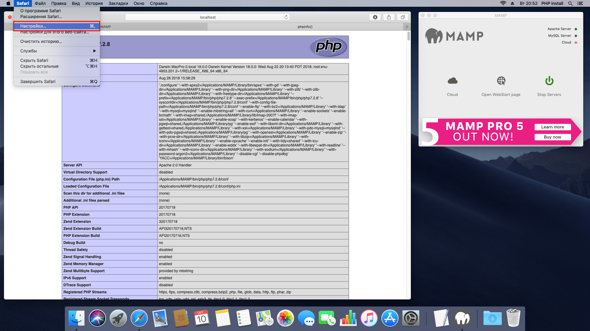

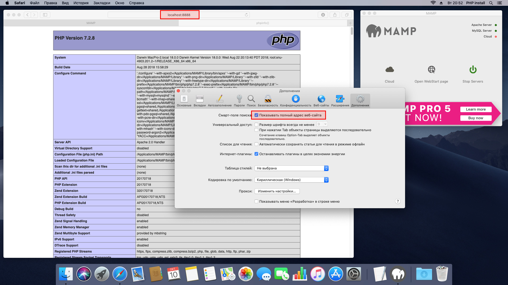

9. Откройте PhpMyAdmin со страницы WebStart page для настройки ваших баз данных. По умолчанию это: http://localhost:8888/phpMyAdmin/  

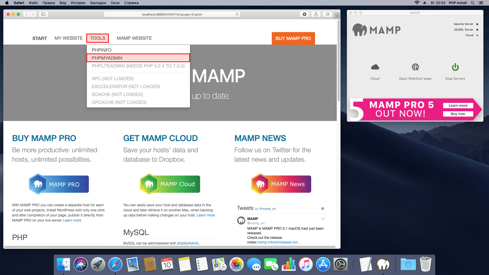

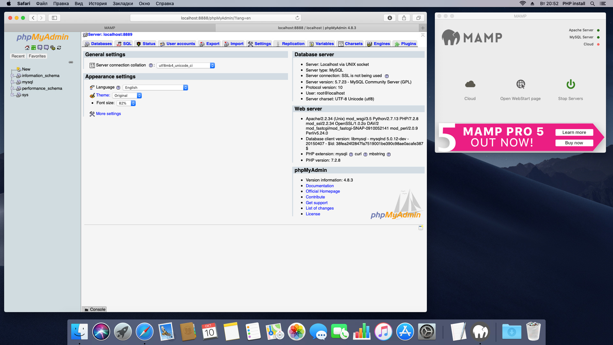

