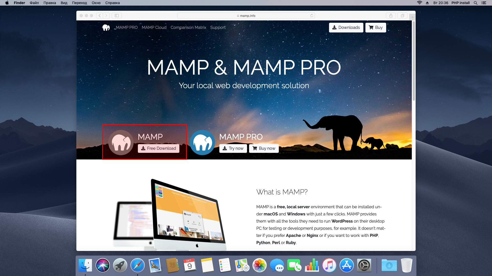

# Установка PHP на MacOS

## Воспользуемся бесплатным приложением MAMP, которое включает MySQL. Этого приложения будет достаточно для прохождения курса.

1. Скачайте приложение MAMP на странице: https://www.mamp.info/en/ 

2. Установите MAMP.

3. Запустите приложение MAMP из папки Программы (Applications).

4. Вы увидите путь к директории Документы (Documents) в Настройках.

5. Запустите веб-сервер (Start servers).

6. Put your project files into Document root. By default it's file:///Applications/MAMP/htdocs 

7. Make sure the webserver is running and open WebStart page. By default it's http://localhost:8888/MAMP/ 

8. Make sure your the browser show full web address  

9. Open PhpMyAdmin from WebStart page for design your databases. By default it's http://localhost:8888/phpMyAdmin/  

